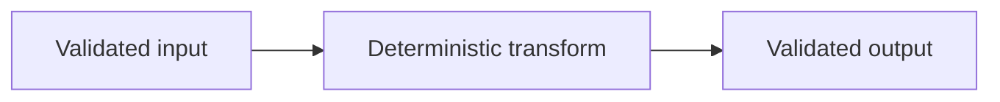

# AGENTS

## Git Rules

NEVER amend git commits. Make a new commit instead.

NEVER use `git rebase` unless the user explicitly approves a rare exception.
Use regular merge commits.

NEVER force any git operation. If a force operation appears necessary, stop and
explain what happened and what options remain.

NEVER create draft pull requests.

NEVER use a `codex` prefix in branch names, PR titles, or commit messages.

Pull request bodies for issue work MUST include GitHub auto-close text such as
`Closes #123` for every issue the PR is intended to close.

## Think

Think is durable memory for cross-session coordination.

- Use `codex-think --remember --json` when starting a new session, changing into
  this repository, or regaining context after a context shift.
- Use `codex-think "..." --json` when a cycle closes or a significant event
  should survive across turns.
- Treat Think as memory, not repo truth. Anchor strong claims back to files,
  commits, commands, issues, or pull requests.
- Claude memories are read-only. Use `claude-think --remember --json` only for
  additional context.

## Topic Shelves

`docs/topics/` contains the living contract graph for landed behavior. Topic
shelves are not proposals, retrospectives, or design archaeology.

Each shelf may contain:

- `README.md`: what is true in HEAD.
- `test-plan.md`: how those truths are verified, including requirements, cases,
  fixtures, oracles, implemented evidence, planned cases, and known gaps.
- `architecture.md`: optional structure or dataflow notes when the machinery
  earns a separate page.
- `rationale.md`: optional still-relevant tradeoffs and rejected approaches.

### When To Update Topic Shelves

For every nontrivial behavior, contract, workflow, release, schema, validation,
or public-surface change:

1. Identify the owning topic shelf before editing code.
2. If no shelf owns durable behavior, create one.
3. Update `test-plan.md` before or alongside tests with requirement IDs, case
   IDs, fixtures, and oracles.
4. Write executable evidence: deterministic tests, fixtures, doctests, or
   contract checks as appropriate.
5. Update the topic `README.md` only after behavior exists in the branch. The
   README describes current branch truth, not intended future behavior.
6. Mark planned cases as implemented only when executable evidence exists.
7. Run `cargo xtask verify` before claiming the shelf is current.

### When Not To Update Topic Shelves

Do not churn topic shelves for purely mechanical edits that do not change a
contract, such as formatting, typo fixes, dependency pin updates with no
observable behavior change, or internal refactors whose existing tests and topic
claims remain accurate.

When a change intentionally does not update a topic shelf, state why in the pull
request body or final report.

### Topic Shelf Discipline

- Topic `README.md` files must not describe intended behavior before it lands.
- `test-plan.md` may include planned cases and known gaps.
- `policy` rows are for human-review workflow contracts. They must not be used
  to avoid writing behavior tests for software behavior.
- Tests assert code behavior and stable contract artifacts, not prose.
- Negative tests should assert stable error kinds or structured artifacts, not
  merely `is_err()` or diagnostic text.
- Release, CI, and publication workflows count as behavior when they define a
  project contract.
- Avoid ceremonial documentation. Update shelves because the contract changed,
  not because a path changed.

## RED/GREEN Testing Discipline

Edict uses RED/GREEN test-driven development for nontrivial changes. The shared
contract lives in [docs/topics/tests/](docs/topics/tests/README.md).

For behavior, contract, workflow, release, schema, validation, or public-surface
changes:

1. Update the owning topic `test-plan.md` with planned requirement and case rows
   before or alongside the first test.
2. Write the deterministic test, fixture, doctest, or contract check before the
   implementation that makes it pass.
3. Run the narrowest relevant command and observe the RED failure.
4. Implement the smallest coherent change that turns that test GREEN.
5. Mark planned rows as implemented only after executable evidence exists.
6. Report the RED command and GREEN command in the final report or pull request
   body.

Tests must assert software behavior. Do not write tests that assert
implementation detail, documentation detail, or repository structure. Tests may
exercise documentation tooling behavior, such as a validator rejecting invalid
input, but they must not pass merely because prose contains a phrase or a file
appears at a particular path.

Do not use after-the-fact tests as a substitute for RED/GREEN. If a change is a
purely mechanical edit with no contract impact, state that no RED/GREEN cycle
was required.

## Documentation Standards

Documentation is a product interface, not a Markdown inventory. The shared
documentation policy lives in
[docs/topics/documentation/](docs/topics/documentation/README.md).

When creating or changing documentation:

- Give each page one primary reader job: tutorial, how-to, reference,
  explanation, troubleshooting, or contributor guidance.
- Keep user-facing task help separate from contributor architecture and evidence
  maps.
- Use concrete, valid examples and show expected results when the result matters.
- Put exact public facts in reference material and validate or generate them
  from authoritative sources when practical.
- Update affected documentation in the same change as behavior, schema, release,
  workflow, or public-surface changes, or state `docs-impact: none` with a
  concise rationale.

## Rust Standards

Rust engineering policy lives in
[docs/topics/rust-standards/](docs/topics/rust-standards/README.md).

For Rust changes:

- Preserve claim integrity: no public claim without executable evidence.
- Keep compiler and validation paths deterministic and free of hidden I/O.
- Prefer structured public failures with stable error kinds over prose-only
  diagnostics.
- Do not add dependencies without PR-body rationale and contract-impact notes.
- Treat planned lint, dependency, and fuzzing ratchets as planned until their
  executable checks land.

## Pull Request Writing

Every pull request body MUST contain a `## Plain-English Walkthrough` section.
Its depth should match the change: a narrow mechanical PR may need only a few
paragraphs, while a behavioral or architectural PR needs enough detail for a
reviewer to reconstruct the important flow, invariants, and risks without
reverse-engineering the diff.

The walkthrough supplements, rather than replaces, the repository's other PR
requirements: issue-closing directives, RED/GREEN evidence, dependency
rationale, documentation impact, and release or compatibility notes still
apply when relevant.

### Required Structure

Use these subsections inside `## Plain-English Walkthrough`:

1. `### TL;DR`: state what changed, why it changed, and the user-visible or
   contract-visible result. Keep it short and avoid implementation trivia.
2. `### Walkthrough`: explain the change through progressive disclosure. Start
   with the previous behavior or problem, introduce the new model and dataflow,
   then cover authority boundaries, invariants, failure modes, compatibility,
   and verification as the change requires.

Use additional `###` through `#####` headings only when they make a substantial
walkthrough easier to navigate. Do not copy a design document or topic shelf
into the PR body; summarize the review-critical facts and link to the durable
document.

### Diagrams

Use Mermaid when a diagram communicates a nontrivial relationship more clearly
than prose. Select the diagram type that matches the claim: flowcharts for
decision or data flow, sequence diagrams for interactions, state diagrams for
lifecycle rules, and class or entity-relationship diagrams for structure. Do
not add decorative diagrams or attempt to use every diagram type. A nontrivial
PR that changes multi-stage flow, lifecycle, ownership, or component
interaction SHOULD include at least one useful diagram; a narrow change may
omit diagrams when prose is clearer.

A section MUST NOT begin with, end with, or consist only of a diagram. Every
diagram needs all four elements:

1. An introductory paragraph that states the point the diagram demonstrates.
2. The Mermaid diagram.
3. A collapsed caption that explains how to read the diagram.
4. A concluding paragraph that interprets the diagram and ties it back to the
   PR's behavior, risk, or contract.

Use this caption shape exactly; the blank lines are required for GitHub
rendering:

````markdown


<details>
<summary>Caption: Deterministic transformation boundary</summary>

1. The caller supplies already validated input.
2. The transform performs no discovery or ambient I/O.
3. The output crosses the boundary only after validation.

</details>
````

For ordered transitions, interactions, or states, prefer a numbered caption.
For ownership maps, compatibility matrices, or field relationships, prefer a
small table. Captions must explain meaningful nodes and edges, not merely
repeat their labels.

### Prose, Tables, And Code

- Use tables for comparisons, ownership maps, compatibility matrices, and
  evidence where rows have a consistent shape.
- Use bullets for genuinely unordered sets and numbered lists for ordered
  procedures, states, or sequences. Do not force prose into a table merely to
  avoid bullets.
- Include focused code, schema, command, or payload snippets when exact syntax
  is part of the review. Snippets must match the branch and omit unrelated
  boilerplate.
- Describe current branch behavior as current behavior. Label planned or
  downstream work explicitly; do not present it as landed.

### Claims And Citations

Tag each material technical claim at its first occurrence using
`[claim:<claim-id>, confidence:<value>]`. Use stable, descriptive claim IDs and
a confidence value from `0.00` through `1.00` that reflects evidence strength,
not rhetorical certainty.

- `1.00`: directly established by deterministic executable evidence or a
  canonical checked artifact at the cited commit.
- `0.90` through `0.99`: directly established by source, schema, or workflow
  inspection, but without an independent executable witness.
- `0.60` through `0.89`: an inference supported by multiple cited facts.
- Below `0.60`: an unresolved assumption or hypothesis. Label it as such and do
  not use it to justify merge readiness.

Source citations MUST use `<repo-relative-path>#<line-number>@<git-sha>`. Cite
tests by test name and source path, commands by exact command plus observed
result, and issues or pull requests with direct links. Prefer committed,
reviewable evidence over transient terminal output. Refresh source and test
citations after follow-up commits so their lines and SHAs still identify the
reviewed evidence. If evidence cannot be found, write `Evidence not found`,
recast the statement as an assumption or open question, and identify the
evidence needed to resolve it.

End the explanatory body with a collapsed citations appendix. GitHub issue
closing directives may follow it.

```markdown
<details>
<summary>Appendix: Citations</summary>

| Claim | Evidence | Confidence | Notes |
| --- | --- | ---: | --- |
| `claim:validated-transform` | `crates/example/src/lib.rs#42@abc1234`; `transform_rejects_invalid_input` in `crates/example/tests/transform.rs` | 1.00 | Source and executable rejection witness agree. |

</details>
```

For a truly mechanical PR with no material technical claim, keep the appendix
and state that no separate claim citation is required, with a brief rationale.

## Pull Request Review Policy

Review policy lives in
[docs/topics/review-process/](docs/topics/review-process/README.md).

- If CodeRabbit is actively reviewing, its approval is required before merge.
- If CodeRabbit is rate limited, out of credits, or reports insufficient usage
  credits, post `@codex review please` on the pull request and wait for the
  alternate review response.
- Do not treat CodeRabbit unavailability as approval. Without CodeRabbit
  approval or an alternate review response, merge is blocked unless a maintainer
  explicitly overrides the review-bot gate.

## Release Discipline

Release policy lives in
[docs/topics/release-process/](docs/topics/release-process/README.md).

For release-prep work:

- Write the release thesis before editing release artifacts.
- Reconcile the diff from the previous version tag before finalizing signposts.
- Update structured release policy and matching release-policy tests.
- Ensure the matching milestone has zero open issues before tag automation runs.
- Verify no crates.io publication happened unless publication policy changes.
- Capture a durable release report with released/not-released scope,
  plan-versus-actual notes, evidence, fallout issues, and the next release
  thesis.

## Local Verification

Use the local gate before claiming a branch is ready:

```text
cargo xtask verify
```
