# Edict: A Comprehensive Report

> A deep-dive introduction to the Edict language, compiler, and artifact stack — what it is, how it works, what makes it unusual, and where it is going.
>
> Evidence basis: repository `flyingrobots/edict` at commit `56f82ec14a3741f7c0d97264da76148e18cef1c3` (2026-07-09). Claims are cited inline as `[claim:<id>, confidence:<0..1>]` and mapped to source citations in [Appendix A](#appendix-a-claims-and-citations). Source citations use the format `<filepath>#<line-number>@<git-sha>`.
>
> Theory basis (added in revision 2): the AION Foundations paper summaries, Observer Geometry summaries, and Continuum API notes in the `agy-readings` corpus at commit `25ff542`, cited with the prefix `agy:` (e.g. `agy:paper-7-summary.md#29@25ff542`). Per that corpus's own handoff notes, these are orientation summaries — "never the source of truth" — so theory claims cite them at correspondingly calibrated confidence; load-bearing definitions were cross-checked across at least two independent summary documents before use.

---

## Table of Contents

1. [Introduction](#1-introduction)
2. [Hello, World](#2-hello-world)
3. [Summary and Overview](#3-summary-and-overview)
4. [Deep Dive: The Feature Landscape](#4-deep-dive-the-feature-landscape)
5. [Plain-English Walkthrough](#5-plain-english-walkthrough)
6. [Unique Aspects and Cool Technical Details](#6-unique-aspects-and-cool-technical-details)
7. [The Roadmap, and What the Future May Hold](#7-the-roadmap-and-what-the-future-may-hold)
8. [Appendix A: Claims and Citations](#appendix-a-claims-and-citations)
9. [Appendix B: Personal Reflections, Reactions, and Brainstorms](#appendix-b-personal-reflections-reactions-and-brainstorms)
10. [Appendix C: Hands-On Lab — Six Verified Transcripts](#appendix-c-hands-on-lab--six-verified-transcripts)
11. [Appendix D: Quick Reference](#appendix-d-quick-reference)
12. [Appendix E: Edict and the Wider World](#appendix-e-edict-and-the-wider-world)

---

## 1. Introduction

Edict is a secure, restricted, deterministic programming language (a DSL) built around a single organizing idea: **what your code is allowed to do should be verified by the compiler, not left to trust** [claim:C01, confidence:1.0]. In an ordinary runtime, a function inherits the full authority of its host process — it can read any table, call any endpoint, write any file, regardless of what its name promises. Edict names this gap **FIDLAR** — *"Footprints Ignored; Developer Lies About Risk"* — the mismatch between a function's *declared* authority (its name and signature) and its *actual* authority (whatever the process can reach) [claim:C02, confidence:1.0].

Edict's answer is to replace the function with an **intent**: an operation that must declare exactly what it reads, what it writes, what it costs, how it can fail, and which digest-locked "law" governs it — and the compiler proves all of it before anything is allowed to run [claim:C03, confidence:1.0]. The output of compilation is not a binary but a **contract bundle**: a cryptographically sealed, participant-neutral artifact whose identity is a SHA-256 hash over every layer of the compilation [claim:C04, confidence:0.98].

The project matters most in the age of autonomous AI agents. When an agent runs a conventional function, its real capability is "anything the process was granted." Edict's formal execution lane for agents is `continuum.lane.lawful-autonomous/v1`, cheekily codenamed **YOLO — "You Only Lawfully Operate"**: an agent may execute autonomously *only after* its intent compiles, its bundle is sealed and hash-locked, an assurance engine certifies it, and a participant runtime's policy admits it [claim:C05, confidence:0.97].

As of this writing, Edict is at `v0.11.0-alpha.1`. The language front end, semantic validation, a compiler spine to Core IR, canonical byte encodings and digests, target-profile validation, lowerability checking, two Target IR backends, contract-bundle assembly, and Gate C admission-boundary checks all exist as tested Rust code; runtime execution, participant policy, and the WASM sandbox are explicitly not implemented yet [claim:C06, confidence:1.0]. The repository is remarkably young and fast-moving: first commit 2026-06-17, 458 commits and eleven published alpha releases in roughly three weeks, with 359 test functions and a zero-tolerance lint posture (`unsafe_code = "forbid"`, clippy `pedantic` at `deny`) [claim:C07, confidence:0.95].

---

## 2. Hello, World

The smallest useful Edict program is deliberately boring. This is the actual `bounded-hello.edict` fixture from the repository [claim:C08, confidence:1.0]:

```graphql
package examples.hello@1;

use lawpack hello.optics@1 digest "sha256:0000000000000000000000000000000000000000000000000000000000000000" as hello;

type HelloInput = {
  name: String<max=256>,
};

type HelloReading = {
  message: String<max=512>,
};

intent sayHello(input: HelloInput)
  returns HelloReading
  profile hello.readOnly
  basis none
  budget <= hello.tinyBudget
  where input.name != ""
{
  let message = "hello, " + input.name;
  return { message };
}
```

Things worth noticing even in a hello world:

| Line | What it shows |
| --- | --- |
| `use lawpack ... digest "sha256:..."` | Every imported authority is pinned to an exact SHA-256 digest. Dependencies cannot change silently without changing the program's identity [claim:C09, confidence:1.0]. |
| `String<max=256>` | Scalars carry compile-time bounds. Unbounded `String`/`Bytes` are rejected — the compiler can compute the intent's maximum memory footprint before admission [claim:C10, confidence:0.95]. |
| `profile hello.readOnly` | The intent claims an operation profile; the compiler checks the body against the profile's allowed write classes and fails compilation on a mismatch [claim:C11, confidence:0.95]. |
| `basis none` | Every intent must declare its causal anchor — the point of history it reads from — even when that anchor is explicitly "none" [claim:C12, confidence:0.95]. |
| `budget <= hello.tinyBudget` | Cost is a declared, checkable ceiling, not an afterthought [claim:C13, confidence:0.95]. |
| `where input.name != ""` | Pure input refinements are part of the type-checked contract and are hash-significant in Core IR [claim:C14, confidence:0.9]. |
| String concatenation | Even `"hello, " + input.name` is bounds-checked: the result's max length is the *sum* of the operands' maxima [claim:C15, confidence:0.9]. |

You can check this file today with the shipped CLI, which speaks only JSONL on stdin/stdout/stderr:

```sh
cargo build -p edict-cli
printf '%s\n%s\n' \
  '{"schema":"edict.compiler.settings/v1","type":"compilerSettings","operation":"check"}' \
  '{"schema":"edict.compiler.input/v1","type":"compilerInput","kind":"path","path":"fixtures/lang/bounds/bounded-hello.edict"}' \
  | target/debug/edict
```

A clean check emits structured result records and exits `0`; compiler diagnostics exit `1`; malformed CLI input exits `2` [claim:C16, confidence:1.0].

---

## 3. Summary and Overview

### 3.1 What Edict is

Edict describes itself as "a restricted deterministic source language for lawful optics over witnessed causal history" [claim:C17, confidence:0.9]. Unpacking that:

| Phrase | Meaning |
| --- | --- |
| *restricted* | Not Turing-complete by design: no unbounded loops, no recursion, no dynamic dispatch surprises. Every intent's cost can be computed and capped statically [claim:C18, confidence:0.95]. |
| *deterministic* | No wall clock, no randomness, no ambient environment, no I/O, no locale, no nondeterministic iteration. Byte-identical inputs produce byte-identical outputs [claim:C19, confidence:0.9]. |
| *lawful* | Every effect is imported from a digest-locked **lawpack** (domain rules) or **target profile** (runtime capabilities). There are no ambient effects [claim:C20, confidence:0.9]. |
| *optics over witnessed causal history* | An intent is modeled as a **WARP optic** — in the theory, a five-part control structure `Ψ = (Ω observer plan, χ aperture, ρ claim-lowering surface, Π admissibility law, Λ retention contract)` that performs one act: *slice* a bounded window of causal history, *lower* the claims inside it under a law, *witness* the result, and *retain* a compact hash-sealed boundary shell (a *hologram*). An Edict intent is a source-language encoding of exactly that tuple: aperture/footprint (χ over the slice), profile and lawpack law (Π), budget-bounded observer (Ω), and the contract bundle as the retained shell (Λ's output) [claim:T01, confidence:0.85]. The vocabulary comes from AION Paper VII and the Observer Geometry series [claim:C21, confidence:0.95]. |

### 3.2 The pipeline at a glance

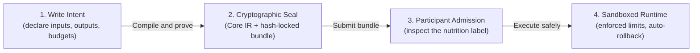

<details>
  <summary>Caption: Edict in ten seconds</summary>

  1. An author (human or AI agent) writes an *intent* declaring its inputs, outputs, effects, budget, and failure vocabulary.
  2. The compiler proves the declarations and produces a sealed, hash-identified contract bundle.
  3. A participant runtime inspects the bundle's machine-generated "nutrition label" and admits or rejects it under its own policy.
  4. If admitted, the runtime executes it inside a sandbox with enforced budgets and atomic rollback on obstruction.

  Stages 1 and the front half of stage 2 are implemented today (`v0.11.0-alpha.1`); admission execution and the runtime sandbox are roadmap items [claim:C06, confidence:1.0].

</details>

### 3.3 Where Edict sits in the stack

Edict is one layer of a larger ecosystem (Wesley, Continuum, Echo, git-warp, AION). GraphQL describes an operation's *shape*; Wesley compiles schemas and evidence; Edict describes what the operation is *actually allowed to do*; target profiles own storage models; Continuum owns participant admission policy; runtimes like Echo own execution [claim:C22, confidence:0.95].

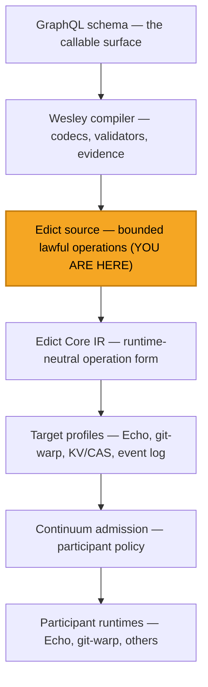

<details>
  <summary>Caption: The Continuum stack layering</summary>

  | Layer | Owns | Does not own |
  | --- | --- | --- |
  | GraphQL schema | Names, types, callable surface | Authority, effects |
  | Wesley | Codecs, validators, evidence artifacts | Operation semantics |
  | Edict source | Declared+proven operation authority | Storage model, policy |
  | Edict Core IR | Runtime-neutral semantics, canonical identity | Runtime nouns (no KV/SQL/graph/commit primitives) |
  | Target profiles | Storage model, intrinsics, cost/footprint algebras | Participant trust |
  | Continuum | Admission policy, capability delegation, revocation | Compilation |
  | Runtimes | Witnessed execution, receipts | Language semantics |

</details>

### 3.4 The workspace

The Rust workspace has exactly three members with a strict dependency direction: `edict-cli → edict-syntax` and `xtask → edict-syntax` [claim:C23, confidence:1.0]. Despite its name, `edict-syntax` is the implementation crate for far more than syntax — lexing, parsing, surface validation, authority facts, the compiler spine, Core IR, canonical encoding, target profiles, lowerability, Target IR, contract bundles, Gate C admission checks, and editor highlighting — a breadth the maintainers explicitly acknowledge as "current branch truth, not an endorsement of the name," with a recorded plan to split it into layered crates behind an umbrella [claim:C24, confidence:1.0]. It is about 11,400 lines of source plus a comparable volume of tests, with the CLI at about 2,000 lines [claim:C07, confidence:0.95].

---

## 4. Deep Dive: The Feature Landscape

### 4.1 The language surface

The v1 grammar admits one `package` declaration, then imports, then declarations (`type`, `enum`, `const`, `fn`, `intent` — with `const`/`fn` deferred in the current implementation), where an intent carries at-most-once clauses `profile`, `implements`, `basis`, `where`, `footprint`, `budget` [claim:C25, confidence:0.85]. The statement set is `let`, `assert`, `require`, `guarantee`, `record`, `if`, `for`, effect statements, and `return`; locals are immutable and there is no assignment statement [claim:C26, confidence:0.85].

The type system is bounded everywhere: scalars are `Bool`, `I32`/`I64`/`U32`/`U64`, `String`, `Bytes`, `Digest`, `Unit` (no floats); `String<max=N, canonical=nfc>` and `Bytes<max=N>` are refined scalar forms; `List<T, max=N>` and `Map<K, V, max=N>` require finite maxima; `Option<T>` provides optionality; integer literal width and signedness are hash-significant [claim:C27, confidence:0.85]. `len(String)` counts Unicode scalars and `len(Bytes)` counts bytes, with canonicalization applied before measuring [claim:C28, confidence:0.8].

The prelude is deliberately closed: `hash(label, value...)`, `canonicalEncode<T>`, `len`, `some`, `none`, `default`, `isSome`, `unwrap`, and overflow-safe `checkedAdd/Sub/Mul/Div/Rem -> Option<T>`; bare arithmetic is accepted only when statically proven not to overflow; there are no bitwise operators in v1 [claim:C29, confidence:0.8].

Four checked constructs are strictly role-separated [claim:C30, confidence:0.85]:

| Construct | Role | `else` clause? | Failure surface |
| --- | --- | --- | --- |
| `where` | Pure input refinement | Never | Platform `EDICT-INPUT-CONSTRAINT` |
| `require` | Precondition | Always (typed) | Domain obstruction |
| `guarantee` | Postcondition | Precommit form yes; verifier-discharged form no | Domain obstruction / proof obligation |
| `assert` | Proof-only | Never | Compilation fails if unprovable |

The only loop is `for x in collection bounded N`, and the compiler must *prove* the collection's max fits the bound statically — a runtime bound violation is defined as an integrity fault, never a silent truncation [claim:C31, confidence:0.85].

### 4.2 Effects: A-normal form and typed obstructions

Effectful calls may appear only as `let x = eff(...)` (optionally with an `else` obstruction handler) or as a bare effect statement — never nested inside arguments, conditions, record literals, or return expressions [claim:C32, confidence:0.95]. The parser enforces that a `let ... else` right-hand side is literally a call (`NonCallEffect` otherwise) [claim:C33, confidence:0.9]. Conditional effect values use a special branch-yield form legal only in `let` position, where each branch ends in a single `yield` and `return` is illegal inside [claim:C34, confidence:0.9]:

```graphql
let initialBlob = if len(initialBytes) == 0 {
  yield none<shape.TextBlob>();
} else {
  let blobRef = echo.ref<shape.TextBlob>(rope.textBlobId(initialBytes));
  let blob = blobRef.ensure({ ... }) else rope.TextBlobHashConflict;
  yield some(blob);
};
```

Failure is a typed outcome, not an exception: there is no `try`/`catch`, no `throw`, no `null`. Every effect's *domain-mappable* failure coordinates must be exhaustively mapped to typed obstructions; the single-obstruction `else X` shorthand is legal only when exactly one coordinate is unmapped, and writing a handler when zero remain is rejected as dead handling [claim:C35, confidence:0.85]. Five failure authority classes exist (`domainMappable`, `participantOwned`, `integrityFault`, `resourceFault`, `internalFault`) and only the first may be author-mapped [claim:C36, confidence:0.8].

### 4.3 Obstruction strands: failure that stays repairable

The newest language feature (unreleased, on `main`) is first-class **obstruction-strand** syntax: `require ... else continue obstructed { reason: ... }` [claim:C37, confidence:1.0]. Where a terminal obstruction collapses the attempt, `continue obstructed` preserves the blocked attempt as *repairable causal material* — the strand continues as "obstructed causal support" that later processes might repair. The form is contextual (only legal in a `require ... else` arm), requires exactly one `reason` field, and is threaded end-to-end: a distinct AST arm, a distinct Core IR failure arm, and a distinct Target IR failure disposition [claim:C38, confidence:0.95].

The accompanying design note formalizes a cross-project outcome taxonomy that must never collapse [claim:C39, confidence:0.9]:

1. **Not-admitted scheduler counterfactual** — the operation never ran.
2. **Admitted obstructed strand** — the operation ran and hit a preserved obstruction outcome.
3. **Hard rejection** — the operation was refused before admitted execution.

### 4.4 The compiler spine

Compilation is deliberately staged, and tests prove the stages do not collapse into one pass [claim:C40, confidence:0.9]:

```text
parse -> validate_surface -> resolve -> type_check -> lower_core -> canonicalize
```

Surface validation (`validate_surface`) is context-free over the AST and enforces seven stable rules: `UnboundedScalar`, `MissingOperationMode`, `MissingBudget`, `MissingBasis`, `DuplicateIntentClause`, `DuplicateName`, `ShadowedName` [claim:C41, confidence:0.95]. The compiler proper (`resolve_module → type_check → lower_core`, or `compile_to_core` in one call) consumes a `CompilerContext` of *authority facts* — operation profiles, profile write-class allowances, effect write classes, and budgets — and refuses to invent any fact it was not given: a missing fact is a `MissingContextFact` error, and an effect whose write class is outside the profile's allowance is a `ProfileEffectMismatch` [claim:C42, confidence:0.95]. Those facts can be loaded from digest-bound JSON authority-facts files whose sources must be `lawpack` or `targetProfile` identities locked to a SHA-256 digest, with stable failure kinds for malformed, non-digest-locked, or conflicting facts [claim:C43, confidence:0.95].

### 4.5 Core IR and canonical bytes

Core IR (`edict.core/v1`) is the runtime-neutral heart: a `CoreModule` holds imports, types, and intents in `BTreeMap`s (deterministic order), and each `CoreIntent` carries input/output types, the required operation profile, typed input constraints, a three-part evaluation budget (`maxSteps`, `maxAllocatedBytes`, `maxOutputBytes`), and a body of `Let`/`Require`/`Effect` nodes [claim:C44, confidence:0.95]. Local names are **alpha-normalized**: the compiler synthesizes position-derived ids (`arg.0`/`$arg0`, `local.{n}`/`$local{n}`, `obstruction.{n}`) so your variable names never influence the hash [claim:C45, confidence:0.95]. Source spans are deliberately stripped: if they were preserved, adding a comment would shift spans, change the Core bytes, and mutate the contract's cryptographic identity — the "formatting identity hazard" [claim:C46, confidence:0.95].

Canonical encoding is a strict CBOR subset (`edict.canonical-cbor/v1`): definite lengths only, minimal integer encodings, map keys sorted by their *encoded bytes*, duplicate keys rejected — and, unusually, canonicality is enforced on *decode* as well: the decoder re-encodes what it read and requires an exact byte match, so a non-canonical artifact cannot even be read as valid [claim:C47, confidence:0.95]. Every digest is domain-separated by hashing the canonical encoding of a frame `["edict.digest/v1", "<domain>", <value>]`, with domains like `edict.core.module/v1` and `edict.target-ir.artifact/v1`, and digests travel as typed `[algorithm, bytes]` pairs — hex strings like `sha256:...` are review-display forms, never hash inputs [claim:C48, confidence:0.95].

### 4.6 Target profiles, lowerability, and Target IR

Edict Core contains no storage nouns, so executing it requires **lowering** through a declared, digest-locked **target profile**. A v1 `TargetProfileManifest` declares its intrinsics, operation profiles, footprint and cost algebras, obstruction taxonomy, verifier, lowerer, sandbox, fuel model, and a fixed v1 application doctrine: `atomic` application, `application-snapshot` read consistency, `precommit-atomic` guard evaluation, and `no-visible-effects` rollback [claim:C49, confidence:0.95].

Before lowering, a typed **lowerability check** classifies each intent as `Native`, `Adapted`, or `Unsupported`. V1 is strict: an effect is either natively supported by a target intrinsic or discharged by *exactly one direct* lawpack adapter — adapter chains and composite discharge are rejected outright as future v2 work, ambiguity is an error, and unsupported means a loud compiler error rather than a silent approximation [claim:C50, confidence:0.95].

Two Target IR backends exist today [claim:C51, confidence:0.95]:

| Target profile | Target IR domain | Supports `require` guards? |
| --- | --- | --- |
| `echo.dpo@1` | `echo.span-ir/v1` | Yes |
| `gitwarp.ref_crdt@1` | `gitwarp.commit-reducer-ir/v1` | No |

Target IR lowering enforces sharp invariants: a `require` referencing a prior step's output, or appearing after any target step, is rejected — requirements are strictly *pre-effect* guards; effect intrinsics must be namespaced under the profile; every obstruction failure key must be a supported obstruction coordinate [claim:C52, confidence:0.9]. (The `kv.transactional@1` profile mentioned in the spec appears in the codebase only as a lowerability test exemplar, not as a shipped backend [claim:C53, confidence:0.95].)

### 4.7 Contract bundles: the two-digest identity

A contract bundle binds *everything*: source artifact digests, Core IR digest, target profile and Target IR digests, lawpack digests, compiler/lowerer/verifier identities, compile options, build provenance, canonicalization profile, conformance corpora, and verifier report [claim:C54, confidence:0.9]. Its identity is split into **two digests with different jobs** [claim:C55, confidence:0.95]:

| Digest | Domain | Binds | Purpose |
| --- | --- | --- | --- |
| `semanticBundleDigest` | `edict.bundle.semantic/v1` | Executable semantics only (Core, target profile, Target IR, lawpacks, semantic options...) — *not* toolchain identity | Two independent conforming lowerers should produce the *same* semantic digest |
| `releaseBundleDigest` | `edict.bundle.release/v1` | The semantic digest *plus* source provenance, toolchain identity, non-semantic options, build provenance | Full supply-chain identity; a comment-only edit moves this but not the semantic digest |

Mutation-sensitivity tests pin this byte contract: reordering preimage components changes the digest, `DigestList([A,B])` hashes differently from two separate `Digest` components (nesting is load-bearing), and changing a resource *coordinate* moves the digest even when artifact bytes are identical [claim:C56, confidence:0.95]. Bundles also structurally exclude admission artifacts — requests, receipts, policies, and signatures live *outside* the bundle so the same bundle can be submitted to many participants without recompilation [claim:C57, confidence:0.95].

### 4.8 Admission: Gate C

The Edict-owned admission boundary (`check_gate_c_invocation`) validates, in order: (1) the bundle and request are valid and the request's `bundleSubject` digest matches the bundle; (2) an admission receipt exists, validates against the request, and its decision is `Accepted`; (3) the invoked operation appears in both the requested and admitted operation sets; (4) a matching *Invocation* capability receipt exists — and a Registration receipt is explicitly *not* invocation authority [claim:C58, confidence:0.95]. Two more checks are philosophically central:

1. **Hidden execution inputs are rejected**: any runtime input classified as `HiddenHostInput` (hidden prompt state, DOM, filesystem, network, host callbacks, scheduler state) fails admission unless materialized as canonical input, witnessed evidence, admitted basis, or capability presentation [claim:C59, confidence:0.95].
2. **Receipt signature cycles are rejected**: the receipt body is hashed *before* any signing envelope, so a body that embeds its own signing envelope is structurally refused (`ReceiptSignatureCycle`) [claim:C60, confidence:0.9].

Amusingly, admission requests use a *second, independent* digest framing — a hand-rolled SHA-256 over length-prefixed, null-delimited label/value pairs — structurally different from the CBOR path, matching its different trust boundary [claim:C61, confidence:0.9].

### 4.9 The assurance trio: HOLMES, Watson, Moriarty

Three named *roles* (not just tools) operate over sealed bundles [claim:C62, confidence:0.95]:

| Role | Job | Signature artifact |
| --- | --- | --- |
| **HOLMES** | Assurance engine: evaluates every invariant over the SHA-locked bundle | *Lawfulness Certificate* — a structured record of what was checked and proven |
| **Watson** | Explainer/remediator: translates structured diagnostics into actionable guidance for humans and agents | Explanations and repair edits |
| **Moriarty** | Adversarial falsifier: mutates source, dependencies, orderings and checks the hashes move as expected | *Hash-Impact Matrix* |

The Hash-Impact Matrix is a genuinely novel QA artifact: for each mutation it records a vector across parse result, raw-source digest, Core IR digest, Target IR digest, both bundle digests, and both admission-receipt validities — e.g., a comment-only change must move the raw-source and release digests while leaving semantics intact ("there is no mysterious fourth result") [claim:C63, confidence:0.85]. If a source mutation *doesn't* change the Core hash, that is a canonicalization bug, not a feature. In the current codebase, assurance evidence exists as typed, hash-bound *references* on bundles — each `AssuranceEvidenceRef` binds a role, an artifact digest, the bundle subject, and the target profile/IR digests, and validation rejects any mismatch [claim:C64, confidence:0.95]. HOLMES/Watson/Moriarty engines themselves are not implemented here [claim:C65, confidence:0.95].

The related **Two-Lowerer Trial** requirement (`EDICT-CONFORMANCE-DIFFERENTIAL-001`) says a target profile or lawpack adapter is not stable until two *independently written* lowerer implementations produce byte-identical Target IR and verifier reports — a defense against compiler-backend exploitation [claim:C66, confidence:0.85].

### 4.10 Developer tooling and the CLI

The `edict` binary is machine-first: JSONL request records in, JSONL records out, nothing else — even `--help` and `--version` emit a structured `edict.cli.info/v1` record [claim:C16, confidence:1.0]. Input kinds are inline `source`, `path`, `pathList`, `directory`, and `glob`, with mutually exclusive field sets; stdin is bounded (8 MiB default, env-overridable); and an optional `inputRoot` confines all path-like inputs via canonicalization, rejecting escapes with `InputPathOutsideRoot` — glob patterns are checked by canonicalizing the literal prefix before any wildcard [claim:C67, confidence:0.95]. Five JSON Schemas for the stream record families are checked into `docs/schemas/` and golden CLI fixtures are replayed byte-for-byte through the binary [claim:C68, confidence:0.9].

An unreleased `project` operation adds editor-facing projection: it accepts dirty (unsaved) source records and emits syntax spans, diagnostics, Core review JSON with canonical digest, and Target IR review JSON with digest — with compiler failures modeled as *projection data* on stdout rather than CLI transport failures [claim:C69, confidence:0.95]. Editor support also includes a lexical `highlight_source` API, a Tree-sitter grammar with corpus tests, a TextMate grammar, and a thin VS Code/Cursor extension [claim:C70, confidence:0.9].

### 4.11 Engineering discipline as a feature

The repository's process is unusually explicit. Release gates require that "No canonical digest is frozen from a paper encoding plan. Meaning freezes before bytes; bytes freeze before hashes; hashes freeze before admission" [claim:C71, confidence:1.0]. The requirements registry (`docs/REQUIREMENTS.md`) is a "fixture constitution" — every normative requirement has a stable ID (families like `EDICT-LANG-*`, `EDICT-CORE-*`, `CONTINUUM-*`), positive and negative fixtures, and a status ladder `spec → fixture → golden → impl`; its motto: "A requirement without a fixture is advisory. A fixture without a requirement is folklore." [claim:C72, confidence:0.85]. Wire-visible error codes are produced by exhaustive Rust matches so a renamed enum variant *cannot* silently change the CLI contract [claim:C73, confidence:0.95]. Every release's notes state what is claimed *and what is explicitly not claimed* [claim:C74, confidence:1.0]. CI runs fmt/clippy/tests on both MSRV (1.85.0) and stable, plus a `cargo-deny` supply-chain job for advisories, licenses, bans, and sources [claim:C75, confidence:1.0].

---

## 5. Plain-English Walkthrough

### TLDR

**Edict is a small, deliberately weak programming language whose compiler produces cryptographically sealed "operation contracts" instead of executables.** You write an *intent* that says "here is exactly what I read, write, spend, and how I can fail, under these hash-pinned rules." The compiler proves every claim, strips away anything cosmetic, and hashes what remains into an identity that changes if *anything meaningful* changes. A runtime later reads that contract like a nutrition label and decides — under its own policy — whether to run it. Nothing hidden can influence execution: no clock, no randomness, no host state, no silent dependency upgrades. Today (v0.11.0-alpha.1) the language, compiler-to-Core, canonical hashing, two lowering backends, bundle assembly, and admission-boundary *checks* are real, tested Rust; the runtime and policy engines are the next acts [claim:C06, confidence:1.0].

### Glossary

| Terminology | Definition | Remarks |
| --- | --- | --- |
| **FIDLAR** | "Footprints Ignored; Developer Lies About Risk" — the gap between what a function's name promises and what its process can actually do | The founding villain of the project; also an invariant (I-007 "FIDLAR Rejection") [claim:C02, confidence:1.0] |
| **Intent** | Edict's unit of execution: an operation declaring bounded inputs/outputs, basis, budget, footprint, profile, and failure mapping | Replaces "function"; modeled as an *optic* [claim:C03, confidence:1.0] |
| **Aperture** | The bounded set of state an intent may read or write; in Observer Geometry terms, the *projection* — what history detail is visible to the observer | Reaching outside it is a compile-time rejection [claim:C76, confidence:0.9]. Theory keeps aperture (what is visible) orthogonal to basis (how it is expressed / where it is judged) [claim:T02, confidence:0.8] |
| **Basis** | The causal-history anchor an intent reads from — theory calls this the *bounded basis* an admission is "judged against under explicit law," resolved to a coordinate in causal history | Must be declared, even as `basis none`; evaluated in the pure pre-body environment [claim:C12, confidence:0.9]. In the Continuum API this is the Coordinate, with determinism laws applying to the *resolved* coordinate receipt, not the request [claim:T03, confidence:0.8] |
| **Footprint** | The read/write/delete contact set of an operation — descended from the delete/use sets of double-pushout graph rewriting, where footprint disjointness is the formal test for safe concurrency | "Delete–use interference is the only sin"; footprint honesty (computed ≤ declared) is Edict invariant I-006 [claim:T04, confidence:0.85] |
| **WARP graph** | The substrate state object: a recursively nested graph where every node and edge can carry another WARP graph, bottoming out at atoms | "Graphs all the way down — but with a floor." Paper VII then demotes it: the graph is a coordinate chart over history, not the territory [claim:T05, confidence:0.85] |
| **Hologram / boundary shell** | A witness-bearing boundary artifact sufficient to verify, replay, transport, or selectively reveal a slice of history without exposing its interior | The contract bundle is Edict's hologram; its direct theoretical ancestor is the content-addressed Boundary Transition Record (BTR) [claim:T06, confidence:0.85] |
| **Support ledger** | A four-compartment evidence ledger tracking how support for a claim travels: *carried*, *declared-lost*, *blocked*, *refuting* | Distinct from the footprint (resource contact) — this tracks evidence and trust, not reads/writes [claim:T07, confidence:0.85] |
| **Witness debt** | The gap between what a system *claims* (emitted report) and what it can *prove* (justified status) | The theory defines hallucination structurally as overreporting beyond carried support [claim:T08, confidence:0.85] |
| **Four-outcome law** | Lowering a slice of claims under an admissibility law returns one of four honest outcomes: `Derived`, `Plural`, `Conflict`, `Obstruction` — plurality and conflict are lawful results, not errors | From Continuum (Paper VIII); explains the README's "accept · reject · obstruct · pluralize" admission phrasing [claim:T09, confidence:0.85] |
| **Lawpack** | A digest-locked, authority-free package of pure helpers, typed constants, semantic effect signatures, obstructions, and target adapters | "Domain law" — imported with `use lawpack ... digest "sha256:..."` [claim:C77, confidence:0.9] |
| **Target profile** | A digest-locked description of a runtime: its intrinsics, write classes, cost/footprint algebras, verifier, sandbox | Owns the storage model so Core doesn't have to [claim:C49, confidence:0.95] |
| **Core IR** | The runtime-neutral compiled form (`edict.core/v1`) — no storage nouns, no spans, alpha-normalized names | The thing that gets hashed [claim:C44, confidence:0.95] |
| **Target IR** | Runtime-owned lowered form (e.g. `echo.span-ir/v1`) | Produced by lowering Core through a profile [claim:C51, confidence:0.95] |
| **Obstruction** | A typed, named domain failure outcome (not an exception) | Callers match on it; agents can react to it programmatically [claim:C35, confidence:0.9] |
| **Obstruction strand** | A blocked attempt preserved as repairable causal material via `continue obstructed` | Newest feature; distinct from terminal obstruction [claim:C37, confidence:1.0] |
| **Contract bundle** | The sealed, participant-neutral output artifact binding every layer by digest | Has *two* identities: semantic and release [claim:C55, confidence:0.95] |
| **Nutrition label** | Machine-generated summary of what a bundle is declared to do | Generated from the artifact, never hand-maintained [claim:C78, confidence:0.9] |
| **Admission (Gate C)** | The boundary where a participant decides to accept/reject a bundle for execution | Edict validates shapes and bindings; participants own policy [claim:C58, confidence:0.95] |
| **Authority facts** | Digest-bound compiler context (profiles, budgets, write classes) loaded from files | The compiler invents no facts [claim:C43, confidence:0.95] |
| **Write class** | The kind of state change an effect makes: `none/read/create/ensure/append/replace/delete/custom` | Profiles allow sets of write classes; mismatches fail compilation [claim:C79, confidence:0.95] |
| **HOLMES / Watson / Moriarty** | Assurance roles: certifier, explainer, adversarial falsifier | Roles, not just tools — any conforming engine may fill them [claim:C62, confidence:0.95] |
| **YOLO lane** | Codename for `continuum.lane.lawful-autonomous/v1`: "You Only Lawfully Operate" | Agents run autonomously only after full verification and admission [claim:C05, confidence:0.97] |
| **Canonical CBOR** | The strict deterministic byte encoding (`edict.canonical-cbor/v1`) used for all hashing | Canonicality enforced on decode too [claim:C47, confidence:0.95] |
| **Digest lock** | Pinning any dependency reference to `sha256:<64 hex>` | Pervasive: imports, facts, adapters, bundle layers [claim:C09, confidence:1.0] |
| **Two-Lowerer Trial** | Requiring two independent lowerer implementations to produce byte-identical output before a profile is trusted | Anti-compiler-exploit measure [claim:C66, confidence:0.85] |

### Concept map

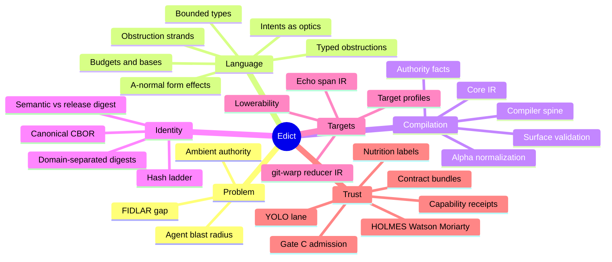

<details>
  <summary>Caption: Edict concept map</summary>

  The project decomposes into six conceptual clusters. **Problem** motivates everything: functions lie about their footprint. **Language** is what authors touch: intents with bounded types, sequenced effects, and typed failure. **Compilation** turns source into a runtime-neutral Core IR using only externally supplied, digest-bound facts. **Identity** makes every artifact hash-stable and mutation-sensitive. **Targets** map neutral Core onto real runtimes without contaminating it. **Trust** is the outer loop: sealed bundles, machine-readable labels, participant admission, and adversarial assurance.

</details>

### Walkthrough

This walkthrough introduces the system progressively: first the problem, then the language, then what the compiler builds, then how identity works, then how trust and execution are decided.

#### 5.1 Level 0 — The problem: your functions can do anything

Consider a normal TypeScript function that reads a message thread. Nothing stops it from reading the payments table, calling an external API, or deleting users — its *real* capability is everything the process can do. The only enforcement is code review and luck. The README's framing: the function's declared authority and its actual authority "are two completely different things, and nothing verifies that they match" [claim:C80, confidence:1.0].

This becomes acute with AI agents: hand an agent a "read messages" tool and its actual capability is "anything the process was granted." Conventional mitigations (allowlists, prompt instructions, after-the-fact log review) are enforced at the *call site* while the function retains ambient authority [claim:C81, confidence:1.0].

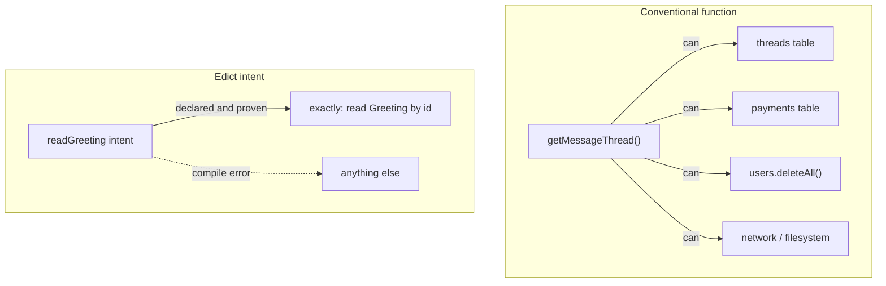

<details>
  <summary>Caption: Ambient authority vs declared-and-proven authority</summary>

  1. The conventional function's name says "read a message thread," but the process grants it reach into every table, the network, and the filesystem — the FIDLAR gap.
  2. The Edict intent must declare its exact read (a `Greeting` node by id) and the compiler proves the body stays within that declaration.
  3. Any attempt to reach further is not caught at runtime — it fails to *compile*, so the artifact never exists [claim:C03, confidence:1.0].

</details>

#### 5.2 Level 1 — The language: writing an intent

An intent looks like a function but reads like a contract. Here is the effectful fixture that actually compiles in the repo today [claim:C82, confidence:1.0]:

```graphql
package examples.greeting@1;

use shape "schemas/greeting.graphql" as shape;
use lawpack greeting.optics@1 digest "sha256:00000000...00000000" as greetingLaw;
use target echo.dpo@1 digest "sha256:11111111...11111111" as echo;

intent readGreeting(input: shape.ReadGreetingInput)
  returns shape.GreetingReading
  profile echo.readOnly
  basis input.greetingId
  budget <= greetingLaw.readGreetingBudget
{
  let greetingRef = echo.ref<shape.Greeting>(input.greetingId);
  let greeting = greetingRef.read()
    else greetingLaw.GreetingMissing;

  return {
    greetingId: input.greetingId,
    message: greeting.message,
  };
}
```

##### 5.2.1 The three import kinds

| Import | What it brings | Digest-locked? |
| --- | --- | --- |
| `use shape "..."` | GraphQL type definitions — Edict compiles *against* your schema rather than owning it | Path-referenced |
| `use lawpack ...` | Domain law: pure helpers, effect signatures, obstruction types, budgets | Yes, mandatory in bundles |
| `use target ...` | The runtime profile this intent lowers through | Yes, mandatory in bundles |

A fourth kind, `use capability`, exists in product sketches but is *rejected* by the v1 parser as unsupported syntax — a nice example of the project encoding its own deferrals as errors rather than silence [claim:C83, confidence:0.95].

##### 5.2.2 Effects must queue up single-file

Edict enforces **A-normal form**: every effect binds to its own `let` before anything can use the result. `let z = hash(foo.read(), bar.create(...))` is rejected — you cannot tell which effect runs first or whether failures are handled. The required shape makes effect order and failure handling legible to the compiler, to tooling, and to human reviewers directly from the artifact [claim:C32, confidence:0.95].

##### 5.2.3 Failure has a type

`greetingRef.read() else greetingLaw.GreetingMissing` maps the read's failure to a *domain* outcome from the lawpack, not a runtime error from the target. An agent receiving `GreetingMissing` (or `EntryObstruction.StaleBase`) knows exactly what happened and can decide to refresh, escalate, or abandon — no stack-trace parsing [claim:C84, confidence:0.95].

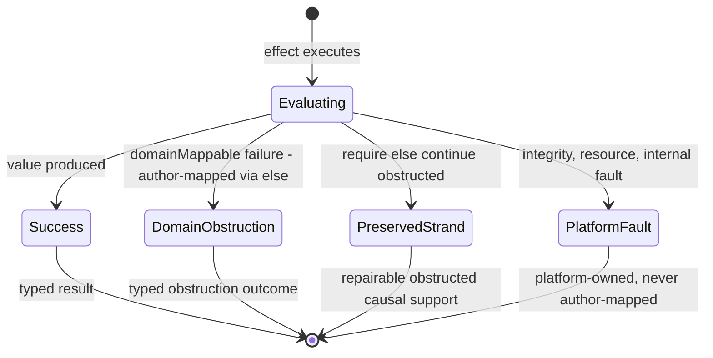

<details>
  <summary>Caption: Outcome states of an Edict effect</summary>

  1. An effect begins evaluating with its declared inputs.
  2. On success it yields a typed value bound by `let`.
  3. A `domainMappable` failure routes through the author's `else` mapping into a typed domain obstruction — an expected outcome callers match on.
  4. A `require ... else continue obstructed { reason: ... }` failure does not terminate the story: the attempt is preserved as an obstructed strand that later processes may repair [claim:C37, confidence:1.0].
  5. Integrity, resource, and internal faults belong to the platform's failure classes and can never be author-mapped [claim:C36, confidence:0.8].

</details>

#### 5.3 Level 2 — What the compiler builds

##### 5.3.1 The staged pipeline

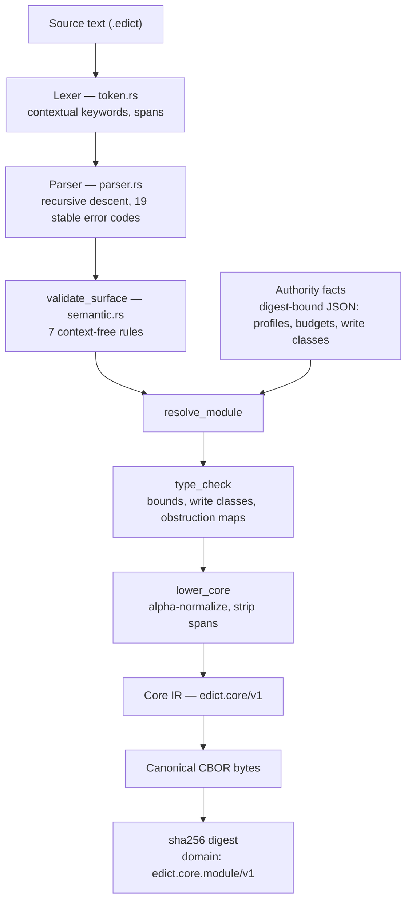

<details>
  <summary>Caption: The compiler spine from source to Core digest</summary>

  1. The lexer produces tokens; keywords are ordinary identifiers resolved contextually by the parser, so you may name a field `max` or `type` [claim:C85, confidence:0.95].
  2. The recursive-descent parser builds the AST with 19 stable error kinds whose wire codes are locked by exhaustive matches [claim:C73, confidence:0.95].
  3. `validate_surface` enforces context-free rules (bounded scalars, mandatory budget/basis/mode, no shadowing) before any imports are resolved [claim:C41, confidence:0.95].
  4. Resolution consumes digest-bound authority facts; the compiler never invents a profile, budget, or write class [claim:C42, confidence:0.95].
  5. Type checking verifies bounds arithmetic, profile/effect write-class compatibility, and obstruction-map exhaustiveness for the supported subset.
  6. Lowering produces Core IR with alpha-normalized locals and no source spans, then canonical CBOR encoding and a domain-separated SHA-256 digest fix its identity [claim:C45, confidence:0.95] [claim:C48, confidence:0.95].

</details>

##### 5.3.2 Core IR, structurally

```mermaid
classDiagram
    class CoreModule {
      api_version: edict.core/v1
      coordinate
      imports: Vec~CoreImport~
      types: BTreeMap
      intents: BTreeMap
      required_core_capabilities
    }
    class CoreImport {
      kind: Lawpack|Target|Core
      resource: ResourceRef
      alias
    }
    class ResourceRef {
      coordinate
      digest: Option~sha256~
      is_digest_locked()
    }
    class CoreIntent {
      input / output
      required_operation_profile
      input_constraints
      core_evaluation_budget
      body: CoreBlock
    }
    class CoreBudget {
      max_steps
      max_allocated_bytes
      max_output_bytes
    }
    class CoreBlock {
      locals
      nodes: Vec~CoreNode~
      result
    }
    class CoreNode {
      <<enum>> Let | Require | Effect
    }
    class EffectNode {
      binding: LocalRef
      effect coordinate
      input: CoreExpr
      obstruction_map: BTreeMap
    }
    class CoreObstructionArm {
      binder: LocalRef
      value: CoreExpr
    }
    class LocalRef {
      id: "arg.0" | "local.n" | "obstruction.n"
      alpha_name: "$arg0" | "$local{n}"
      ty
    }

    CoreModule --> CoreImport
    CoreImport --> ResourceRef
    CoreModule --> CoreIntent
    CoreIntent --> CoreBudget
    CoreIntent --> CoreBlock
    CoreBlock --> CoreNode
    CoreNode --> EffectNode
    EffectNode --> CoreObstructionArm
    CoreObstructionArm --> LocalRef
```

<details>
  <summary>Caption: Core IR class structure (as implemented in core_ir.rs)</summary>

  | Type | Role |
  | --- | --- |
  | `CoreModule` | The hashable unit; `BTreeMap` collections give deterministic iteration order for free [claim:C44, confidence:0.95] |
  | `ResourceRef` | Every external reference carries a coordinate plus an optional digest; `is_digest_locked()` demands a valid `sha256:` review digest |
  | `CoreIntent` | Carries the contract (profile, constraints, budget) alongside the body |
  | `CoreBudget` | The portable three-axis budget: steps, peak allocated bytes, output bytes [claim:C86, confidence:0.9] |
  | `CoreNode::Effect` | The semantic effect node: a binding, an effect coordinate, one input, and a `BTreeMap` obstruction map |
  | `LocalRef` | Alpha-normalized: ids are position-derived (`arg.0`, `local.3`, `obstruction.1`), so renaming a source variable cannot change the hash [claim:C45, confidence:0.95] |

</details>

#### 5.4 Level 3 — Identity: how hashing actually works

##### 5.4.1 The hash ladder

Every layer freezes before the next may claim it. The assurance guide names this the **hash ladder** [claim:C87, confidence:0.8], and the ROADMAP enforces the ordering as a release gate: "Meaning freezes before bytes; bytes freeze before hashes; hashes freeze before admission" [claim:C71, confidence:1.0].

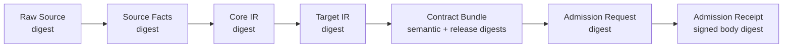

<details>
  <summary>Caption: The hash ladder</summary>

  1. Raw source bytes are digested (formatting-sensitive by nature).
  2. Source facts (profiles, budgets, write classes) are digested from their digest-bound files.
  3. Core IR is digested from canonical CBOR under domain `edict.core.module/v1` — formatting-insensitive because spans are stripped and names alpha-normalized [claim:C46, confidence:0.95].
  4. Target IR is digested under `edict.target-ir.artifact/v1`.
  5. The bundle computes its semantic digest (executable meaning) and then its release digest (meaning + provenance + toolchain); release references semantic, never the reverse [claim:C55, confidence:0.95].
  6. Admission requests digest the bundle subject and request fields under `edict.admission-request/v1`.
  7. Receipts hash their body before any signature envelope — signatures live outside the body, preventing cycles [claim:C60, confidence:0.9].

</details>

##### 5.4.2 Why two bundle digests?

Because "did the meaning change?" and "did the supply chain change?" are different questions. A comment-only edit should invalidate release-level receipts (the source changed) while leaving semantic-level attestations valid (the meaning didn't). Moriarty's hash-impact matrix makes exactly this distinction testable [claim:C63, confidence:0.85]. The split also enables the two-lowerer check: two independent conforming toolchains should agree on the *semantic* digest while differing on the release digest [claim:C55, confidence:0.95].

#### 5.5 Level 4 — Targets: from neutral Core to a real runtime

Core IR deliberately contains no storage nouns — "Core contains laws of physics, not furniture," as the spec puts it [claim:C88, confidence:0.85]. Execution requires lowering through a target profile, and lowerability is decided first, as a typed question:

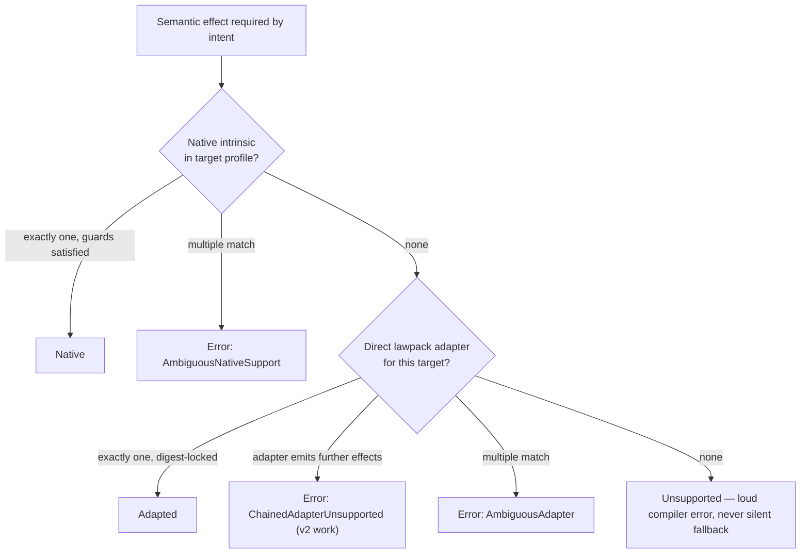

<details>
  <summary>Caption: V1 lowerability classification decision tree</summary>

  1. For each semantic effect, the checker first looks for a native target intrinsic; exactly one must match with its guard requirements satisfied at that specific effect [claim:C50, confidence:0.95].
  2. If none is native, exactly one *direct*, digest-locked lawpack adapter may discharge the effect.
  3. Adapter chains (an adapter that emits further semantic effects) are rejected as `ChainedAdapterUnsupported` — obligation-closure resolution is explicitly deferred to a v2 design track [claim:C89, confidence:0.9].
  4. Ambiguity in either lane is an error; zero support is a loud `Unsupported` error. There is no silent approximation anywhere in the tree [claim:C50, confidence:0.95].

</details>

The two shipped backends make the neutrality concrete: the same Core module lowers to `echo.span-ir/v1` for the Echo runtime and to `gitwarp.commit-reducer-ir/v1` for git-warp — and the git-warp profile honestly declares it does not support `require` guards, so intents using them refuse to lower rather than degrade [claim:C51, confidence:0.95].

#### 5.6 Level 5 — Trust: bundles, admission, and the YOLO lane

##### 5.6.1 The bundle as an artifact graph

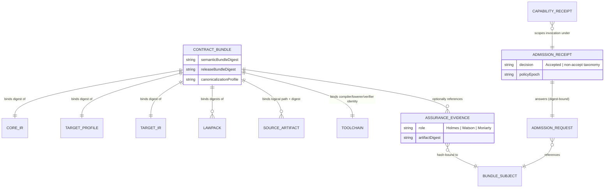

<details>
  <summary>Caption: The contract-bundle artifact graph</summary>

  | Relationship | Rule |
  | --- | --- |
  | Bundle → Core/Target IR/profile/lawpacks | Every reference is digest-locked; an undigested resource fails validation [claim:C54, confidence:0.9] |
  | Bundle → toolchain | Compiler, lowerer, and verifier identities are coordinate+digest bound into the *release* preimage only [claim:C55, confidence:0.95] |
  | Bundle → assurance evidence | Optional HOLMES/Watson/Moriarty references must match the bundle subject and target digests exactly, or validation fails [claim:C64, confidence:0.95] |
  | Bundle ↛ admission artifacts | Requests, receipts, policies, signatures are structurally excluded — the bundle stays participant-neutral [claim:C57, confidence:0.95] |
  | Receipt → request | The receipt body embeds the request digest and echoes the bundle subject; admitted operations/capabilities must be subsets of what was requested [claim:C90, confidence:0.9] |

</details>

##### 5.6.2 The YOLO lane, step by step

```mermaid
sequenceDiagram
    autonumber
    actor Agent
    participant Compiler as Edict Compiler + Lowerer + Verifier
    participant HOLMES
    participant Participant as Participant Runtime (Gate C)
    participant Runtime as Sandboxed Target Runtime

    Agent->>Compiler: submit Edict source
    Compiler->>Compiler: prove footprint, budget, effects, obstructions
    Compiler-->>Agent: sealed Contract Bundle (semantic + release digests)
    Agent->>HOLMES: request assurance
    HOLMES-->>Agent: Lawfulness Certificate (hash-bound evidence)
    Agent->>Participant: admission request (bundleSubject digest)
    Participant->>Participant: policy evaluation (participant-owned)
    Participant-->>Agent: signed admission receipt (Accepted)
    Agent->>Participant: invoke operation + invocation capability receipt
    Participant->>Participant: Gate C checks (subject, operation, capability, no hidden inputs)
    Participant->>Runtime: execute admitted bundle
    Runtime-->>Agent: typed outcome (reading | receipt | obstruction | preserved strand)
```

<details>
  <summary>Caption: Lawful-autonomous execution ("YOLO lane") end to end</summary>

  1. The agent does not run code — it submits source to the compiler [claim:C91, confidence:0.95].
  2. The compiler proves the declared footprint, budget, effect ordering, and obstruction coverage; failures are structured diagnostics (Watson's raw material).
  3. The output is a sealed bundle whose two digests fix its identity.
  4. HOLMES (any conforming assurance engine) evaluates the full bundle and issues a Lawfulness Certificate [claim:C62, confidence:0.95].
  5. The agent submits an admission request that names the bundle subject by digest.
  6. Policy is entirely participant-owned — Edict deliberately does not implement it [claim:C92, confidence:0.95].
  7. A signed receipt with decision `Accepted` comes back (or a non-accept taxonomy).
  8. Invocation additionally requires a matching *invocation* capability receipt — registration evidence is not invocation authority [claim:C58, confidence:0.95].
  9. Gate C re-validates everything and rejects hidden host inputs [claim:C59, confidence:0.95].
  10. The runtime executes with enforced budgets; the outcome is typed, including the possibility of a preserved obstruction strand.

  Steps 1–3 and the *validation* halves of steps 5–9 exist in code today; HOLMES, policy engines, and runtime execution are roadmap [claim:C06, confidence:1.0].

</details>

##### 5.6.3 What admission actually decides

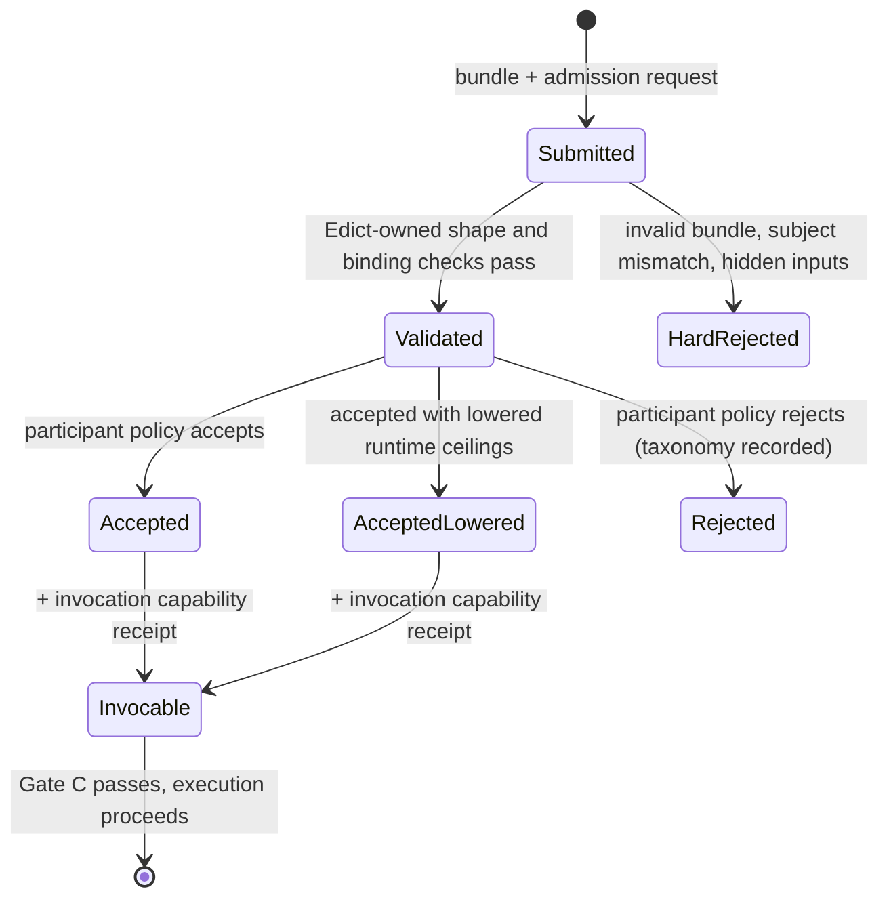

<details>
  <summary>Caption: Admission decision states</summary>

  1. A submission pairs a participant-neutral bundle with a participant-specific admission request.
  2. Edict-owned validation checks bundle validity, subject-digest match, operation binding, and hidden-input rejection; structural failures never reach policy [claim:C58, confidence:0.95].
  3. Participant policy may accept, reject (recording an obstruction/rejection taxonomy), or accept while *lowering* admitted runtime ceilings — there is no "pluralize" outcome in the admission spec [claim:C93, confidence:0.85].
  4. Even an accepted operation is not invocable until a matching invocation capability receipt is presented; capability expiry uses participant policy epochs, not wall-clock time [claim:C94, confidence:0.8].

</details>

#### 5.7 Level 6 — The CLI session, concretely

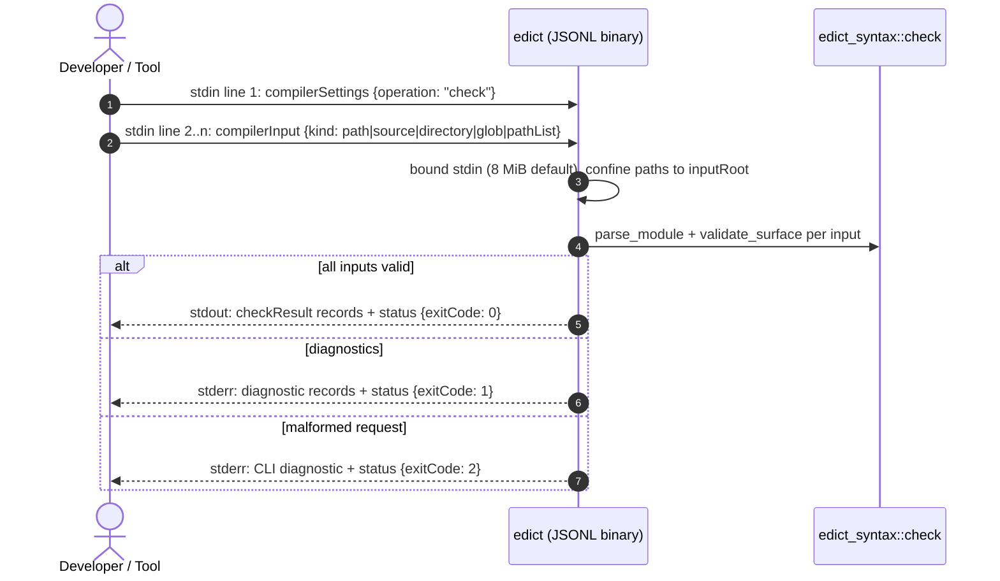

<details>
  <summary>Caption: One edict check session over the JSONL protocol</summary>

  1. The request is exactly one `edict.compiler.settings/v1` record followed by one or more `edict.compiler.input/v1` records, one JSON object per line [claim:C95, confidence:0.95].
  2. Before parsing anything, the CLI bounds stdin (default 8 MiB, `EDICT_CLI_MAX_STDIN_BYTES` override) and, when `inputRoot` is set, canonicalizes and confines every path-like input, rejecting escapes — including glob patterns, whose literal prefix is canonicalized before any wildcard [claim:C67, confidence:0.95].
  3. Each input runs through the same library entry point the public API exposes (`check` = `parse_module` then `validate_surface`) [claim:C96, confidence:0.95].
  4. Results, diagnostics, and a terminal status record are all typed JSONL with checked-in JSON Schemas; exit codes are `0` ok, `1` compiler diagnostics, `2` invalid CLI input [claim:C16, confidence:1.0].

</details>

#### 5.8 Level 7 — The theory beneath it all

Everything above has a formal ancestry: the eight-paper **AION Foundations** series (WARP graphs), the three-paper **Observer Geometry** series, and the **Continuum** protocol work. You do not need the theory to *use* Edict, but nearly every load-bearing Edict noun turns out to be a precise term of art rather than a metaphor. The core inversion: **history (the causal graph of transformations) is the primary, immutable artifact, and current "state" is a materialized view projected from it** [claim:T10, confidence:0.85]. Paper VII compresses the whole architecture into one repeated act — *"Slice. Lower. Witness. Retain."* — and then delivers the series' most striking demotion: *the graph is a coordinate chart over causal history; there is no privileged, substrate-owned graph.* What is real is witnessed causal history; "the graph," "the state," "the database" are readings an observer emits over it [claim:T05, confidence:0.85].

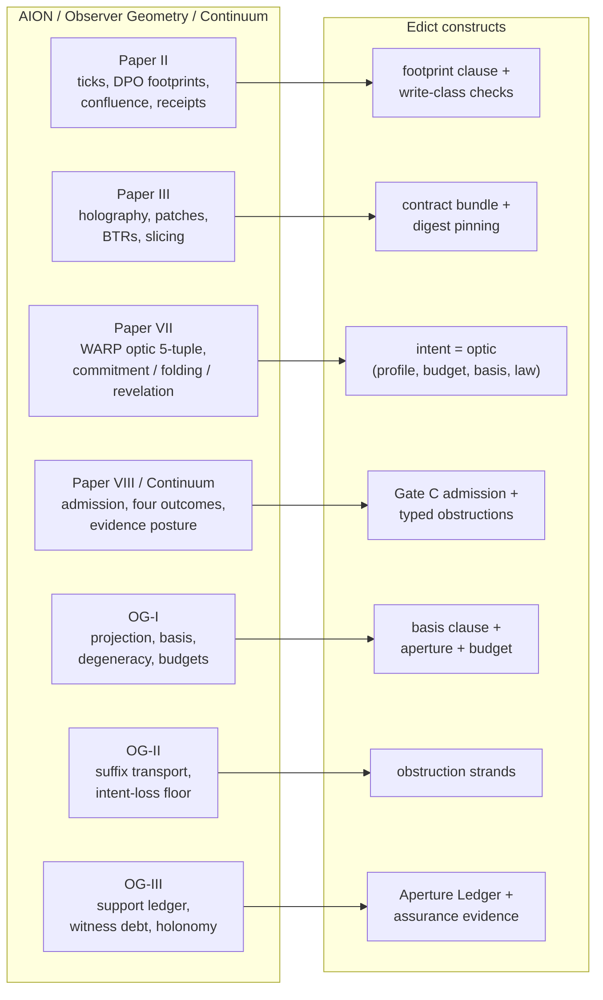

<details>
  <summary>Caption: Which theory papers ground which Edict constructs</summary>

  | Theory source | What it defines | The Edict construct it grounds |
  | --- | --- | --- |
  | Paper II (ticks) | Read/write (delete/use) footprints as the formal independence test for safe concurrency; tick confluence; deterministic scheduler; descriptive receipts | The `footprint` clause, write-class checking, and determinism-as-contract. FIDLAR's "Footprints Ignored" is a literal Paper II accusation, not a metaphor [claim:T04, confidence:0.85] |
  | Paper III (holography) | The bulk/boundary split: full history reconstructible from initial state + tick patches; the prescriptive patch ("what happened") vs descriptive receipt ("why") split; content-addressed Boundary Transition Records | The contract bundle (Edict's BTR/hologram), the hash ladder, and the intent/witness envelope separation. The "anti-tautology" — holography holds only when patches pin every choice — is the formal reason Edict digest-locks lawpacks, targets, and bases [claim:T06, confidence:0.85] [claim:T11, confidence:0.8] |
  | Paper VII (optics) | The WARP optic five-tuple; the one act at every scale; the commitment/folding/revelation plane split; "there is no graph" | The intent as optic; the revelation-vs-affect intent classes; runtime-neutral Core ("no storage nouns" because storage is a *reading*, not a substrate) [claim:T01, confidence:0.85] |
  | Paper VIII (Continuum) | Admission as "a runtime-owned, witnessed act judged against a bounded basis under explicit law"; four canonical outcomes `Derived / Plural / Conflict / Obstruction`; evidence posture lattice; obstruction witnesses as "causal teaching artifacts" for agents | Gate C, typed obstruction outcomes, the participant-neutral bundle, and the whole YOLO lane posture [claim:T09, confidence:0.85] [claim:T12, confidence:0.8] |
  | OG-I | Projection (aperture) vs basis (native expression) vs accumulation as orthogonal observer axes; degeneracy; budget elasticity | The `basis` and `budget` clauses; why aperture and basis are separate declarations [claim:T02, confidence:0.8] |
  | OG-II | Suffix transport without rollback; the last-write-wins "intent-recovery insufficiency floor" — silent merges permanently erase intent | Obstruction strands: preserving a blocked attempt as first-class causal material is exactly how a system avoids the insufficiency floor [claim:T13, confidence:0.8] |
  | OG-III | The four-compartment support ledger (carried/declared-lost/blocked/refuting); witness holonomy (loop defect); witness debt; hallucination as structural overreport | The Aperture Ledger's support-carried/lost/blocked/refuting fields and witness-debt vocabulary in the Edict spec [claim:T07, confidence:0.85] [claim:T08, confidence:0.85] |

</details>

Three consequences of the theory are worth spelling out, because they sharpen claims made earlier in this report:

1. **"Pluralize" is not a README typo.** This report's first revision flagged the README's "accept · reject · obstruct · pluralize" admission phrasing as unevidenced, because the Edict repo's admission spec models accept/reject/lower-ceilings. The theory resolves it: Continuum's lowering law returns four honest outcomes — `Derived`, `Plural`, `Conflict`, `Obstruction` — where *plural is a lawful result, not a merge failure*. The Edict-repo admission spec simply has not absorbed that outcome axis yet; the README line is fidelity to Paper VIII, not aspiration [claim:T09, confidence:0.85].
2. **Determinism is conditional, and the conditions are exactly what Edict pins.** In Paper II, a state admits many candidate rewrites; determinism holds once the batch (scheduler policy) is fixed. In the Continuum API, determinism laws apply to the *resolved* coordinate, not the request. Edict's obsessive digest-locking of lawpacks, target profiles, bases, and compiler facts is the language-level enforcement of those conditions — the "anti-tautology" that a sealed artifact only means replay if its boundary is sufficient and stable [claim:T11, confidence:0.8] [claim:T03, confidence:0.8].
3. **Obstruction is pedagogy, not just failure.** Continuum frames the machine-readable obstruction witness as a "causal teaching artifact" that an agent uses to refine its next attempt. That reframes Edict's typed obstructions and obstruction strands: they are the feedback channel of the lawful-autonomous loop, which is why they must be typed, structured, and preserved rather than collapsed into exceptions [claim:T12, confidence:0.8].

There is also real Edict source circulating in the theory corpus itself — a `task.edit_document@1` intent with a `require jim.basisFresh(input.basis) else ... StaleBase` optimistic-concurrency guard and a typed `EditReceipt | EditObstruction` return union — confirming that the README's aspirational `createEntry` example reflects a syntax already being exercised in cross-project design work [claim:T14, confidence:0.8].

---

## 6. Unique Aspects and Cool Technical Details

Beyond the headline design, the codebase is full of small, sharp decisions worth calling out.

| # | Detail | Why it's cool |
| --- | --- | --- |
| 1 | **Keywords aren't reserved** — the lexer emits plain `Ident` tokens for everything and the parser resolves keywords contextually, so `input.type` and a field named `max` just work [claim:C85, confidence:0.95] | Solves an everyday API-design annoyance with lexer simplicity, at the cost of "defensive identifier peeking" |
| 2 | **Adjacency-locked versions** — `examples.hello@1.2.3-beta` must contain zero whitespace; the parser detects gaps by comparing adjacent token spans (`span.start != end`) [claim:C97, confidence:0.95] | Version numbers can never be misparsed as arithmetic (`major.minor - beta`); the same span-adjacency trick disambiguates generics `<T>(...)` from less-than comparisons |
| 3 | **Canonicality enforced on decode** — the decoder re-encodes and byte-compares, rejecting non-minimal integers and unsorted maps [claim:C47, confidence:0.95] | Most systems only *produce* canonical output; Edict refuses to even *read* a non-canonical artifact |
| 4 | **The lexer stays total on unknown integer suffixes** by rewinding and letting the parser flag them [claim:C98, confidence:0.9] | Clean separation: lexing never fails on judgment calls that belong to the grammar |
| 5 | **Wire codes locked by exhaustive matches** — every diagnostic `code()` is a full `match`, with round-trip tests [claim:C73, confidence:0.95] | Renaming a Rust enum variant becomes a compile error rather than a silent protocol break |
| 6 | **Two structurally different digest framings** — canonical-CBOR frames for artifacts vs a hand-rolled length-prefixed framing for admission requests [claim:C61, confidence:0.9] | Framing follows trust boundary; both are domain-separated |
| 7 | **Nesting is load-bearing in preimages** — tests assert `DigestList([A,B])` hashes differently from `[Digest(A), Digest(B)]` [claim:C56, confidence:0.95] | Digest preimages are typed structures, not concatenated bytes; classic length-extension-style ambiguities are structurally impossible |
| 8 | **Coordinate changes move digests even with identical bytes** — a toolchain's *identity* is part of the release preimage [claim:C56, confidence:0.95] | "Same bytes, different claimed origin" is a detectable supply-chain event |
| 9 | **Requirements must precede effects** — Target IR rejects any `require` placed after a step or reading a step output [claim:C52, confidence:0.9] | Guards are provably pre-effect; no interleaved check-then-act ambiguity survives lowering |
| 10 | **`basis none` must be said out loud** — every intent declares its causal anchor, even the empty one [claim:C12, confidence:0.9] | Absence of history-dependence is a claim, not a default |
| 11 | **The repo audits itself in-tree** — dated code-quality, documentation-quality, and ship-readiness audits live in `docs/audit/` [claim:C99, confidence:0.9] | Ship-readiness is versioned evidence, like everything else here |
| 12 | **Docs are executable** — topic-shelf READMEs are wired in as doctests, and `cargo xtask verify` checks golden bytes, digests, topic contracts, and link hygiene in one gate [claim:C100, confidence:0.9] | Documentation drift fails the build instead of accumulating |
| 13 | **Spec aphorisms** — "A theorem the IR cannot represent is a wish"; "Core contains laws of physics, not furniture"; "A prose ABI is not yet an ABI" [claim:C88, confidence:0.85] | The specs read like they were written to be quoted — and each aphorism encodes a real invariant |
| 14 | **Codename hygiene is an invariant** — YOLO and friends may live only in display sidecars keyed by digest, never in hash-significant coordinates [claim:C101, confidence:0.8] | Even humor is kept out of the trusted computing base |

---

## 7. The Roadmap, and What the Future May Hold

### 7.1 Where the train has been

Edict runs a strict two-week-cadence "alpha train," with each release claiming exactly one new layer and explicitly disclaiming everything else [claim:C102, confidence:1.0]:

| Release | Milestone | Layer claimed |
| --- | --- | --- |
| v0.1.0-alpha.1 | 2026-06-24 | Front end: lexer/parser + surface validation |
| v0.2.0-alpha.1 | 2026-07-01 | Core semantic model + normative CDDL schema |
| v0.3.0-alpha.1 | 2026-07-15 | Compiler spine + canonical encoder + first golden digests |
| v0.4.0-alpha.1 | 2026-07-29 | Target profiles, lowerability, bundle validation |
| v0.5.0-alpha.1 | 2026-08-12 | Gate C admission-boundary checks |
| v0.6.0-alpha.1 | 2026-08-26 | Developer tooling (Tree-sitter, TextMate, VS Code) |
| v0.7.0-alpha.1 | 2026-09-09 | File-backed authority facts |
| v0.8.0-alpha.1 | 2026-09-23 | First effectful compiler-spine path |
| v0.9.0-alpha.1 | 2026-10-07 | First Target IRs (Echo + git-warp) |
| v0.10.0-alpha.1 | 2026-10-21 | Public JSONL CLI + structured diagnostics |
| v0.11.0-alpha.1 | 2026-11-04 | Contract-bundle assembly + canonical Target IR bytes |

(Note the future-dated targets relative to today's date reflect the roadmap's target-date bookkeeping; tags v0.7 through v0.11 are marked published with pinned tag commits [claim:C102, confidence:0.9].)

### 7.2 Where it is going next

Four planned alphas and one design track are on the books [claim:C103, confidence:1.0]:

| Planned release | Scope |
| --- | --- |
| v0.12.0-alpha.1 | **Admission workflow harness**: one bundle travels end-to-end through the Edict-owned admission boundary — requests, receipts, operation requirements, and invocation evidence generated from the same bundle graph, with structured failure cases (hidden inputs, stale receipts, mismatched participants) |
| v0.13.0-alpha.1 | **Trusted lawpack/target-profile authorship**: authoring manifests with author/reviewer/provenance fields, review digest binding, revision history, and CLI verbs (`edict lawpack check/diff`, `edict target-profile check`, `edict authority explain`) — provenance validation without a global registry or trust root |
| v0.14.0-alpha.1 | **Publication readiness**: a deliberate crates.io policy (everything is `publish = false` today), semver rules separating spec maturity from API stability |
| v0.15.0-alpha.1 | **Language-server semantic diagnostics**: LSP diagnostics that reuse the compiler's structured error kinds rather than inventing editor-only semantics |
| v2-design | **Obligation-closure resolution**: adapter composition via a monotonic fixed-point resolver over `consumes/provides/requires` obligation sets — the deliberate answer to the v1 direct-adapter-only rule [claim:C89, confidence:0.9] |

The parallel **Authority Fact Governance** track asks the questions the file-backed fact model opened: who authors a lawpack, who reviews a write-class claim, how conflicting fact owners are rejected — with a crisp boundary that Edict validates provenance *shape and evidence binding* while Continuum and participants own trust *policy* [claim:C104, confidence:0.95].

### 7.3 Speculation: what the future may hold

What follows is informed speculation, not repository fact.

The near-term trajectory is legible from the train itself: after v0.12–v0.15, the obvious arc is **runtime execution** — Echo executing admitted span-IR with witnessed receipts (the obstruction-strand fixture already reserves slots for `echo-receipt.review` artifacts and cross-references Echo PR work [claim:C105, confidence:0.85]), then git-warp commit-object creation and CRDT reducer verification. The WASM component boundary is already specified (`edict-target-lowerer.wit` defines `lowerer` and `verifier` worlds exchanging `{domain, bytes}` canonical artifacts [claim:C106, confidence:0.85]), which suggests target lowerers and verifiers will eventually load as sandboxed WASM plugins — making the two-lowerer trial practical by letting independent implementations slot into the same harness.

Strategically, Edict is a bet that **provable-by-construction beats guarded-at-runtime** for agent infrastructure. If that bet is right, the most valuable artifacts long-term may not be the language at all but the *artifact discipline*: domain-separated typed-preimage hashing, the semantic/release digest split, fixture constitutions, and hash-impact matrices are all portable ideas that other toolchains could adopt. The nutrition label plus lawfulness certificate could become the interchange format for "what is this agent about to do?" across ecosystems — the project's participant-neutral framing reads like it was designed for exactly that plurality.

The theory corpus sharpens the long arc considerably. The Continuum design work already sketches a **PROVE-IT ladder** of evidence levels — from L0 (bare agent assertion, worthless) through L1 (signed receipt), L2 (history inclusion proof, called the "minimum serious alpha requirement"), L3 (holographic witness capsules with Verkle/IPA openings over pre/post state), L4 (challenge replay), up to L5 (proof-carrying transitions via zkVM, aspirational) — with the "buildable Continuum" resting on L2 + L3 + signatures [claim:T15, confidence:0.8]. Expect Edict's verifier-report and assurance-evidence slots to climb that ladder rung by rung, and expect the **evidence posture lattice** (origin × proof strength × access × completeness) and the FULL/ZK/OPAQUE revelation tiers from the ethics paper to eventually surface as bundle and admission vocabulary — the machinery for "perfect provenance and real privacy at the same time" [claim:T16, confidence:0.75].

The biggest open risks are visible in the project's own honest non-claims: trusted authorship without a registry is a hard social problem (v0.13 addresses shape, not trust); the obligation-closure resolver (v2) is where language expressiveness will collide with decidability; and adoption requires authors to accept real friction — bounded types, mandatory budgets, exhaustive obstruction maps — in exchange for verifiability. The project's disciplined honesty about what it does *not* yet claim is, ironically, its best evidence of being able to deliver what it does.

---

## Appendix A: Claims and Citations

All file citations are at git sha `56f82ec` (`56f82ec14a3741f7c0d97264da76148e18cef1c3`). Line numbers are 1-indexed. Confidence reflects the strength and directness of evidence found (1.0 = directly read verbatim; ~0.9 = verified by targeted inspection with precise lines; ~0.8 = verified at section level; lower = inference).

| Claim ID | Claim | Citation(s) | Confidence | Notes |
| --- | --- | --- | --- | --- |
| C01 | Edict is a secure DSL where the compiler, not trust, verifies what code may do | `README.md#3@56f82ec`, `README.md#5@56f82ec` | 1.0 | Read directly |
| C02 | FIDLAR = "Footprints Ignored; Developer Lies About Risk"; also invariant I-007 | `README.md#62@56f82ec`, `docs/SPEC_edict-language-v1.md#986@56f82ec` | 1.0 | Spec never expands the acronym; README does |
| C03 | An intent declares reads, writes, cost, failure modes, and governing law; compiler verifies before admission | `README.md#107-118@56f82ec` | 1.0 | |
| C04 | Compilation output is a contract bundle whose identity is a hash over every layer | `README.md#255-283@56f82ec`, `crates/edict-syntax/src/contract_bundle.rs#428-452@56f82ec` | 0.98 | |
| C05 | YOLO = "You Only Lawfully Operate", codename for `continuum.lane.lawful-autonomous/v1`; six-step precondition list for autonomous execution | `README.md#353-381@56f82ec`, `docs/SPEC_edict-language-v1.md#135@56f82ec` | 0.97 | Spec lane coordinate verified at section level |
| C06 | v0.11.0-alpha.1 implements front end through bundle assembly; runtime execution, participant policy, WASM sandbox not implemented | `README.md#16-25@56f82ec`, `README.md#624-643@56f82ec`, `ARCHITECTURE.md#157-172@56f82ec` | 1.0 | |
| C07 | First commit 2026-06-17; 458 commits; 359 `#[test]` fns; ~11,394 src lines in edict-syntax, ~1,991 in CLI; unsafe forbidden; clippy pedantic deny | `git log` output; `grep`/`wc` output; `Cargo.toml#12-18@56f82ec` | 0.95 | Counts measured at HEAD |
| C08 | The bounded-hello fixture is as quoted | `fixtures/lang/bounds/bounded-hello.edict#1-23@56f82ec` | 1.0 | Read verbatim |
| C09 | Imports are pinned to SHA-256 digests; drift changes identity | `README.md#193-196@56f82ec`, `crates/edict-syntax/src/parser.rs#163-168@56f82ec` | 1.0 | Parser enforces `sha256:` + 64 hex |
| C10 | Unbounded String/Bytes rejected; bounds enable max-memory computation | `crates/edict-syntax/src/semantic.rs#311-320@56f82ec`, `docs/TECHNICAL_EXPLANATION.md#641-647@56f82ec` | 0.95 | |
| C11 | Profile claims are checked against effect write classes; mismatch fails compilation | `crates/edict-syntax/src/compiler.rs#1047-1087@56f82ec`, `README.md#199-204@56f82ec` | 0.95 | |
| C12 | Every intent must declare a basis; `basis none` is the explicit no-basis form; basis is evaluated pure | `crates/edict-syntax/src/semantic.rs#253-259@56f82ec`, `crates/edict-syntax/src/parser.rs#818-824@56f82ec`, `docs/SPEC_edict-language-v1.md#1785@56f82ec` | 0.95 | |
| C13 | Budget is a mandatory declared ceiling | `crates/edict-syntax/src/semantic.rs#246-252@56f82ec` | 0.95 | |
| C14 | `where` predicates become typed input constraints, hash-significant in Core | `crates/edict-syntax/src/compiler.rs#658-680@56f82ec`, `docs/SPEC_edict-language-v1.md#1763@56f82ec` | 0.9 | |
| C15 | String concatenation bound = sum of operand maxima | `crates/edict-syntax/src/compiler.rs#1695-1725@56f82ec`, `docs/SPEC_edict-language-v1.md#1597@56f82ec` | 0.9 | |
| C16 | CLI is JSONL-only; exit codes 0/1/2; `--help`/`--version` emit structured info records | `README.md#486-516@56f82ec`, `crates/edict-cli/src/main.rs#27-29@56f82ec`, `crates/edict-cli/src/main.rs#189-197@56f82ec` | 1.0 | |
| C17 | Edict self-describes as "restricted deterministic source language for lawful optics over witnessed causal history" | `docs/SPEC_edict-language-v1.md#69@56f82ec` | 0.9 | Agent-verified |
| C18 | Not Turing-complete: no unbounded loops/recursion; cost computable statically | `docs/TECHNICAL_EXPLANATION.md#598-603@56f82ec`, `docs/SPEC_edict-language-v1.md#962@56f82ec` | 0.95 | |
| C19 | Determinism invariant I-003 forbids clock, randomness, env, IO, locale, nondeterministic iteration | `docs/SPEC_edict-language-v1.md#935@56f82ec` | 0.9 | |
| C20 | All effects are imported from digest-locked lawpacks/target profiles; no ambient effects (I-017) | `docs/SPEC_edict-language-v1.md#441@56f82ec` | 0.9 | |
| C21 | Optic/basis/aperture vocabulary inherits from Observer Geometry; AION named as theory source | `docs/SPEC_edict-language-v1.md#91@56f82ec`, `README.md#687-690@56f82ec`, `agy:paper-7-summary.md#15@25ff542`, `agy:og-1-summary.md#18-20@25ff542` | 0.95 | Raised from 0.85 in revision 2: the theory corpus confirms the lineage directly |
| C22 | Stack layering: GraphQL → Wesley → Edict → Core → targets → Continuum → runtimes | `README.md#453-470@56f82ec` | 0.95 | |
| C23 | Workspace = edict-cli, edict-syntax, xtask; strict dependency direction | `ARCHITECTURE.md#7-20@56f82ec`, `Cargo.toml#2@56f82ec` | 1.0 | |
| C24 | edict-syntax's breadth is acknowledged; layered crate split planned (not a rename) | `ARCHITECTURE.md#23-45@56f82ec`, `docs/design/crate-scope-v0.11.md#1@56f82ec` | 1.0 | |
| C25 | Grammar: package, imports, type/enum/const/fn/intent; at-most-once intent clauses | `docs/SPEC_edict-language-v1.md#1329@56f82ec`, `crates/edict-syntax/src/ast.rs#173-182@56f82ec` | 0.85 | `const`/`fn` deferred in impl per `crates/edict-syntax/src/lib.rs#31-37@56f82ec` |
| C26 | Statement set: let/assert/require/guarantee/record/if/for/effect/return; locals immutable | `docs/SPEC_edict-language-v1.md#1329@56f82ec`, `docs/SPEC_edict-language-v1.md#1700@56f82ec`, `crates/edict-syntax/src/ast.rs#193-246@56f82ec` | 0.85 | `record` statement not yet parsed in impl |
| C27 | Type system: Bool/I32/I64/U32/U64/String/Bytes/Digest/Unit, no floats; refined scalars; bounded List/Map; Option; hash-significant int widths | `docs/SPEC_edict-language-v1.md#1578@56f82ec`, `docs/SPEC_edict-language-v1.md#1272@56f82ec`, `crates/edict-syntax/src/ast.rs#122-144@56f82ec` | 0.85 | |
| C28 | len(String) counts Unicode scalars; len(Bytes) counts bytes (EDICT-LANG-LEN-001) | `docs/SPEC_edict-language-v1.md#1597@56f82ec` | 0.8 | |
| C29 | Closed prelude; checked arithmetic; no bitwise ops (EDICT-LANG-PRELUDE-001, EDICT-LANG-INT-SAFETY-001) | `docs/SPEC_edict-language-v1.md#1846@56f82ec`, `docs/SPEC_edict-language-v1.md#1906@56f82ec` | 0.8 | |
| C30 | where/require/guarantee/assert role separation (EDICT-LANG-REQUIRE-ELSE-001) | `docs/SPEC_edict-language-v1.md#1700@56f82ec` | 0.85 | |
| C31 | `for ... bounded N` is the only loop; static bound proof; runtime violation = integrity fault | `docs/SPEC_edict-language-v1.md#1822@56f82ec`, `crates/edict-syntax/src/ast.rs#232-241@56f82ec` | 0.85 | |
| C32 | A-normal form: effects only in let-binding or statement position | `README.md#224-249@56f82ec`, `docs/SPEC_edict-language-v1.md#481@56f82ec` | 0.95 | |
| C33 | `let ... else` RHS must be a call (`NonCallEffect`) | `crates/edict-syntax/src/parser.rs#881-887@56f82ec` | 0.9 | |
| C34 | Branch-yield conditionals legal only as let RHS; return illegal inside yield blocks | `crates/edict-syntax/src/ast.rs#390-397@56f82ec`, `crates/edict-syntax/src/parser.rs#994-999@56f82ec`, `docs/SPEC_edict-language-v1.md#520@56f82ec` | 0.9 | Example from `fixtures/lang/effects/conditional-blob.edict#14-25@56f82ec` |
| C35 | Obstruction mapping exhaustive over domainMappable coordinates; shorthand rules incl. dead-handling rejection | `docs/SPEC_edict-language-v1.md#629@56f82ec` | 0.85 | |
| C36 | Five failure authority classes; only domainMappable author-mapped | `docs/SPEC_edict-language-v1.md#629@56f82ec` | 0.8 | |
| C37 | First-class `require ... else continue obstructed { reason: ... }` syntax landed (unreleased) | `CHANGELOG.md#13-20@56f82ec`, `crates/edict-syntax/src/ast.rs#257-264@56f82ec` | 1.0 | |
| C38 | Strand semantics threaded through AST, Core, Target IR as distinct arms/dispositions | `crates/edict-syntax/src/core_ir.rs#235-242@56f82ec`, `crates/edict-syntax/src/target_ir.rs#199-203@56f82ec`, `CHANGELOG.md#21-38@56f82ec` | 0.95 | |
| C39 | Outcome taxonomy: scheduler counterfactual vs admitted obstructed strand vs hard rejection | `docs/design/obstruction-strands-v0.md#1@56f82ec`, `CHANGELOG.md#39-44@56f82ec` | 0.9 | Design-note citation is file-level |
| C40 | Explicit compiler stages; tests prove stages don't collapse | `ROADMAP.md#105-133@56f82ec`, `crates/edict-syntax/src/compiler.rs#24-30@56f82ec` | 0.9 | |
| C41 | validate_surface enforces 7 stable rules | `crates/edict-syntax/src/semantic.rs#13-22@56f82ec` | 0.95 | |
| C42 | CompilerContext holds 4 fact maps; MissingContextFact / ProfileEffectMismatch semantics | `crates/edict-syntax/src/compiler.rs#56-66@56f82ec`, `crates/edict-syntax/src/compiler.rs#1047-1087@56f82ec` | 0.95 | |
| C43 | Authority facts: digest-bound JSON, lawpack/targetProfile sources, 9 stable failure kinds, conflict detection | `crates/edict-syntax/src/authority_facts.rs#70-81@56f82ec`, `crates/edict-syntax/src/authority_facts.rs#275-282@56f82ec`, `crates/edict-syntax/src/authority_facts.rs#351-370@56f82ec` | 0.95 | |
| C44 | CoreModule/CoreIntent structure with BTreeMaps and three-part budget | `crates/edict-syntax/src/core_ir.rs#13-21@56f82ec`, `crates/edict-syntax/src/core_ir.rs#189-205@56f82ec` | 0.95 | |
| C45 | Alpha-normalized locals: arg.0/$arg0, local.n, obstruction.n | `crates/edict-syntax/src/core_ir.rs#108-114@56f82ec`, `crates/edict-syntax/src/compiler.rs#636-640@56f82ec`, `crates/edict-syntax/src/compiler.rs#1685-1693@56f82ec` | 0.95 | |
| C46 | Spans stripped from Core IR to avoid the formatting identity hazard | `docs/TECHNICAL_EXPLANATION.md#666-683@56f82ec`, `crates/edict-syntax/src/token.rs#10-16@56f82ec` | 0.95 | |
| C47 | Canonical CBOR: minimal ints, byte-sorted map keys, duplicate rejection, decode-side canonicality enforcement | `crates/edict-syntax/src/canonical.rs#1056-1075@56f82ec`, `crates/edict-syntax/src/canonical.rs#1107-1136@56f82ec`, `crates/edict-syntax/src/canonical.rs#424-451@56f82ec` | 0.95 | |
| C48 | Domain-separated digest frames; typed [algorithm, bytes] digests, hex is review-only | `crates/edict-syntax/src/canonical.rs#160-183@56f82ec`, `crates/edict-syntax/src/canonical.rs#627-650@56f82ec` | 0.95 | Spec: EDICT-DIGEST-WIRE-001 |
| C49 | TargetProfileManifest fields and fixed v1 doctrine (atomic/application-snapshot/precommit-atomic/no-visible-effects) | `crates/edict-syntax/src/target_profile.rs#21-51@56f82ec`, `crates/edict-syntax/src/target_profile.rs#15-18@56f82ec` | 0.95 | |
| C50 | Lowerability: Native/Adapted/Unsupported; direct-adapter-only; ambiguity and chains rejected | `crates/edict-syntax/src/lowerability.rs#103-148@56f82ec`, `crates/edict-syntax/src/lowerability.rs#189-193@56f82ec`, `crates/edict-syntax/src/lowerability.rs#359-421@56f82ec` | 0.95 | |
| C51 | echo.dpo@1→echo.span-ir/v1 (requirements: yes); gitwarp.ref_crdt@1→gitwarp.commit-reducer-ir/v1 (requirements: no) | `crates/edict-syntax/src/target_ir.rs#16-50@56f82ec` | 0.95 | |
| C52 | Target IR invariants: requirements pre-effect only; namespaced intrinsics; obstruction coordinates checked | `crates/edict-syntax/src/target_ir.rs#456-497@56f82ec`, `crates/edict-syntax/src/target_ir.rs#573-639@56f82ec` | 0.9 | |
| C53 | kv.transactional@1 exists only as a lowerability test exemplar (and spec direction) | `crates/edict-syntax/tests/lowerability.rs#15-41@56f82ec`, `docs/SPEC_edict-language-v1.md#2840@56f82ec` | 0.95 | Grep-verified absence in src/ |
| C54 | Bundle manifest binds source, Core, target, lawpacks, toolchain, options, provenance, evidence | `crates/edict-syntax/src/contract_bundle.rs#428-452@56f82ec` | 0.9 | |
| C55 | Semantic vs release digest split; release references semantic, never reverse; enables two-lowerer agreement | `crates/edict-syntax/src/contract_bundle.rs#674-722@56f82ec`, `crates/edict-syntax/src/canonical.rs#231-237@56f82ec` | 0.95 | Spec: CONTINUUM-BUNDLE-DAG-001 |
| C56 | Mutation-sensitivity tests: order, nesting, coordinate identity all move digests; golden digest pinned | `crates/edict-syntax/src/canonical.rs#1360-1471@56f82ec` | 0.95 | |
| C57 | Bundles structurally exclude admission artifacts (AdmissionArtifactUnsupported) | `crates/edict-syntax/src/contract_bundle.rs#1023-1035@56f82ec` | 0.95 | |
| C58 | Gate C check sequence: bundle/subject, accepted receipt, operation binding, invocation capability; registration ≠ invocation authority | `crates/edict-syntax/src/admission.rs#421-489@56f82ec`, `crates/edict-syntax/src/admission.rs#528-560@56f82ec` | 0.95 | |
| C59 | HiddenHostInput rejection (EDICT-ADMISSION-HIDDEN-INPUT-001) | `crates/edict-syntax/src/admission.rs#43-51@56f82ec`, `crates/edict-syntax/src/admission.rs#510-525@56f82ec` | 0.95 | |
| C60 | Receipt body hashed before signing envelope; embedded envelope → ReceiptSignatureCycle | `crates/edict-syntax/src/admission.rs#355-362@56f82ec` | 0.9 | |
| C61 | Admission request digest uses a hand-rolled length-prefixed framing, distinct from CBOR path | `crates/edict-syntax/src/admission.rs#267-312@56f82ec`, `crates/edict-syntax/src/admission.rs#689-698@56f82ec` | 0.9 | |
| C62 | HOLMES/Watson/Moriarty roles and artifacts (Lawfulness Certificate, explanations, hash-impact matrix); roles not tools | `README.md#310-349@56f82ec` | 0.95 | |
| C63 | Hash-impact matrix vector semantics; comment-only example; "no mysterious fourth result" | `docs/GUIDE_edict-assurance-transparency.md#83@56f82ec` | 0.85 | Section-level citation |
| C64 | AssuranceEvidenceRef binds role + subject + target digests; mismatches fail validation | `crates/edict-syntax/src/contract_bundle.rs#417-425@56f82ec`, `crates/edict-syntax/src/contract_bundle.rs#984-1021@56f82ec` | 0.95 | |
| C65 | HOLMES/Watson/Moriarty engines not implemented in this repo; only typed evidence references validated | `crates/edict-syntax/src/lib.rs#39-41@56f82ec`, `ROADMAP.md#570-576@56f82ec` | 0.95 | |
| C66 | Two-Lowerer Trial: two independent lowerers must produce byte-identical output (EDICT-CONFORMANCE-DIFFERENTIAL-001) | `docs/SPEC_edict-lawpack-abi-v1.md#297@56f82ec`, `docs/TECHNICAL_EXPLANATION.md#660-665@56f82ec` | 0.85 | |
| C67 | CLI hardening: 8 MiB stdin cap (env-overridable), inputRoot confinement, glob-prefix canonicalization, symlinks skipped by default | `crates/edict-cli/src/lib.rs#42@56f82ec`, `crates/edict-cli/src/main.rs#1670-1688@56f82ec`, `crates/edict-cli/src/main.rs#1620-1652@56f82ec`, `crates/edict-cli/src/main.rs#1570-1578@56f82ec` | 0.95 | |
| C68 | Five JSON Schemas checked in; golden CLI fixtures replayed byte-for-byte | `docs/README.md#79-93@56f82ec`, `README.md#598-604@56f82ec` | 0.9 | Schemas listed in docs/schemas/ |
| C69 | Unreleased `project` CLI operation: dirty-source projection of syntax/diagnostics/Core/Target IR + digests; failures are projection data | `CHANGELOG.md#45-58@56f82ec`, `crates/edict-cli/src/main.rs#49-64@56f82ec` | 0.95 | |
| C70 | highlight_source API, Tree-sitter grammar + corpus, TextMate grammar, VS Code/Cursor extension | `README.md#557-565@56f82ec`, `grammars/tree-sitter-edict/grammar.js@56f82ec` (file exists), `grammars/textmate/edict.tmLanguage.json@56f82ec` (file exists) | 0.9 | |
| C71 | Release gate: "Meaning freezes before bytes; bytes freeze before hashes; hashes freeze before admission" | `ROADMAP.md#23-25@56f82ec` | 1.0 | Read directly |
| C72 | REQUIREMENTS.md is a fixture constitution with ID families and status ladder; "advisory/folklore" motto | `docs/REQUIREMENTS.md#1@56f82ec` (file-level), `docs/README.md#113-115@56f82ec` | 0.85 | Motto verified by agent; precise line not recorded |
| C73 | Stable wire codes via exhaustive matches with round-trip tests | `crates/edict-syntax/src/parser.rs#38-69@56f82ec`, `crates/edict-syntax/src/semantic.rs#33-43@56f82ec`, `crates/edict-cli/src/main.rs#1081-1094@56f82ec` | 0.95 | |
| C74 | Release notes must state claims and non-claims; every roadmap entry carries non-goals | `ROADMAP.md#20-22@56f82ec`, `ROADMAP.md#54-59@56f82ec` | 1.0 | |
| C75 | CI: fmt/clippy/test on MSRV 1.85.0 + stable; cargo-deny supply-chain job | `.github/workflows/ci.yml#16-57@56f82ec` | 1.0 | |
| C76 | Aperture = bounded state set; outside access is compile-time rejection | `docs/TECHNICAL_EXPLANATION.md#65@56f82ec` (glossary table) | 0.9 | |
| C77 | Lawpack = digest-locked authority-free package of pure helpers, constants, effect signatures, adapters | `docs/TECHNICAL_EXPLANATION.md#67@56f82ec`, `docs/SPEC_edict-lawpack-abi-v1.md#43@56f82ec` | 0.9 | |
| C78 | Nutrition label generated from the artifact, verifiable by compiler and participants | `README.md#285-307@56f82ec` | 0.9 | Format shown is illustrative in README |
| C79 | Write classes: none/read/create/ensure/append/replace/delete/custom | `crates/edict-syntax/src/lowerability.rs#13-23@56f82ec`, `crates/edict-syntax/src/authority_facts.rs#659-671@56f82ec` | 0.95 | |
| C80 | README's framing of declared vs actual authority | `README.md#33-72@56f82ec` | 1.0 | |
| C81 | Agent-specific problem framing; call-site enforcement flaw | `README.md#76-97@56f82ec` | 1.0 | |
| C82 | read-greeting fixture as quoted (digests abbreviated) | `fixtures/lang/effects/read-greeting.edict#1-22@56f82ec` | 1.0 | Digest strings shortened for display |
| C83 | `use capability` present in AST enum but rejected by v1 parser as UnsupportedSyntax | `crates/edict-syntax/src/ast.rs#26-34@56f82ec`, `crates/edict-syntax/src/parser.rs#489-496@56f82ec` | 0.95 | |
| C84 | Typed obstructions let agents respond programmatically (StaleBase example) | `README.md#401-444@56f82ec` | 0.95 | createEntry example is aspirational syntax in README |
| C85 | Keywords contextual; lexer emits Ident for all bare words | `crates/edict-syntax/src/token.rs#3-6@56f82ec`, `docs/TECHNICAL_EXPLANATION.md#631-635@56f82ec` | 0.95 | |
| C86 | CoreBudget = maxSteps/maxAllocatedBytes/maxOutputBytes; budget-unit semantics pinned in spec | `crates/edict-syntax/src/core_ir.rs#189-194@56f82ec`, `docs/SPEC_edict-language-v1.md#766@56f82ec` | 0.9 | |
| C87 | Hash ladder: Raw Source → Source Facts → Core IR → Target IR → Bundle → Request → Receipt | `docs/GUIDE_edict-assurance-transparency.md#143@56f82ec` | 0.8 | Section-level citation |
| C88 | Spec aphorisms as quoted | `docs/SPEC_edict-language-v1.md#1151@56f82ec`, `docs/SPEC_edict-language-v1.md#441@56f82ec`, `docs/SPEC_edict-target-profile-abi-v1.md#16@56f82ec` | 0.85 | Agent-verified |
| C89 | V2 obligation-closure: consumes/provides/requires sets, monotonic fixed-point resolver; no v2 behavior in HEAD | `docs/design/v2-obligation-closure.md#1@56f82ec` (file-level), `ROADMAP.md#670-689@56f82ec` | 0.9 | |
| C90 | Receipt binds request digest; admitted sets must be subsets of requested | `crates/edict-syntax/src/admission.rs#316-417@56f82ec` | 0.9 | |
| C91 | The agent submits the bundle; the runtime admits/rejects and executes | `README.md#374-381@56f82ec` | 0.95 | |
| C92 | Edict validates admission shape/binding; participants own policy — explicit ownership boundary | `crates/edict-syntax/src/admission.rs#1-7@56f82ec`, `docs/SPEC_continuum-admission-v1.md#16@56f82ec` | 0.95 | |
| C93 | Admission outcomes: accept / reject (with taxonomy) / accept-with-lowered-ceilings; no "pluralize" outcome in the admission spec | `docs/SPEC_continuum-admission-v1.md#16@56f82ec` | 0.85 | README's "pluralize" mention (`README.md#269@56f82ec`) is not in the admission spec — noted discrepancy |
| C94 | Capability expiry uses participant policy epochs, not wall-clock | `docs/SPEC_continuum-admission-v1.md#16@56f82ec` | 0.8 | Section-level citation |
| C95 | CLI request = one settings record + ≥1 input records | `crates/edict-cli/src/main.rs#338-382@56f82ec` | 0.95 | |
| C96 | `check` = parse_module then validate_surface; the supported alpha entry point | `crates/edict-syntax/src/lib.rs#174-183@56f82ec`, `crates/edict-syntax/src/lib.rs#57-63@56f82ec` | 0.95 | |
| C97 | Whitespace-adjacency tricks for versions and generics disambiguation | `crates/edict-syntax/src/parser.rs#442-469@56f82ec`, `crates/edict-syntax/src/parser.rs#1362-1376@56f82ec` | 0.95 | |
| C98 | Lexer rewinds on unknown integer suffix, stays total | `crates/edict-syntax/src/token.rs#291-300@56f82ec` | 0.9 | |
| C99 | Dated audits in-tree | `docs/audit/2026-06-28_code-quality.md@56f82ec`, `docs/audit/2026-06-28_documentation-quality.md@56f82ec`, `docs/audit/2026-06-28_ship-readiness.md@56f82ec` (files exist) | 0.9 | Contents not reviewed |
| C100 | Topic READMEs wired as doctests; `cargo xtask verify` runs fmt/clippy/tests/goldens/contract checks | `crates/edict-syntax/src/lib.rs#218-249@56f82ec`, `ARCHITECTURE.md#87-116@56f82ec` | 0.9 | |
| C101 | Codenames only in display sidecars keyed by digest, never hash-significant (I-024 context) | `docs/SPEC_edict-language-v1.md#135@56f82ec` | 0.8 | |
| C102 | Eleven alpha releases with per-release scope/non-goals; v0.7–v0.11 published with pinned tag commits | `ROADMAP.md#30-495@56f82ec`, `docs/README.md#25-48@56f82ec` | 1.0 | |
| C103 | Planned v0.12–v0.15 scopes and v2-design track as summarized | `ROADMAP.md#496-689@56f82ec` | 1.0 | |
| C104 | Authority-fact governance boundary: Edict validates provenance shape; Continuum/participants own trust policy | `ROADMAP.md#642-668@56f82ec`, `docs/design/authority-fact-governance.md#1@56f82ec` | 0.95 | |
| C105 | Obstruction-strand fixture reserves Echo receipt layers; references Echo runtime PR | `fixtures/obstruction-strands/v0/stale-basis/README.md#1-42@56f82ec`, `docs/design/obstruction-strands-v0.md#250@56f82ec` | 0.85 | |
| C106 | WIT boundary defines lowerer and verifier worlds exchanging {domain, bytes} canonical artifacts | `docs/abi/edict-target-lowerer.wit#1@56f82ec` (file-level) | 0.85 | Agent-verified |

### Theory claims (added in revision 2)

Citations prefixed `agy:` refer to files in the `agy-readings` corpus at commit `25ff542`. These are curated summaries of the AION, Observer Geometry, and Continuum papers — per the corpus's own handoff notes, "fast orientation only, never the source of truth" (`agy:onramp-HANDOFF.md#67@25ff542`) — so confidence is capped at 0.85 even for directly quoted material, and every load-bearing definition below was corroborated across at least two independent summary documents.

| Claim ID | Claim | Citation(s) | Confidence | Notes |
| --- | --- | --- | --- | --- |
| T01 | A WARP optic is a five-part control structure Ψ = (observer plan Ω, aperture χ, claim-lowering surface ρ, admissibility law Π, retention contract Λ) performing "Slice. Lower. Witness. Retain."; an Edict intent encodes that tuple | `agy:paper-7-summary.md#28@25ff542`, `agy:braid-optics-design.md#15-18@25ff542`, `agy:onramp-aion-07-its-all-optics.md#29-39@25ff542` | 0.85 | Five-tuple corroborated in two documents; component letter-assignments vary slightly between them |
| T02 | Observer Geometry keeps projection/aperture (what is visible), basis (native expression vocabulary), and accumulation (aggregation over history) as orthogonal observer axes; degeneracy = how many histories collapse to one trace | `agy:og-1-summary.md#18-20@25ff542`, `agy:observer-geometry-overview.md#27-37@25ff542` | 0.8 | Edict's `basis` clause uses the Paper VIII "bounded basis" sense (see T03), not the OG-I trace-vocabulary sense — a naming subtlety worth a docs note |
| T03 | Admission is "a runtime-owned, witnessed act judged against a bounded basis under explicit law"; determinism laws apply to the resolved coordinate (receipt), not the request | `agy:paper-8-summary.md#21@25ff542`, `agy:WARP-CONTINUUM-APIs.md#148-158@25ff542` | 0.8 | |
| T04 | Footprints originate in Paper II's double-pushout rewriting as delete/use sets; disjoint footprints are the formal independence test enabling confluent parallel execution ("delete–use interference is the only sin") | `agy:paper-2-summary.md#15@25ff542`, `agy:onramp-aion-02-ticks.md#62-73@25ff542`, `agy:og-2-summary.md#17@25ff542` | 0.85 | Grounds Edict invariant I-006 (footprint honesty) and gives FIDLAR's "Footprints Ignored" its technical bite |
| T05 | "The graph is a coordinate chart over causal history; there is no privileged, substrate-owned graph" — what is real is witnessed causal history; state/files/processes are materialized views (readings) | `agy:onramp-aion-07-its-all-optics.md#66-88@25ff542`, `agy:paper-8-summary.md#13@25ff542` | 0.85 | Direct quote verified in the onramp document |
| T06 | The contract bundle's theoretical ancestor is the Boundary Transition Record: a content-addressed, tamper-evident package binding initial/final state hashes, payload, and signatures; "tamper-evident, not tamper-proof" | `agy:paper-3-summary.md#28@25ff542`, `agy:onramp-aion-03-holography.md#130-134@25ff542` | 0.85 | |
| T07 | The support ledger has four compartments — carried, declared-lost, blocked, refuting — tracking evidence transport along paths; it is distinct from the resource footprint | `agy:og-3-summary.md#28@25ff542`, `agy:observer-geometry-overview.md#42-48@25ff542`, `agy:WARP-CONTINUUM-APIs.md#601@25ff542` | 0.85 | The Continuum API carries it as `SupportLedger{carried, declaredLost, blocked, refuted, status}` |
| T08 | Witness debt = the gap between emitted report and justified status; hallucination is structurally defined as overreporting beyond carried support | `agy:og-3-summary.md#23-34@25ff542`, `agy:observer-geometry-overview.md#45@25ff542` | 0.85 | Formally checked in Coq/Rocq per the summaries |
| T09 | Continuum defines four canonical admission/lowering outcomes — Derived, Plural, Conflict, Obstruction — with plurality and conflict as first-class honest results; the Continuum app API mirrors this as `Accepted/Plural/Conflict/Obstruction` and `Observed/Plural/Conflict/Obstructed` | `agy:paper-8-summary.md#30@25ff542`, `agy:aion-overview.md#65@25ff542`, `agy:onramp-aion-07-its-all-optics.md#33@25ff542`, `agy:WARP-CONTINUUM-APIs.md#559@25ff542` | 0.85 | Corroborated in four documents; resolves this report's original "pluralize" evidence gap |
| T10 | AION's core inversion: history is the primary immutable artifact; current state is a materialized view projected from it | `agy:aion-overview.md#8@25ff542` | 0.85 | |
| T11 | Computational holography (bulk reconstructible from initial state + tick patches) holds only when patches are sufficient and stable — every choice pinned, nothing outside the declared boundary ("the anti-tautology") — which is the formal justification for Edict's digest pinning; Paper III also predicts "what happened" and "why" become *intent* and *witness* in separate envelopes | `agy:onramp-aion-03-holography.md#53-75@25ff542`, `agy:paper-3-summary.md#20-21@25ff542` | 0.8 | |
| T12 | Agents interacting through Continuum receive machine-readable "obstruction witnesses" as "causal teaching artifacts" to refine behavior | `agy:paper-8-summary.md#37@25ff542` | 0.8 | Reframes Edict obstructions as the feedback channel of the lawful-autonomous loop |
| T13 | OG-II proves silent last-write-wins merges create a permanent "intent-recovery insufficiency floor"; only preserving conflict/authored acts as first-class objects avoids it | `agy:og-2-summary.md#29@25ff542`, `agy:observer-geometry-overview.md#38@25ff542` | 0.8 | The theoretical case for Edict's obstruction strands |
| T14 | Real Edict source exists in cross-project design docs: a `task.edit_document@1` intent with pinned digests, `budget <=`, a `require jim.basisFresh(input.basis) else ... StaleBase` guard, effect-level `else` obstructions, and a typed `EditReceipt` &#124; `EditObstruction` return union | `agy:agy/continuum-receipts.md#12-46@25ff542` | 0.8 | Matches the README's aspirational `createEntry` syntax family |
| T15 | The PROVE-IT evidence ladder runs L0 (agent assertion) → L1 (signed receipt) → L2 (history inclusion proof, "minimum serious alpha requirement") → L3 (holographic witness capsule) → L4 (challenge replay) → L5 (proof-carrying transition); the "buildable Continuum" rests on L2+L3+signature | `agy:agy/continuum-receipts.md#57-84@25ff542` | 0.8 | |
| T16 | The evidence posture lattice spans origin, proof strength, access, and completeness dimensions; Paper VI defines FULL/ZK/OPAQUE provenance tiers; Paper VII's commitment/folding/revelation split enables "perfect provenance and real privacy at the same time" | `agy:paper-8-summary.md#32@25ff542`, `agy:paper-6-summary.md#28@25ff542`, `agy:onramp-aion-07-its-all-optics.md#94-96@25ff542` | 0.75 | Speculative as an *Edict roadmap* claim; well-attested as theory |

### Evidence gaps

| Topic | Status |
| --- | --- |
| "Pluralize" as an admission outcome | Mentioned in `README.md#269@56f82ec` ("accept · reject · obstruct · pluralize") with no support in `docs/SPEC_continuum-admission-v1.md` or `crates/edict-syntax/src/admission.rs` (which model accept, reject-with-taxonomy, and accept-with-lowered-ceilings). **Revision 2 update:** this phrasing is grounded in theory — Continuum's four canonical lowering outcomes are `Derived / Plural / Conflict / Obstruction` (`agy:paper-8-summary.md#30@25ff542`, `agy:aion-overview.md#65@25ff542`); the Edict-repo admission spec has not yet absorbed that outcome axis. See §5.8. |
| FIDLAR acronym expansion in the specs | The expansion appears only in `README.md#62@56f82ec` and `docs/TECHNICAL_EXPLANATION.md#63@56f82ec`; the language spec uses the term without expansion. |
| HOLMES/Watson/Moriarty as running software | No implementation found in this repository; only typed, hash-bound evidence *references* are validated (`crates/edict-syntax/src/contract_bundle.rs#396-425@56f82ec`). Descriptions of their behavior are design/guide material. |
| WASM sandbox execution | Specified (WIT worlds, sandbox/fuel manifest fields) but **no executable sandbox exists** in this repo; `ARCHITECTURE.md#157-172@56f82ec` lists runtime execution among current non-claims. |
| Appendix A of the language spec (jedit rope stress test, lines ~2881–3514) | Not reviewed line-by-line for this report. |

---

## Appendix B: Personal Reflections, Reactions, and Brainstorms

*This appendix is explicitly first-person and non-normative: my own reactions after reading the codebase, the specs, and then the AION / Observer Geometry / Continuum theory corpus. Nothing here is a claim about the repository; it is what the material made me think.*

### B.1 Reactions

**The theory reading changed what I think Edict *is*.** My first pass read Edict as excellent security tooling — a capability-verifying compiler for the agent era, in the same conceptual neighborhood as OPA or CHERI but at the language layer. After the theory corpus, that framing feels too small. If history is the territory and every state is a reading (Paper VII/VIII), then Edict is not "a DSL that restricts what code can do" — it is the **source language for authoring lawful acts of observation and admission** in a post-Unix substrate where "running," "merging," "syncing," and "revealing" are all the same act. The compiler's paranoia (canonical bytes, digest pinning, alpha-normalization) stops looking like defense-in-depth and starts looking like the *minimum machinery required for a reading to be trustworthy at all*. Security is the marketing; epistemology is the product.

**FIDLAR is a much better joke than it first appears.** Before reading Paper II, "Footprints Ignored; Developer Lies About Risk" reads as a catchy acronym. After Paper II, "footprint" is the precise delete/use contact set whose disjointness is the formal test for safe concurrency — the very thing tick confluence is built on. So "footprints ignored" is not rhetorical: it names the exact mathematical object that mainstream software declines to track, and everything else (races, ambient authority, unauditable agents) follows from that one omission. The acronym is a theorem wearing a clown nose.

**The intellectual honesty is structural, not performative.** Three separate places enforce the same discipline: release notes must state non-claims (ROADMAP gates), requirements without fixtures are "advisory" (REQUIREMENTS.md), and witness debt makes overreporting a *formal defect* (OG-III). The project's culture and its theory agree: claiming beyond your carried support is the cardinal sin, whether you are a database, an AI agent, or a release note. I have not seen a project where the engineering process is this isomorphic to its own theory.

### B.2 Observations

**A naming collision worth a docs note: `basis`.** OG-I uses *basis* for the observer's native trace vocabulary (orthogonal to aperture); Paper VIII and the Continuum API use *bounded basis* / Coordinate for the causal anchor admission is judged against. Edict's `basis` clause is clearly the latter. Both senses are legitimate, but a reader coming from Observer Geometry will trip on it — one clarifying sentence in `SPEC_edict-language-v1.md` would prevent the drift the theory corpus itself warns about.

**A possible pun worth confirming: `echo.dpo@1`.** The Edict technical explanation glosses DPO as "Deterministic Process Object"; the theory's tick engine is built on **D**ouble-**P**ush**O**ut rewriting. If the collision is intentional, it's delightful and deserves a footnote; if accidental, it will eventually confuse someone who has read Paper II. Either way it's worth one sentence somewhere.

**The bundle is a hologram — and calling it a "receipt" anywhere would be a category error.** The theory keeps three artifacts rigorously apart: the descriptive *receipt* (why, audit-grade), the prescriptive *patch* (what, replay-grade), and the sealed *hologram/BTR* (boundary, transport-grade). Edict's code already respects this (bundles exclude admission artifacts; receipts are admission-side), but as prose accumulates, that three-way distinction is the easiest one to blur. It might deserve its own topic shelf.

**Obstruction strands are OG-II's theorem wearing work clothes.** The "intent-recovery insufficiency floor" — silent merges permanently erase intent — is, to me, the single most practical result in the whole corpus, and `require ... else continue obstructed { reason: ... }` is its direct engineering consequence: never collapse an authored attempt, preserve it as repairable causal material. I'd surface that lineage in the obstruction-strands design note; it upgrades the feature from "nice error handling" to "provably necessary."

### B.3 Ideas and brainstorms

1. **Moriarty is measuring holonomy — say so.** OG-III's loop defect measures how evidence degrades around a translation loop. Moriarty's hash-impact matrix is exactly a discrete holonomy measurement over the artifact graph: mutate, propagate, and check which digests move. Formalizing the matrix as "digest holonomy must be zero on semantics-preserving loops and provably nonzero on semantic mutations" would give Moriarty a crisp mathematical spec — and might surface canonicalization bugs as *loop defects* rather than ad-hoc test failures.
2. **Watson should carry a support ledger.** If Watson is ever implemented over an LLM, OG-III hands you its compliance test for free: every explanation is an emitted report, so require Watson to attach the support ledger (carried/lost/blocked/refuting) for each remedial claim, and reject explanations with nonzero witness debt. "The explainer may not hallucinate" becomes a checkable property, not a hope. A `watson.explanation/v1` schema with mandatory per-claim support references would be a striking first.
3. **Nutrition labels could advertise witness debt = 0.** The label already reports profile, budget, footprint, obstructions. Adding an evidence-posture line (origin / proof strength / access / completeness, per the Paper VIII lattice) and an explicit "witness debt: none — every claim below is compiler-derived" would make the label's own trustworthiness self-describing.
4. **Budget elasticity as a v2 budget refinement.** OG-I models observers with *budget elasticity* — how much more they recover as budgets grow. Edict budgets today are scalar ceilings. An elasticity-aware budget ("this intent degrades gracefully: at half budget it returns a coarser reading") would let participants admit operations at negotiated resolution instead of binary accept/reject. That pairs naturally with the accept-with-lowered-ceilings outcome already in the admission spec.
5. **Adopt the four-outcome coproduct at the Edict admission boundary.** The repo's admission spec models accept/reject/lower; the theory's `Derived | Plural | Conflict | Obstruction` is richer and already leaked into the README. When v0.12's admission harness lands, aligning the receipt decision taxonomy with the Continuum coproduct early would avoid a painful migration later — exhaustive-match handling of all four outcomes is exactly the kind of law (`Exhaustive Admission`) the Continuum API notes already state.
6. **The two-lowerer trial is a rulial-distance experiment.** Paper IV defines translation cost between observers; two independent lowerers producing byte-identical Target IR is a demonstration that the semantic digest sits at rulial distance zero between two implementations. Framing conformance that way suggests a generalization: *measure* the divergence when they disagree (where in the artifact, under which mutation class) instead of just failing — a diagnostic gold mine for canonicalization work.
7. **Obstruction strands will eventually meet Paper VI.** If agents' blocked attempts are preserved as first-class causal material, then strands are behavioral records of an agent's decision-making — precisely the material provenance sovereignty exists to protect. A future where strand payloads support ZK/OPAQUE tiers ("prove the strand exists and is repairable, without revealing the attempt's content") feels less like speculation and more like an inevitable v3 issue.
8. **"There is no graph" deserves to be Edict's recruiting pitch.** The most compelling single document I read was the Paper VII onramp. Edict's README sells safety; the theory sells a worldview. Somewhere between them is a short document — "Why Edict looks weird" — that explains bounded types, mandatory bases, and typed obstructions as consequences of one sentence: *state is a reading, and readings must be lawful.* I suspect that document would convert more contributors than any feature list.

### B.4 A closing thought

The thing that most impressed me isn't in any single file. It's that a three-week-old repository, a stack of dense theory papers, and a pile of cross-project design notes all *agree with each other* — same vocabulary, same invariants, same refusal to overclaim, from Coq-checked support algebra down to a clippy lint that bans `unwrap()`. An external review in the corpus scored the project "a masterclass in paranoid, deterministic systems engineering" and I'd sharpen that: the paranoia is not a style, it's the theory expressing itself as engineering. Systems that make honesty structural are rare; systems whose *tests, hashes, and jokes* all enforce the same honesty are rarer. I came away convinced the hard part — the part you can't retrofit — is already done.

---

## Appendix C: Hands-On Lab — Six Verified Transcripts

*Every transcript below was captured live from `target/debug/edict` built from this working tree (Rust sources identical to `56f82ec`; only docs changed since). Labs 5–6 use the `project` operation, which is on `main` but **unreleased** (post-`v0.11.0-alpha.1`). Digest values in Labs 5b–6 depend on the supplied authority facts — they are live demonstrations, not reviewed goldens.*

### Lab 1 — A clean check (exit 0)

```sh
printf '%s\n%s\n' \
  '{"schema":"edict.compiler.settings/v1","type":"compilerSettings","operation":"check"}' \
  '{"schema":"edict.compiler.input/v1","type":"compilerInput","kind":"path","path":"fixtures/lang/bounds/bounded-hello.edict"}' \
  | target/debug/edict
```

```json
{"command":"check","input":{"kind":"path","path":"fixtures/lang/bounds/bounded-hello.edict"},"schema":"edict.cli.check-result/v1","status":"ok","type":"checkResult"}
{"checked":1,"command":"check","errors":0,"exitCode":0,"schema":"edict.cli.event/v1","status":"ok","type":"status"}
```

### Lab 2 — Sloppy source, three typed diagnostics (exit 1)

Feed it an inline source with an unbounded `String` and an intent missing its `budget` and `basis` clauses:

```graphql
package examples.broken@1;

type Sloppy = {
  name: String,        // unbounded — not allowed
};

intent greet(input: Sloppy)
  returns Sloppy
  profile hello.readOnly
{
  return { name: input.name };
}
```

All three violations are reported in one pass, on stderr, with byte spans:

```json
{"command":"check","input":{"kind":"source","name":"inline.edict"},"kind":"UnboundedScalar","schema":"edict.cli.diagnostic/v1","severity":"error","span":{"end":58,"start":46},"stage":"semantic","type":"diagnostic"}
{"command":"check","input":{"kind":"source","name":"inline.edict"},"kind":"MissingBudget","schema":"edict.cli.diagnostic/v1","severity":"error","span":{"end":168,"start":64},"stage":"semantic","type":"diagnostic"}
{"command":"check","input":{"kind":"source","name":"inline.edict"},"kind":"MissingBasis","schema":"edict.cli.diagnostic/v1","severity":"error","span":{"end":168,"start":64},"stage":"semantic","type":"diagnostic"}
{"checked":0,"command":"check","errors":3,"exitCode":1,"schema":"edict.cli.event/v1","status":"error","type":"status"}
```

The spans are structured but not yet surgical insertion points. In this
transcript, both missing-clause diagnostics share the broad intent-body span
`64..168`; consumers should not assume that every missing clause receives a
distinct, exact source location.

There is no "warning" escape hatch: an unbounded scalar is an error, full stop.

### Lab 3 — A malformed digest is a parse error, not a lint (exit 1)

`use lawpack hello.optics@1 digest "sha256:tooshort" as hello;` fails in the *parser* — digest well-formedness (`sha256:` + 64 hex) is grammar, not policy:

```json
{"command":"check","input":{"kind":"source","name":"inline.edict"},"kind":"InvalidDigest","schema":"edict.cli.diagnostic/v1","severity":"error","span":{"end":76,"start":59},"stage":"parse","type":"diagnostic"}
{"checked":0,"command":"check","errors":1,"exitCode":1,"schema":"edict.cli.event/v1","status":"error","type":"status"}
```

### Lab 4 — The CLI rejects fields it doesn't know (exit 2)

Add a stray `"hacker":"yes"` field to an input record and the request is refused before any file is touched — the stream contract is closed, mirroring the published JSON Schemas' `additionalProperties: false`:

```json
{"command":"check","input":{"kind":"stdin"},"kind":"InvalidInputRecord","line":2,"message":"`path` compiler input record has unexpected field `hacker`","schema":"edict.cli.diagnostic/v1","severity":"error","stage":"cli","type":"diagnostic"}
{"checked":0,"command":"check","errors":1,"exitCode":2,"schema":"edict.cli.event/v1","status":"error","type":"status"}
```

### Lab 5 — The compiler invents no facts

Ask the unreleased `project` operation for Core IR *without* supplying authority facts, and compilation is **blocked** — the compiler will not guess what `hello.readOnly` or `hello.tinyBudget` mean. Note two things: the failure is *projection data on stdout with exit 0* (an editor querying a half-written file is not a transport failure), and the reason is structured:

```json
{"command":"project","input":{"kind":"path","path":"fixtures/lang/bounds/bounded-hello.edict"},"reason":[{"kind":"MissingContextFact","severity":"error","span":{"end":464,"start":249},"stage":"resolve"},{"kind":"MissingContextFact","severity":"error","span":{"end":464,"start":249},"stage":"resolve"}],"schema":"edict.projection.core/v1","state":"blocked","type":"core"}
{"checked":1,"command":"project","errors":2,"exitCode":0,"schema":"edict.cli.event/v1","status":"ok","type":"status"}
```

Supply the facts in `compilerContext` — a read-only profile for `hello.readOnly` and a `{maxSteps: 64, maxAllocatedBytes: 4096, maxOutputBytes: 1024}` budget for `hello.tinyBudget` — and the same request yields a live Core review and a canonical digest:

```json
{"schema":"edict.projection.core/v1","state":"available","digest":"sha256:f8243875a77aa3cc8f02529e2c8b18e183ed6b02ad5f6fd6d0795c6ad532ce85","review":{"apiVersion":"edict.core/v1","coordinate":"examples.hello@1","intents":{"sayHello":{"body":{"locals":[{"alphaName":"$arg0","id":"arg.0","ty":"examples.hello@1.HelloInput"},{"alphaName":"$local0","id":"local.0","ty":"String<max=263,canonical=raw-utf8>"}],"...":"..."}}}}}
```

Two details in that review are worth savoring. The locals are the alpha-normalized `$arg0` / `$local0` — your variable names are already gone. And the concatenation `"hello, " + input.name` was typed `String<max=263>`: the compiler summed the literal's length (7) and the input's bound (256). Bounds are arithmetic, not annotations.

### Lab 6 — The identity experiment

Finally, the whole identity story in two runs. First, take the same program but add a comment **and rename the local** `message` → `msg`. Then, separately, keep the source byte-identical but change one number in the *budget fact* (`maxSteps: 64` → `65`):

| Mutation | Core digest | Verdict |
| --- | --- | --- |
| (baseline) | `sha256:f8243875a77aa3cc…` | — |
| + comment, local renamed `message`→`msg` | `sha256:f8243875a77aa3cc…` | **Identical.** Spans are stripped; locals are alpha-normalized. Formatting and naming cannot touch identity. |
| budget fact `maxSteps` 64→65, source untouched | `sha256:d5a85b4021837e97…` | **Moved.** The evaluation budget is hash-significant Core meaning — change what the operation is *allowed to cost* and it is a different operation. |

This is Moriarty's hash-impact matrix in miniature, reproduced against the real binary: non-semantic mutations must not move the digest; semantic mutations must.

---

## Appendix D: Quick Reference

### D.1 Module skeleton

```graphql
package <qual.ident>@<version>;                      // exactly one, first

use shape "<path>" as <alias>;                       // GraphQL types
use lawpack <pkg>@<ver> digest "sha256:<64hex>" as <alias>;
use target  <pkg>@<ver> digest "sha256:<64hex>" as <alias>;

type <Name> = { field: Type, ... };                  // record | variant | ref
enum <Name> { Case1, Case2 }

intent <name>(input: <Type>)
  returns <Type>                                     // may be a union: Reading | Obstruction
  profile <alias>.<profile>                          // and/or implements
  basis <expr> | basis none                          // mandatory
  budget <= <alias>.<budget>                         // mandatory
  where <pure predicate>                             // optional
  footprint <= <alias>.<bound>                       // optional
{ ... }
```

### D.2 Statements and effect shapes

| Form | Notes |
| --- | --- |
| `let x = <pure expr>;` | Locals are immutable; no assignment statement exists |
| `let x = eff(arg) else <Obstruction>;` | Single-obstruction shorthand: legal only when exactly one mappable failure remains |
| `let x = eff(arg) else { failure(binder) => <Obstruction> { ... }, ... };` | Full obstruction map; duplicate failure keys rejected |
| `let x = if p { ...; yield e1; } else { ...; yield e2; };` | Branch-yield: the only conditional effect form; `return` illegal inside |
| `require <pred> else <Obstruction>;` | Precondition; always carries a typed `else` |
| `require <pred> else continue obstructed { reason: <expr> };` | Obstruction strand: preserve the blocked attempt (unreleased) |
| `guarantee <pred> else <Obstruction>;` / `assert <pred>;` | Postcondition (precommit) / proof-only, never `else` |
| `for x in xs bounded N { ... }` | The only loop; `max(xs) <= N` must be provable statically |
| `return { field, other: expr };` | Record shorthand `{ message }` = `{ message: message }` |

### D.3 Types and prelude

| Category | Forms |
| --- | --- |
| Scalars | `Bool`, `I32`, `I64`, `U32`, `U64`, `String`, `Bytes`, `Digest`, `Unit` — no floats |
| Refined | `String<max=N>`, `String<max=N, canonical=nfc>`, `Bytes<max=N>` — runtime `String`/`Bytes` must be bounded |
| Compound | records, `variant { Case(T), ... }`, `enum`, `Option<T>`, `List<T, max=N>`, `Map<K, V, max=N>`, `CapabilityRef<T>` |
| Prelude | `hash(label, v...)`, `canonicalEncode<T>`, `len`, `some`, `none`, `default`, `isSome`, `unwrap`, `checkedAdd/Sub/Mul/Div/Rem -> Option<T>` — closed set, no bitwise ops |

### D.4 Diagnostic code inventory (wire-stable)

| Family | Codes |
| --- | --- |
| Parser (19) | `Lex`, `ExpectedToken`, `ExpectedKeyword`, `ExpectedIdentifier`, `ExpectedExpression`, `InvalidInteger`, `InvalidDigest`, `InvalidVersion`, `ReservedKeyword`, `UnsupportedSyntax`, `InvalidName`, `EmptyEnum`, `EmptyObstructionMap`, `EmptyMatch`, `MissingRequiredField`, `DuplicateField`, `NonCallEffect`, `ReturnInYieldBlock`, `InvalidTypeCall` |
| Semantic (7) | `UnboundedScalar`, `MissingOperationMode`, `MissingBudget`, `MissingBasis`, `DuplicateIntentClause`, `DuplicateName`, `ShadowedName` |
| Compiler (10) | `SurfaceValidation`, `MissingContextFact`, `UnsupportedSourceShape`, `UnresolvedType`, `UnknownField`, `TypeMismatch`, `ExpectedPredicate`, `ProfileEffectMismatch`, `DuplicateObstructionFailure`, `DuplicateObstructionPayloadField` |
| CLI exit codes | `0` ok · `1` compiler/validation diagnostics · `2` invalid CLI input |

### D.5 Digest domains

Every digest is `SHA-256(canonical-cbor(["edict.digest/v1", "<domain>", <typed value>]))`:

| Domain | Hashes |
| --- | --- |
| `edict.core.module/v1` | Canonical Core module bytes |
| `edict.target-ir.artifact/v1` | Canonical Target IR artifact bytes |
| `edict.bundle.semantic/v1` | Executable-semantics bundle preimage |
| `edict.bundle.release/v1` | Semantic digest + provenance + toolchain preimage |
| `edict.admission-request/v1` | Admission requests (separate length-prefixed framing, not CBOR) |

### D.6 Repository verbs

| Command | Does |
| --- | --- |
| `cargo build -p edict-cli` | Build the `edict` binary |
| `cargo xtask verify` | fmt + clippy + tests + doctests + all goldens + topic contracts + diff hygiene |
| `cargo xtask contract-check` | Topic-shelf tables, evidence refs, local links |
| `cargo xtask core-goldens / target-ir-goldens / bundle-goldens / cli-goldens --check/--write` | Reviewed byte/digest/stream fixtures |
| `cargo xtask release-prep <version>` | Mechanical release scaffolding |

---

## Appendix E: Edict and the Wider World

Edict sits at the intersection of several research and engineering traditions. None of them is what Edict is; each contributes one axis.

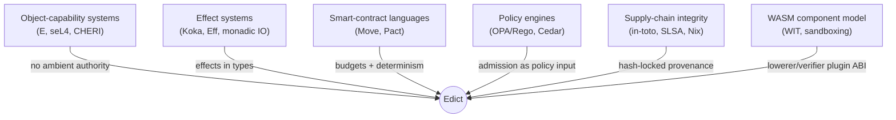

<details>
  <summary>Caption: Traditions Edict draws from</summary>

  | Tradition | What Edict borrows | Where Edict departs |
  | --- | --- | --- |
  | Object-capability security (E, seL4, CHERI) | The rejection of ambient authority: you can only touch what you were explicitly handed | Enforcement moves from runtime reference-passing (or hardware, in CHERI's case) to compile-time proof over a declared aperture; `CapabilityRef<T>` carries only a receipt *digest*, powerless until a participant admits it |
  | Effect systems (Koka, Eff, monadic IO) | Effects are visible in types and cannot hide in pure code | Edict adds *authority* and *cost* to the effect: every effect has a write class, a footprint obligation, an obstruction vocabulary, and a digest-locked owner — not just a type tag |
  | Smart-contract languages (Move, Pact) | Deterministic, budgeted, sandboxed execution of untrusted logic | Edict is participant-neutral: no chain, no consensus, no fee market, no coupled storage model — the same bundle can be admitted by many independent runtimes |
  | Policy engines (OPA/Rego, Cedar) | Admission is explicit policy, separate from the code it governs | Policy engines answer "is this allowed?" about an opaque request; Edict makes the request *self-describing and proven* so policy has real facts to evaluate |
  | Supply-chain integrity (in-toto, SLSA, Nix) | Hash-locked dependencies, attestations, reproducible artifacts | Edict pushes provenance below the package: into the operation, its effects, and its two-level (semantic/release) identity; the bundle spec explicitly plans in-toto Statement + DSSE signing |
  | WASM component model | A typed, language-neutral plugin ABI (`edict-target-lowerer.wit` defines `lowerer` and `verifier` worlds) | The sandbox is planned for *toolchain* components (lowerers, verifiers) and runtimes — the Edict language itself never gets general computation to sandbox |

</details>

The one-line positioning: **capability discipline from OCap, effect visibility from PL research, determinism-and-budgets from smart contracts, admission from policy engines, identity from supply-chain security — unified by a theory (WARP optics over witnessed causal history) that none of those traditions has.**

### E.1 Suggested reading order

| Step | Read | You come away with |
| --- | --- | --- |
| 1 | This report's [TLDR](#tldr) and [walkthrough Levels 0–2](#51-level-0--the-problem-your-functions-can-do-anything) | The problem and the language surface |
| 2 | `README.md`, then `fixtures/lang/` | The official pitch, plus every currently-parseable construct |
| 3 | `ARCHITECTURE.md` + `docs/topics/` shelves for whatever you touch | The workspace map and per-subsystem current truth |
| 4 | `docs/SPEC_edict-language-v1.md` (skim §invariants I-001…I-031 first) | The normative language contract |
| 5 | `docs/GUIDE_edict-assurance-transparency.md` | HOLMES/Watson/Moriarty, nutrition labels, the hash ladder |
| 6 | Theory: the OG/AION onramps (`onramp-aion-01…07`), then Paper VII/VIII summaries | Why the whole thing is shaped this way — "the graph is a chart; history is the territory" |
| 7 | `ROADMAP.md` + `docs/REQUIREMENTS.md` | Where it's going, and the fixture constitution that keeps it honest |

---

*Report generated 2026-07-10 against `flyingrobots/edict` @ `56f82ec`; revision 2 (same day) folds in the AION / Observer Geometry / Continuum theory corpus (`agy-readings` @ `25ff542`); revision 3 (same day) adds the verified hands-on lab, quick reference, and wider-world positioning. Edict is part of the [Continuum](https://github.com/flyingrobots/continuum) project; Apache-2.0 licensed.*
