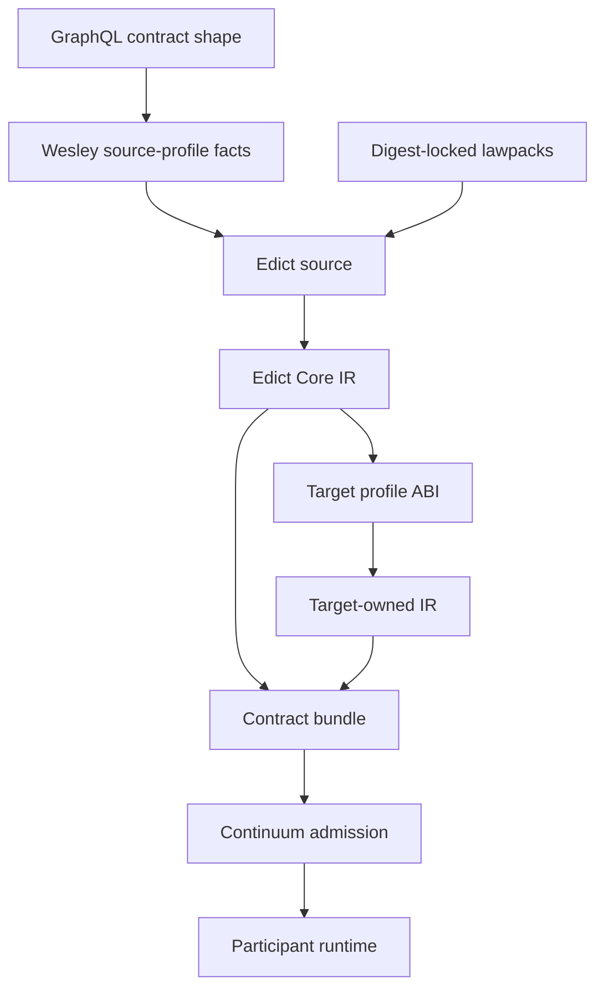
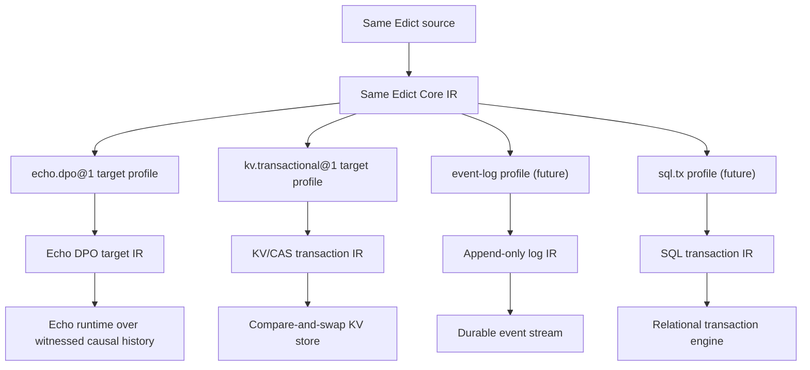
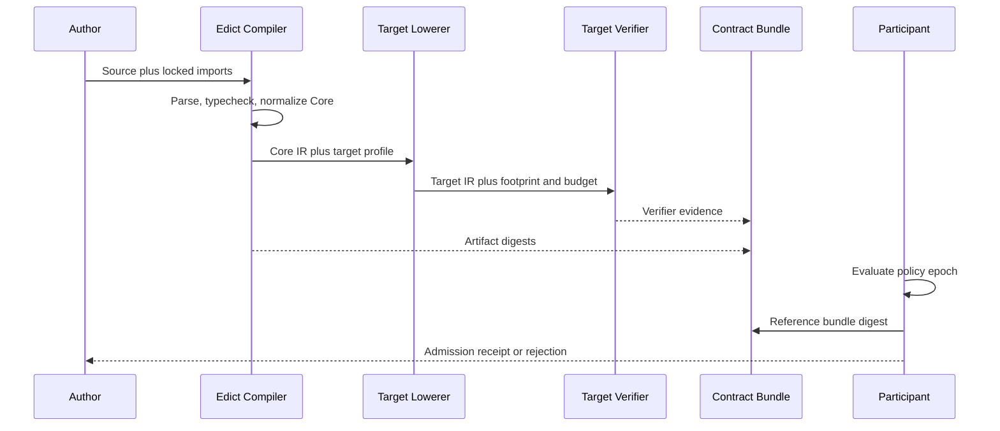
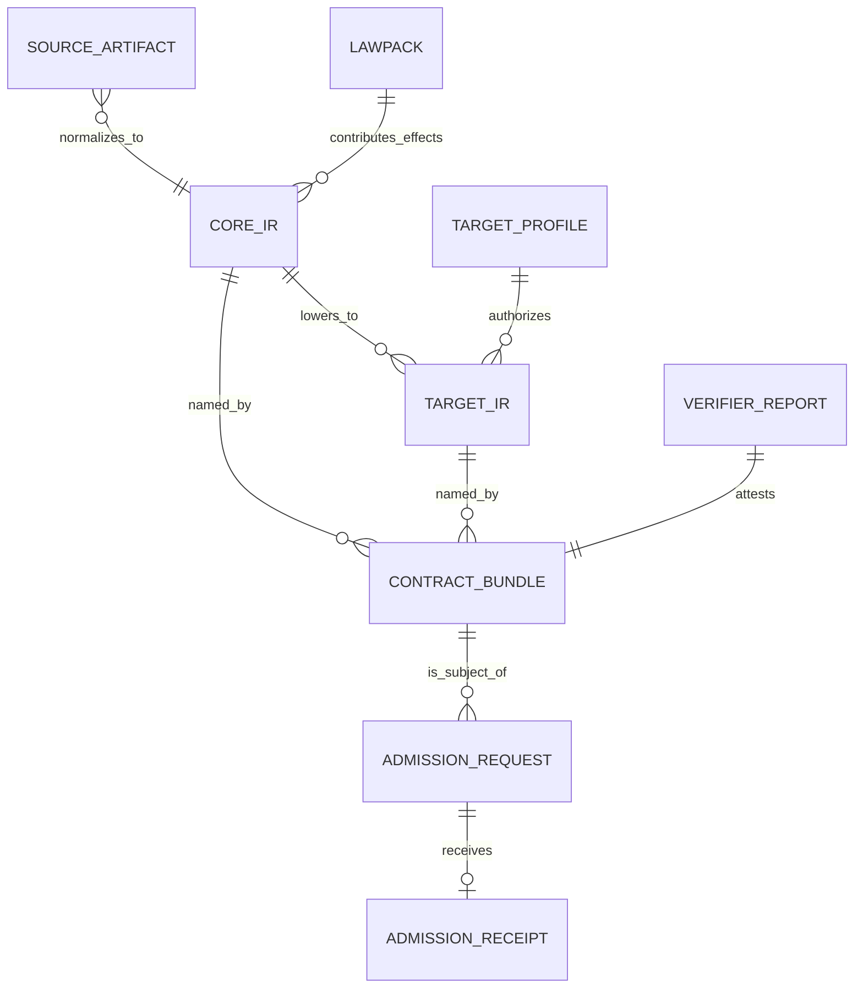

# Edict

Edict is a restricted deterministic language for lawful operations. It compiles
optic-shaped intent source into Edict Core IR, lowers through explicit target
profiles, and binds the resulting artifacts into participant-neutral contract
bundles.

Edict is intended as a contribution toward
[Continuum](https://github.com/flyingrobots/continuum), the protocol suite for
lawful causal interoperability over witnessed causal history. Continuum is not a
runtime, database, compiler, debugger, filesystem, service registry, app
framework, or universal graph. It is the shared protocol vocabulary by which
heterogeneous participants say what happened, from which basis, under which law,
with which witness, and with what outcome.

## At A Glance

Edict sits between contract shape and participant admission. It gives an
operation a deterministic, inspectable body without taking over the runtime that
will eventually admit or reject it.



## Why Edict?

Continuum's core distinction is that history is the territory. State is a
policy-relative materialized view, the graph is a coordinate chart, files are
readings, and admission is witnessed. A message, edit, import, or generated
artifact arriving at a host does not become causal truth until the relevant
runtime or authority admits it against a bounded basis under explicit law.

That creates a gap between three useful layers:

- [GraphQL](https://spec.graphql.org/) can describe contract-family shape: the
  fields, operations, values, and callable surfaces that cross boundaries.
- [Wesley](https://github.com/flyingrobots/wesley) can compile those shapes,
  `weslaw` facts, codecs, validators, manifests, and generated access artifacts
  into deterministic evidence.
- Continuum can name the shared protocol envelopes, evidence posture,
  witnesses, readings, suffix exchange, admission outcomes, and compatibility
  truth.

Those layers still do not provide a portable language for the lawful operation
itself. They can say what the callable surface is, what evidence was generated,
and how an admission should be witnessed. They do not, by themselves, give an
agent or tool a deterministic way to say:

- what aperture over causal history it is allowed to inspect or affect;
- what basis, frontier, and bounds the operation depends on;
- which effects are proof-only and which materialize at runtime;
- how target failures become domain obstructions;
- what cost and footprint must be checked before execution;
- what support obligations and witness debt the result carries;
- which target-owned atomic application unit will verify the result.

Edict is a proposed answer to that missing layer. The better category-theory
object is not a plain function or unconstrained morphism. It is an
Observer-Geometry-shaped optic: a focused, bounded, evidence-bearing operation
over witnessed causal history.

A read intent is a revelation optic. It projects a bounded aperture into a
reading without authoring history. A write intent is an affect/reintegration
optic. It proposes effects against a basis and carries the guards, support
obligations, and obstruction vocabulary needed for a participant to decide
whether the result can enter admitted history. A semantic lawpack intent is a
portable optic candidate that can be interpreted into different target profiles
without pretending those targets share a storage substrate.

Edict Core is the normalized form of that optic. A target profile is then a
structure-preserving interpretation into a runtime-owned execution category,
such as [Echo](https://github.com/flyingrobots/echo) DPO, a KV/CAS transaction
profile, or another participant-owned target. A valid lowering must preserve the
Observer Geometry structure: basis, aperture, projection or affect boundary,
footprint independence, support ledger posture, atomic guards, cost budgets,
obstruction classes, and canonical artifact identity.

This framing is practical, not decorative. It separates source derivation
honesty from destination admission lawfulness. An Edict bundle can be honestly
compiled from its source and still be obstructed, pluralized, conflicted, or
rejected by a destination participant because Continuum admission remains
runtime-owned and basis-relative. That is the point: Edict should make proposed
operations inspectable and reproducible without pretending to be the runtime,
the protocol, or the final admission authority.

The goal is maximum autonomy only after maximum explicitness: no ambient host
authority, no hidden storage model, no unchecked filesystem or network access,
and no trust-me callbacks. Edict operations should either compile into
SHA-locked, target-verified artifacts or fail with structured reasons that
humans and agents can repair.

## Runtime-Neutral Lowering

The same Edict source does not imply the same runtime. Edict Core captures the
lawful operation. Target profiles interpret that Core into runtime-owned target
IR for systems with very different backends.



The target profile owns the storage model, verifier, obstruction taxonomy,
atomic application semantics, and target IR. Edict Core must stay boring enough
that these lowerings are honest interpretations, not hidden assumptions about a
universal graph, database, filesystem, or event log.

Edict does not promise that every operation runs everywhere. It promises that
lowerability is explicit, inspectable, and evidence-bound.

> The audacious part is not that Edict translates everything. The audacious part
> is that Edict can say, precisely and cryptographically: This translates. This
> translates through this adapter. This translates only under this equivalence.
> And this does not translate without lying.

## Hello, Edict

The smallest useful Edict example is intentionally boring. It has no ambient
host access, no clock, no filesystem, no network, and no target write. It is a
bounded read-only optic from explicit input to a deterministic reading.

```edict
package examples.hello@1;

use lawpack hello.optics@1 digest "sha256:..." as hello;

type HelloInput = {
  name: String<max=256>,
};

type HelloReading = {
  message: String<max=512>,
};

intent sayHello(input: HelloInput)
  returns HelloReading
  profile hello.readOnly
  basis none
  budget <= hello.tinyBudget
  where input.name != ""
{
  let message = "hello, " + input.name;
  return { message };
}
```

That example should compile to Core with no runtime effects. The scalar bounds
are not decoration: a naked, unbounded `String` is rejected in the
lawful-autonomous lane because its output cost cannot be proven. The same source
with `name: String` and `message: String` is a negative (RED) fixture, not valid
documentation.

A target-backed intent looks similar, but every read or write must come through
an imported target or lawpack effect and must map failures into typed
obstructions:

```edict
package examples.greeting@1;

use shape "schemas/greeting.graphql" as shape;
use lawpack greeting.optics@1 digest "sha256:..." as greetingLaw;
use target echo.dpo@1 digest "sha256:..." as echo;

intent readGreeting(input: shape.ReadGreetingInput)
  returns shape.GreetingReading
  profile echo.readOnly
  basis input.greetingId
  budget <= greetingLaw.readGreetingBudget
{
  let greetingRef = echo.ref<shape.Greeting>(input.greetingId);
  let greeting = greetingRef.read()
    else greetingLaw.GreetingMissing;

  return {
    greetingId: input.greetingId,
    message: greeting.message,
  };
}
```

The lawpack is aliased `greetingLaw` so the local `greeting` does not shadow an
import alias; locals shadowing imports, types, or prelude names are rejected. The
second example is still read-only only if the compiler proves it from the
imported effect signatures. The `profile echo.readOnly` line is a claim to
check, not authority to trust.

Every Edict example shown as valid in this README is intended to live in
`fixtures/` and be compiled (or rejected) so documentation cannot drift from the
language. The fixture is near-verbatim, with one mechanical substitution: prose
`digest "sha256:..."` ellipses become syntactically valid dummy digests
(`sha256:` + 64 hex), since the grammar's `digest-lit` requires 64 hex digits.
See [`fixtures/README.md`](./fixtures/README.md) and the
[requirements registry](./docs/REQUIREMENTS.md).

## Bundle And Admission

The compilation pipeline is deliberately split from admission. A contract bundle
is participant-neutral. Admission requests and receipts reference that bundle;
they do not change its identity.



## Non-Goals

- Edict is not a runtime. Runtime admission, scheduling, clocks, persistence,
  and receipts belong to participant runtimes such as Echo.
- Edict is not a storage model. Graphs, tables, logs, files, objects, and KV
  stores belong to target profiles.
- Edict is not a general scripting language. Host callbacks, ambient network
  access, filesystem mutation, randomness, and wall-clock time are not Core
  language features.
- Edict is not participant policy. Policies admit, reject, or constrain bundles;
  they do not rewrite Core semantics.
- Edict is not a way to make cross-target atomicity free. v1 intents lower to
  one runtime effect domain unless a composite target profile explicitly owns
  coordination and rollback.
- Edict is not an approval bypass for agents. Lawful autonomy starts only after
  explicit law, bounded effects, target verification, locked artifacts, and
  participant admission.

## FAQ

### Is This Just GraphQL?

No. GraphQL is a shape and boundary language. It is good at saying what fields,
objects, inputs, mutations, and queries exist. It does not say which causal
basis an operation depends on, which target effects it may emit, whether a read
is bounded, how stale-basis failure maps into a domain obstruction, or which
atomic application unit owns the commit.

Edict is intended to sit below that callable surface. A GraphQL mutation can
name "replace this range." Edict describes the lawful optic behind that
mutation: the basis, aperture, proof obligations, target references, guards,
effects, costs, obstructions, and bundle identity that make the operation
inspectable before a participant admits it.

### Is This Just Wesley With More Syntax?

No. Wesley compiles contract-family shape and `weslaw` evidence. It should
remain excellent at producing codecs, validators, manifests, generated helpers,
and deterministic facts about authored contracts.

Edict is the operation-language layer Wesley was missing. Wesley can tell you
what the operation surface is and what artifacts were generated. Edict says
what the operation is allowed to read or affect, which effects are proof-only or
runtime-materialized, which lawpacks and target profiles authorize those
effects, and what Core IR must be hashed before target lowering.

The intended boundary is cooperative: Wesley can be a source-profile adapter and
compiler evidence producer for Edict, but Wesley should not own Edict Core,
target application semantics, or participant admission.

### Is This Just OPA/Rego?

No. Rego is a policy language. It answers questions such as "is this request
allowed?" against supplied data. That is useful, but Edict is not primarily
asking for a policy decision. It is describing a bounded lawful operation that
can compile to target-owned effects.

An Edict intent may contain proof obligations and obstruction mappings, and a
participant policy may later accept or reject the resulting bundle. But the
language body is not a standalone authorization rule. It carries typed inputs
and outputs, target references, effect ordering, path conditions, loop bounds,
cost budgets, canonical value semantics, and lowering obligations.

Policy can judge an Edict bundle. Policy does not replace the bundle.

### Is This Just CEL?

No. CEL is intentionally small, deterministic, mutation-free, and safe to embed.
Edict should borrow that restraint, especially around totality, bounded
evaluation, and host authority. But CEL expressions do not describe target-owned
atomic effects, content-addressed `ensure` semantics, stale-basis runtime
guards, target-profile lowerings, or SHA-locked contract bundles.

Edict Core should be boring in the same spirit CEL is boring. The difference is
that Edict uses that boring core to make lawful effects explicit, not to stay in
expression-only policy space.

### Is This Just A Workflow Language?

No. A workflow language coordinates tasks. It often answers "what step runs
next?" or "which service should be called?" Edict intentionally avoids ambient
host callbacks, open network authority, clocks, queues, and service invocation
as language primitives.

An Edict intent is closer to a target-verifiable operation plan than a process
orchestration script. It must lower to one target-owned atomic application unit
in v1, with explicit reads, writes, guards, obstructions, footprint, and budget.
If a future version supports cross-bundle invocation, that invocation must bring
its callee effects, costs, obstructions, and admission requirements into the
same evidence model. It cannot be "run this other thing, trust me."

### Is This Just Terraform Or Kubernetes YAML?

No. Terraform and Kubernetes manifests are declarative configuration surfaces
for particular infrastructure control planes. They are allowed to contain nouns
from those domains because that is their job.

Edict Core must not grow storage-shaped nouns such as graph, table, topic,
bucket, file, event log, or cluster. Those belong to target profiles or lawpacks.
The portable language names typed values, imports, effects, guards, bounds, and
canonical artifacts. A target profile may interpret those effects into Echo DPO,
a KV/CAS transaction, an event log, or some future substrate, but Core does not
pretend those substrates are the same thing.

### Is This Just A Smart-Contract Language?

No. Smart-contract platforms usually bind language, execution environment,
consensus model, account model, gas model, storage model, and deployment surface
into one runtime world. Edict is deliberately participant-neutral. It produces
contract bundles that a participant may admit under its own policy and target
profile.

There is no token, global validator set, global storage trie, or universal
chain. The important property is not that every participant runs the same
world-computer. The important property is that an operation bundle has canonical
source, Core IR, target IR, lowering evidence, verifier evidence, footprint,
budget, and obstruction semantics that can be inspected before runtime-owned
admission.

### Is This Just SQL, A Graph Query, Or An Event Log DSL?

No. Those languages choose a storage model. Edict must not. SQL assumes tables
and relations. Graph queries assume graph-shaped traversal. Event-log DSLs
assume append history is the primitive.

Edict can target systems that use tables, graphs, logs, content-addressed
objects, or KV/CAS transactions, but those are target-profile facts. The Core
language is intentionally dull about storage. It describes lawful observations
and effects without smuggling in a universal database.

### Is This Just Rust Or TypeScript In A Sandbox?

No. A sandboxed plugin can be useful for deterministic helpers, lowerers, or
verifiers, but opaque native code is not a language semantics. If a helper can
read host state, call the network, allocate without bound, or hide effects, it
breaks Edict's reason to exist.

For assured use, pure helpers must be authored in Edict/Core or be
digest-locked, deterministic, sandboxed, fuel-bounded, and covered by
conformance fixtures. Opaque helper code may exist only behind conservative
declared bounds. It cannot be allowed to launder authority through a friendly
function name.

### Is This Just Echo Intents?

No. Echo is one important target family, not the language. Echo owns
runtime-admitted causal history, scheduling, ticks, receipts, and `echo.dpo@1`
target semantics. Edict owns the portable operation source, Core IR,
canonicalization rules, and target-profile ABI surface.

An Edict intent can lower to Echo, but it should also be able to stress a
KV/CAS transaction target or another participant-owned target profile. That is
the relapse test: if the language accidentally assumes Echo's storage or event
model, it is no longer runtime-neutral.

### Is This A Way For Agents To Bypass Review?

No. Edict is meant to make autonomous operation harder to fake, not easier to
wave through. The formal lane is `lawful-autonomous`: autonomous only after
explicit law, bounded effects, deterministic Core IR, target verification,
SHA-locked artifacts, and participant admission.

The codename YOLO is allowed as a human-facing joke. It is not a canonical
coordinate, not an approval bypass, and not authority. A lawful-autonomous
bundle may still be rejected because the participant policy, basis, budget,
target verifier, or admission epoch says no.

## Research Anchors

Edict has no exact precedent. The useful precedents point to language shape,
evidence boundaries, and failure modes, not domain equivalence:

- [GraphQL](https://spec.graphql.org/) is the stable schema and callable-surface
  precedent. Edict can use GraphQL-shaped facts, but GraphQL does not express
  bounded target effects, obstruction mapping, or atomic application semantics.
- [OPA/Rego](https://www.openpolicyagent.org/docs/policy-language) and
  [CEL](https://cel.dev/) are important restraint precedents. Edict should
  borrow their bias toward analyzable evaluation without becoming only a policy
  or expression language.
- [Lamport clocks](https://lamport.azurewebsites.net/pubs/time-clocks.pdf)
  show why distributed systems need explicit ordering relations rather than
  ambient wall-clock truth. Edict inherits that lesson through basis, frontier,
  and admission coordinates.
- [W3C Trace Context](https://www.w3.org/TR/trace-context/) and
  [OpenTelemetry signals](https://opentelemetry.io/docs/concepts/signals/) show
  the value of separating propagated evidence from any one backend. Edict
  bundles should do the same for operation evidence.
- [CloudEvents](https://cloudevents.io/) is a common event-envelope precedent.
  Edict needs stronger causal, footprint, budget, and verifier structure, but
  the envelope lesson applies.
- [W3C PROV-DM](https://www.w3.org/TR/prov-dm/) provides useful provenance
  vocabulary for entities, activities, agents, and derivations. Edict needs a
  stricter runtime-grade witness and admission posture.
- [in-toto](https://in-toto.io/) and
  [SLSA provenance](https://slsa.dev/spec/v1.0/provenance) are supply-chain
  evidence precedents. Edict contract bundles should reuse their separation of
  materials, products, builders, subjects, predicates, and attestations where
  possible.
- [UCAN](https://ucan.xyz/) is a useful capability-token precedent for
  delegated authority. Edict should stay capability-shaped for agents,
  lawpacks, target access, and admission rights.
- [Git](https://git-scm.com/) proves the product value of portable history and
  local autonomy. Edict preserves the history-first lesson while adding target
  admission, bounded optics, and verifier evidence.
- [IPLD](https://ipld.io/) is a content-addressed data precedent. Edict source,
  Core IR, target IR, lawpacks, verifier reports, and retained artifacts should
  be digest-addressable.
- The
  [WebAssembly Component Model](https://component-model.bytecodealliance.org/)
  and [WIT](https://component-model.bytecodealliance.org/design/wit.html) show
  how language-neutral component boundaries can work. Edict can learn from that
  without making Wasm the semantic core.
- [CRDT literature](https://crdt.tech/) is an important contrast. CRDTs converge
  replicated state under specific algebraic constraints. Edict describes
  bounded lawful operations that participants may admit, obstruct, pluralize, or
  reject under explicit target law.

## Artifact Identity

The artifact graph is hash-oriented. Raw source provenance, semantic Core,
target IR, verifier evidence, admission requests, and admission receipts have
separate identities.



## Related Projects

- [Continuum](https://github.com/flyingrobots/continuum): shared causal
  vocabulary, protocol profiles, evidence posture, admission and outcome
  vocabulary, conformance posture, and compatibility truth.
- [Wesley](https://github.com/flyingrobots/wesley): GraphQL and `weslaw`
  compiler substrate for contract-family shape, law facts, manifests, codecs,
  validators, and generated artifacts.
- [Echo](https://github.com/flyingrobots/echo): sibling Continuum runtime
  implementation for hot/interactive admitted causal history.
- [Graft](https://github.com/flyingrobots/graft): structural observer and
  review engine that consumes observer plans, reading envelopes, and evidence
  posture.
- [jedit](https://github.com/flyingrobots/jedit): product-pressure editing app
  used to test whether the language handles real intents, readings, stale bases,
  checkpoints, and structural history.
- [WARP TTD](https://github.com/flyingrobots/warp-ttd): debugger/operator
  surface over Continuum profiles.
- [WARP DRIVE](https://github.com/flyingrobots/warp-drive): POSIX-shaped
  membrane over readings and intents.
- [Think](https://github.com/flyingrobots/think): agent/session/history app
  candidate for observation, counterfactual, and evidence-ledger profiles.
- [Bijou](https://github.com/flyingrobots/bijou): rendered UI/TUI candidate for
  reading envelopes and intent-producing interfaces.
- [AION](https://github.com/flyingrobots/aion): theory source and conceptual
  background for causal worlds, optics, and braid theory.

## Current Status

This repository is in Phase 0. It currently holds design material, not a
production implementation.

What exists:

- Edict language syntax, type system, effects, and Core IR.
- Lawpack ABI (portable semantic effects, pure helpers, target adapters).
- Target profile ABI and atomic application semantics, with machine schemas
  (CDDL manifest, WIT plugin boundary) as the single source of truth.
- Continuum contract bundle identity.
- Continuum admission artifacts.
- Assurance and transparency guidance.
- A requirements registry (the Fixture Constitution) tying every normative
  requirement to its owner spec and planned fixtures.

What does not exist yet:

- a parser;
- a canonical Core encoder;
- a compiler CLI;
- target profile conformance fixtures;
- Echo or KV/CAS target lowerers;
- admission tooling.

The next useful milestone is Phase 0 fixtures: examples that parse or reject,
golden canonicalization cases, negative relapse cases, and hash-impact
regression cases.

## Specifications

- [SPEC - Edict Language v1](./docs/SPEC_edict-language-v1.md)
- [SPEC - Edict Lawpack ABI v1](./docs/SPEC_edict-lawpack-abi-v1.md)
- [SPEC - Edict Target Profile ABI v1](./docs/SPEC_edict-target-profile-abi-v1.md)
- [SPEC - Continuum Contract Bundle v1](./docs/SPEC_continuum-contract-bundle-v1.md)
- [SPEC - Continuum Admission v1](./docs/SPEC_continuum-admission-v1.md)
- [GUIDE - Edict Assurance and Transparency](./docs/GUIDE_edict-assurance-transparency.md)
- [Requirements Registry (Fixture Constitution)](./docs/REQUIREMENTS.md)
- [Design Baseline](./docs/DESIGN_runtime-neutral-edict-sha-lock-assurance.md)

Machine schemas (single source of truth for the ABIs):

- [`docs/abi/edict-common.cddl`](./docs/abi/edict-common.cddl) (shared types)
- [`docs/abi/edict-target-profile.cddl`](./docs/abi/edict-target-profile.cddl)
- [`docs/abi/edict-target-lowerer.wit`](./docs/abi/edict-target-lowerer.wit)
- [`docs/abi/edict-lawpack.cddl`](./docs/abi/edict-lawpack.cddl)

## Repository Boundary

Edict owns the language, Core IR, canonicalization rules, conformance fixtures,
and target-profile ABI surface.

Wesley owns GraphQL and `weslaw` source-profile adapters. Continuum owns
participant protocol and admission. Echo owns `echo.dpo@1` target semantics.

## License

Apache-2.0. See [LICENSE](./LICENSE).
