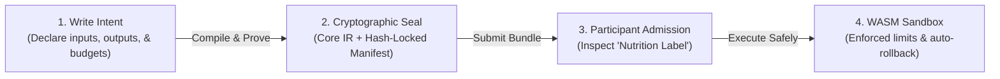
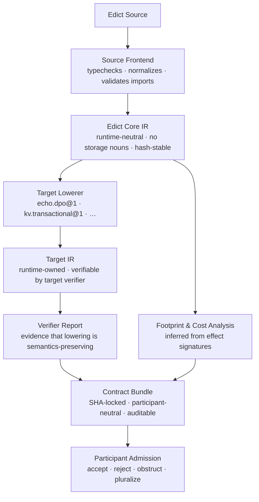
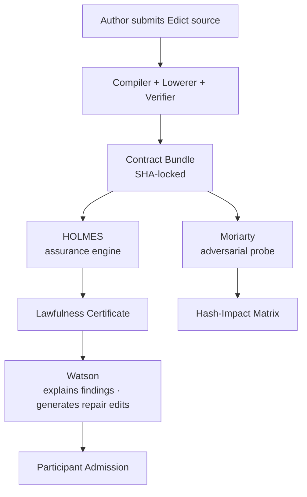

# Edict: Safe, Statically Verifiable Operations for Autonomous Runtimes

**Edict is a secure programming language (DSL) that guarantees what your code is allowed to do is verified by the compiler—not left to trust.**

Unlike general-purpose runtimes where code has unrestricted access to the filesystem, network, or database, Edict isolates operations at the compiler level. If an operation tries to access unauthorized state, mutate a forbidden table, or exceed its execution budget, it fails to compile.

## Edict in 10 Seconds



## Why it Matters

Traditional security runs at the boundary (firewalls, sandboxes). But if you hand an AI agent a tool, it inherits the permissions of the parent process. Edict makes the code *declare* and *prove* its capabilities beforehand, preventing malicious prompt injections or library updates from causing harm.

---

## The Problem You Already Have

Here's a function you've probably written:

```typescript
async function getMessageThread(userId: string, threadId: string) {
  const thread = await db.threads.findOne({ id: threadId });
  const messages = await db.messages.findMany({ threadId });
  return { thread, messages };
}
```

Simple enough. "Read a message thread." What is this function actually allowed to do?

Everything. It is allowed to do everything the process can do.

It can read *any* thread — not just the one passed in. It can read the users table,
the payments table, the admin table. It can call `db.users.deleteAll()` if someone
adds a line. It can make HTTP requests to external services. It can write files to
disk. The fact that it *only* reads one thread is a convention enforced by code
review, team trust, and luck.

When you add a new engineer, you show them the function and they assume it does
what the name says. When a library you're using quietly adds a line, no compiler
catches it. When you hand this function to an AI agent and say "read the user's
messages," the agent's actual capability is "do anything the process was granted."

This pattern has a name: **FIDLAR**.

> **FIDLAR** — *Footprints Ignored; Developer Lies About Risk*

Not maliciously. Nobody writes `getMessageThread` intending to deceive. But the
function's *declared authority* (its name, its signature, the comment above it)
and its *actual authority* (whatever the process can reach) are two completely
different things, and nothing verifies that they match.

This matters even if you never ship an agent. When the only thing enforcing your
function's scope is code review and good intentions, that's a bet on institutional
memory. Junior engineers, library authors, and future-you will all implicitly trust
the name. Edict makes the scope a compiler guarantee instead.

---

## The Specific Problem With Agents

FIDLAR has always existed. It got worse when autonomous agents arrived.

When a human engineer writes a misscoped function, the blast radius is bounded by
what they do with it. Code review catches obvious overreach. Peer scrutiny slows
things down. The human has judgment.

When an AI agent runs a function, the blast radius is whatever the process grants,
the agent's capability is whatever the function can reach, and nothing is watching
except the logs after the fact.

"Just restrict what the agent can call" is the conventional response. Allowlists of
function names. Prompt instructions about what not to do. Runtime guards that check
results after they've already been produced.

These approaches share a flaw: they're enforced at the call site, not at the
definition. The function still has ambient authority. You're just hoping nobody
misuses it.

What if instead, an operation had to **declare** — and **prove** — what it was
allowed to do?

---

## Enter Edict

Edict is a restricted deterministic language where the compiler enforces what an
operation is actually allowed to do — not as a convention, but as a verified
contract.

You write an *intent*. The intent declares:

- **What it reads** — exactly which data it is allowed to inspect, bounded
- **What it writes** — exactly which effects it may produce, with typed outcomes
- **What it costs** — a budget that the compiler checks against declared bounds
- **How it can fail** — typed obstructions, not generic exceptions
- **What law governs it** — imported, digest-locked law packages

The compiler verifies all of these. Not at runtime — before admission. If the code
tries to reach beyond its declared aperture, it doesn't compile. If an effect can
fail and the failure isn't mapped to a typed outcome, it doesn't compile. If the
cost bounds aren't satisfiable, it doesn't compile.

The result isn't a function. It's a **sealed, verifiable artifact**: a contract
bundle with a canonical identity, a cryptographic fingerprint over every layer of
the compilation, and a structured record of what it does and what it's allowed to
do.

---

## What An Intent Looks Like

The smallest useful Edict program is deliberately boring:

```graphql
package examples.hello@1;

use lawpack hello.optics@1 digest "sha256:a3f..." as hello;

type HelloInput = {
  name: String,
};

type HelloReading = {
  message: String,
};

intent sayHello(input: HelloInput)
  returns HelloReading
  profile hello.readOnly
  budget <= hello.tinyBudget
  where input.name != ""
{
  let message = "hello, " + input.name;
  return { message };
}
```

No ambient access. No clock. No filesystem. No network. No database. This intent
compiles to a Core IR with zero runtime effects. The current compiler-spine can
prove the pure subset and can reject known profile/effect write-class conflicts
from deterministic compiler context facts, including facts loaded from explicit
authority-facts files. Loading full lawpack and target-profile manifests remains
future target/lawpack work.

A more realistic intent — one that actually reads from a backing store — looks like
this:

```graphql
package examples.greeting@1;

use shape "schemas/greeting.graphql" as shape;
use lawpack greeting.optics@1 digest "sha256:b4e..." as greeting;
use target echo.dpo@1 digest "sha256:c9f..." as echo;

intent readGreeting(input: shape.ReadGreetingInput)
  returns shape.GreetingReading
  profile echo.readOnly
  budget <= greeting.readGreetingBudget
{
  let greetingRef = echo.ref<shape.Greeting>(input.greetingId);

  let greetingNode = greetingRef.read()
    else greeting.GreetingMissing;

  return {
    greetingId:  input.greetingId,
    message:     greetingNode.message,
  };
}
```

Walk through this line by line:

- `use shape` — imports the GraphQL schema that defines your types. Edict doesn't
  own your schema; it compiles against it.
- `use lawpack ... digest "sha256:..."` — imports a law package *pinned to an exact
  cryptographic hash*. You can't silently upgrade a law package and keep the same
  bundle identity. Version drift is visible by construction.
- `use target echo.dpo@1 digest "sha256:..."` — imports the target runtime profile
  under which this intent will execute. Edict Core is runtime-neutral; it lowers
  to a specific target through an explicitly declared, hash-locked profile.
- `profile echo.readOnly` — a claim the current compiler can check when the
  caller supplies deterministic profile and effect write-class facts, including
  facts loaded from explicit authority-facts files. If the body contains a known
  write effect under a read-only profile, this claim fails and compilation
  fails. Loading full target-profile manifests remains future target-profile
  work.
- `budget <= greeting.readGreetingBudget` — the current compiler resolves the
  budget through explicit deterministic context facts. Full inferred operation
  cost from imported effect signatures is future lowerability work.
- `greetingRef.read() else greeting.GreetingMissing` — every effect that can fail
  must declare how it fails. `GreetingMissing` comes from the *lawpack* import
  (`greeting`), not the target — it's a domain failure name, not a runtime error.
  It's a typed outcome that callers can match on.

Notice what's absent: no `try/catch`. No `throw`. No `null`. No "check this
exists and then read it and hope the check is still valid." The compiler forces you
to account for failure at the point of the effect, not somewhere upstream in a
handler that may or may not be there.

---

## Effects Are Explicit And Ordered

In Edict, effectful calls follow **A-normal form**: every effect must be bound to
a `let` before any other expression can use the result. Effects cannot be nested
inside function arguments, conditions, or record literals. This isn't an
inconvenient restriction — it makes effect ordering visible and unambiguous by
construction.

This is rejected:

```graphql
// ❌ Can't tell which effect runs first, or if the failure is handled
let z = hash(foo.read(), bar.create({ id: input.id }));
```

This is required:

```graphql
// ✅ Explicit ordering, explicit failure handling
let fooValue = foo.read()
  else domain.FooMissing;
let barValue = bar.create({ id: input.id })
  else domain.BarConflict;
let z = hash(fooValue, barValue);
```

The explicit form makes the intent's effect structure legible to the compiler, to
tooling, and to human reviewers. When an agent submits an Edict intent for
admission, a participant can read the effect sequence directly from the Core IR —
not by running the code, but by inspecting the artifact.

---

## What The Compiler Produces

An Edict intent doesn't compile to a binary that you run. It compiles to a
**contract bundle** — a structured, participant-neutral artifact that can be
inspected, admitted, and executed by a runtime that accepts it.



The bundle's identity is a cryptographic hash over every layer: source, Core IR,
target IR, verifier evidence, imported law packages, and target profile. Change
*any* line of source, any dependency, or any target profile — and you get a
different bundle. You cannot silently patch a bundle. You cannot claim the same
identity after a change.

### The Nutrition Label

Every contract bundle carries what the design calls a *nutrition label*: a
human-readable (and machine-readable) summary of what the operation is declared
to do:

```text
Contract Bundle: examples.greeting@1 / readGreeting
────────────────────────────────────────────────────
Profile:      echo.readOnly
Budget:       reads ≤ 10 nodes, writes = 0, bytes ≤ 4096
Footprint:    [greeting:{greetingId}] (read-only)
Obstructions: greeting.GreetingMissing
Law packages: greeting.optics@1 @ sha256:b4e...
Target:       echo.dpo@1 @ sha256:c9f...
Core hash:    sha256:7a2...
Bundle hash:  sha256:d83...
```

This isn't documentation you maintain. It's generated from the artifact. The
compiler produced it; the compiler can verify it; a participant runtime can check
it before executing anything.

---

## The Assurance Toolchain

Three roles operate over the sealed bundle before a participant admits it:

**HOLMES** — the assurance engine. HOLMES takes the complete, SHA-locked bundle
and evaluates every invariant: Is the Core hash consistent with the source? Does
the target IR match the Core lowering? Is the verifier evidence fresh? Is every
law package at its declared digest? HOLMES produces a *Lawfulness Certificate* —
a structured record of what was checked and what the result was. HOLMES is a
role, not just a tool; any conforming assurance engine may fill it.

**Watson** — the explainer and remediator. When the compiler, verifier, or HOLMES
finds a problem, Watson translates the structured diagnostic into actionable
guidance — for humans and for agents. Watson understands the correction. If an
effect is missing an obstruction mapping, Watson says what the mapping should be.
If a declared profile claim is false, Watson explains which effect violated it.

**Moriarty** — the adversarial falsifier. Moriarty mutates the bundle — flipping
bits in the source, swapping dependency versions, altering effect orderings —
and checks whether the hash changes as expected. The *hash-impact matrix* is a
record of which mutations propagate through which artifact layers. If a mutation
to the source doesn't change the Core hash, that's a bug in the canonicalization,
not a feature.



---

## YOLO: You Only Lawfully Operate

The formal lane for autonomous agent execution is called `lawful-autonomous`.
Inside the project it goes by a more honest name: **YOLO** — *You Only Lawfully
Operate*.

The name is a joke aimed at a real failure mode. Current AI agents often run in
what might be called FIDLAR mode: they're given a capability, they use it, and
whatever happens was technically authorized because the process allowed it. Nobody
checked the footprint. Nobody verified the law. The operation just ran.

The YOLO lane is the alternative. An agent may execute autonomously *only after*:

1. Its intent is expressed in Edict source.
2. The source compiles to a Core IR with verified footprint, budget, and effects.
3. The Core lowers to a target-specific IR through a declared, hash-locked target
   profile.
4. A verifier confirms that the lowering is semantics-preserving.
5. HOLMES evaluates the full bundle and issues a Lawfulness Certificate.
6. A participant runtime's admission policy evaluates the bundle and accepts it.

The agent doesn't run the code. The agent *submits the bundle*. The runtime admits
or rejects it based on policy. If admitted, the runtime executes it. The execution
is witnessed. The outcome — success, obstruction, conflict, or plural outcome — is
a typed result, not an exception.

This isn't about slowing agents down. It's about making their operations
inspectable *before* they run rather than auditable *after* the damage.

---

## What Edict Is Not

The FAQ in the reference docs is long because this question comes up a lot. Short
version:

| "Is this just...?" | Why not |
| --- | --- |
| GraphQL | GraphQL describes surface shape. Edict describes the bounded lawful operation *behind* that surface. |
| SQL / graph queries | Those choose a storage model. Edict doesn't. It lowers to a target profile that owns the storage model. |
| OPA/Rego | Policy asks "is this allowed?" Edict describes *what the operation actually does* so policy has something real to evaluate. |
| A smart contract language | Smart contract languages couple language, runtime, consensus, storage, and fees. Edict is participant-neutral. |
| Terraform YAML | Terraform is declarative configuration for specific control planes. Edict Core contains no storage-shaped nouns. |
| Rust/TypeScript in a sandbox | Sandboxed opaque code can hide effects behind function names. Edict effects must be declared, imported, and explicitly mapped. |
| An approval bypass for agents | The opposite. Autonomous execution requires more verification, not less. |

---

## Failure Is A Typed Outcome, Not An Exception

One of the less obvious design choices in Edict: failure is not exceptional. It's
a domain outcome with a type.

When a conventional function fails to find a record, it throws `NotFoundException`,
returns `null`, or crashes. The failure is an escape hatch from the type system.
Callers catch it or don't; nothing enforces that they handle it correctly.

In Edict, effects that can fail must declare typed *obstructions* — named,
structured failure outcomes that are part of the intent's return type:

```graphql
intent createEntry(input: shape.EntryInput)
  returns shape.EntryReceipt | history.EntryObstruction
  profile history.readWrite
  budget <= history.createEntryBudget
{
  require history.basisFresh(input.basis)
    else history.EntryObstruction.StaleBase {
      providedBasis: input.basis,
    };

  let entry = history.entry.record({
    content: input.content,
    author:  input.author,
    basis:   input.basis,
  }) else {
    conflict => history.EntryObstruction.Conflict { ... },
  };

  reveal entry; // produces the success path once all effects have settled
}
```

`StaleBase` and `Conflict` aren't exceptions. They're expected domain outcomes
that callers can match, reason about, and respond to. The participant runtime that
evaluates this intent knows, before execution, exactly what failure vocabulary the
operation can produce.

This matters for agents in particular. An agent that submits an Edict intent and
receives `history.EntryObstruction.StaleBase` knows exactly what happened and
can decide how to respond — refresh its basis and retry, escalate, or abandon —
without inspecting a stack trace or parsing an error message.

---

## How It Fits

Edict is one layer in a larger stack. You don't need to understand the whole stack
to understand Edict, but here's where it sits:

```mermaid
flowchart TD
    GQL["GraphQL schema\ndescribes the callable surface — fields, types, operations"]
    WES["Wesley compiler\ncodecs · validators · evidence artifacts"]
    EDT["Edict source ← YOU ARE HERE\nbounded lawful operations with verified effects"]
    CORE["Edict Core IR\nnormalized · runtime-neutral operation form"]
    TGT["Target profiles\nEcho · KV/CAS · event log · SQL\neach owns its storage model"]
    CONT["Continuum admission\nwitnessed causal history exchange and participant policy"]
    RT["Participant runtime\nEcho · git-warp · others\nwhere admitted history lives"]

    GQL --> WES --> EDT --> CORE --> TGT --> CONT --> RT
    style EDT fill:#f5a623,color:#000,stroke:#c47d0e,stroke-width:2px
````

The key insight behind the layering: GraphQL can say what an operation is *named*
and what types it involves. Wesley can say what *evidence* was generated about
those types. But neither can say what the operation is *actually allowed to do*.
That's the gap Edict fills.

---

## Current Status

Edict now has executable Rust implementation slices alongside the design specs.
The current implementation includes the front end, Core semantic schema, the
first source-to-in-memory-Core compiler spine, target-profile and bundle
validation, Gate C admission-boundary checks, and editor-facing lexical
highlighting roles plus initial Tree-sitter, TextMate, and VS Code/Cursor
integration artifacts. It is not a complete compiler or full admission
execution stack.

What exists today:

- Language specification and ABI specs for the current design baseline
- Target profile ABI specification
- Contract bundle and admission specifications
- Assurance and transparency guidance (HOLMES, Watson, Moriarty)
- Design rationale and research anchors
- Phase 1 `edict-syntax` lexer/parser for the landed source-AST subset
- Editor-facing lexical `highlight_source` API with stable source roles for the
  first developer-tooling slice
- Tree-sitter grammar source, generated parser source, highlight query, and a
  current-subset corpus for editor syntax trees over the accepted fixture
  families
- TextMate grammar artifact for `.edict` lexical scopes in TextMate-compatible
  editors
- Thin VS Code/Cursor extension package for `.edict` language registration and
  TextMate-backed syntax highlighting
- Phase 2 source-AST semantic validation for checks that do not require Core IR
- `edict.core/v1` semantic model and normative CDDL schema
- Initial compiler-spine APIs: `resolve_module`, `type_check`, `lower_core`, and
  `compile_to_core` for the first pure local-record subset
- Compiler-spine profile/effect compatibility checks for effectful source bodies
  against explicit in-memory profile and effect write-class facts
- File-backed authority-facts loading for the first compiler context facts:
  operation profiles, budgets, profile write-class allowances, and effect write
  classes from digest-bound lawpack or target-profile source identities
- The first minimal effectful compiler-spine path: an annotated
  `let ... = effect(arg) else { failure(binder) => Obstruction }` source shape
  lowers through file-backed authority facts into typed Core with a semantic
  effect node and deterministic obstruction map
- Reference `edict.canonical-cbor/v1` Core encoder and canonical byte validation
  path for the current in-memory Core module model
- Reviewed Core golden bytes and exact `edict.core.module/v1` digest fixture for
  the initial pure local-record Core artifact
- Typed v1 target-profile manifest conformance for runtime-neutral profile
  validation, including `echo.dpo@1` and `kv.transactional@1` shaped profiles
- Typed v1 lowerability checks for `LoweringRequirements` against explicit
  target-profile facts, including native, direct-adapter, and unsupported
  classifications
- Typed v1 contract-bundle manifest validation for participant-neutral,
  SHA-locked bundle artifacts, release-only provenance inputs, and optional
  HOLMES/Watson/Moriarty evidence references
- Typed Gate C admission-boundary checks for Edict-owned bundle-subject,
  operation-requirement, hidden execution input rejection, receipt,
  invoked-operation, and invocation capability evidence semantics
- Deterministic file-backed authority-facts merging with stable load failure
  kinds for conflicting, malformed, invalid, or non-digest-locked facts
- Published `v0.9.0-alpha.1` release notes for the first Target IR alpha:
  `echo.dpo@1` lowers to `echo.span-ir/v1`, and `gitwarp.ref_crdt@1` lowers to
  `gitwarp.commit-reducer-ir/v1` review artifacts without runtime execution
- First JSONL-only `edict` CLI surface: the `check` operation reads compiler
  settings and compiler input records from stdin as JSONL, accepts inline
  source, file paths, directories, path lists, and glob patterns, and emits only
  JSONL records on stdout and stderr
- Published `v0.8.0-alpha.1` release notes for the minimal effectful
  compiler-spine alpha
- Published `v0.7.0-alpha.1` release notes for the file-backed
  authority-facts alpha
- Published `v0.6.0-alpha.1` release notes for the developer-tooling alpha
- Published `v0.5.0-alpha.1` release notes for the Gate C admission-boundary
  alpha
- Published `v0.4.0-alpha.1` release notes for the target-profile,
  lowerability, and contract-bundle validation alpha
- Published `v0.3.0-alpha.1` release notes and release runbook for the
  compiler-spine alpha
- Topic shelves and local contract-graph verification via `cargo xtask verify`
- Release roadmap and GitHub milestone schedule in
  [`ROADMAP.md`](./ROADMAP.md)

What doesn't exist yet:

- Full source-language lowering beyond the initial pure local-record subset and
  first annotated effectful `let ... else` shape
- Compiler CLI workflows beyond JSONL `check`, including compile, lower,
  explain, bundle, admission, and human-pretty output modes
- Deferred minimal-v1 syntax (`fn`/`const`, `record` effects, list/map/unit
  expression literals)
- Packaged Tree-sitter bindings plus Vim, Zed, and jedit integrations
- Full file-backed target-profile, lawpack, and contract-bundle manifest loading
- Authority-facts loading for obstruction, obligation, adapter, footprint, cost,
  and target-capability corpora beyond the first compiler context facts
- Trusted lawpack and target-profile authorship, review provenance, or
  participant acceptance policy
- Target-runtime execution, Echo verifier reports, git-warp commit object
  creation, or git-warp CRDT reducer verification
- Full admission execution tooling
- Participant policy evaluation, capability delegation, and revocation logic

The scheduled alpha train is tracked in [`ROADMAP.md`](./ROADMAP.md). The
published `v0.1.0-alpha.1` release is a front-end milestone,
`v0.2.0-alpha.1` is a Core semantic model and schema milestone, and the
`v0.3.0-alpha.1` release is a compiler-spine/canonical-Core milestone,
`v0.4.0-alpha.1` is a target-profile, lowerability, and contract-bundle
validation milestone, and `v0.5.0-alpha.1` is a Gate C admission-boundary
milestone. The `v0.6.0-alpha.1` release prepares developer tooling artifacts for
publication. The published `v0.7.0-alpha.1` release covers file-backed
authority facts and opens the Authority Fact Governance design track. The
published `v0.8.0-alpha.1` release covers one minimal effectful source-to-Core
path. The published `v0.9.0-alpha.1` release covers the first Echo and git-warp
target-owned IR review artifacts before the train moves through the JSONL CLI,
bundle assembly, admission workflow harnessing, trusted fact authorship,
publication policy, and language-server diagnostics. None of the published
releases claims target-runtime execution, full admission execution tooling, or
trusted fact governance.

---

## Where To Go Next

- **[Authority Fact Governance Design Note](./docs/design/authority-fact-governance.md)** —
  the planning note for trusted lawpack and target-profile authorship,
  provenance, review, and the Edict/Continuum trust-policy boundary.
- **[SPEC — Edict Language v1](./docs/SPEC_edict-language-v1.md)** — the full
  language specification: syntax, type system, effect rules, A-normal form, Core
  IR, and canonical value semantics.
- **[SPEC — Target Profile ABI v1](./docs/SPEC_edict-target-profile-abi-v1.md)** —
  how Edict Core lowers to runtime-specific target IR, and what a target profile
  must declare.
- **[SPEC — Contract Bundle v1](./docs/SPEC_continuum-contract-bundle-v1.md)** —
  the participant-neutral bundle format, artifact graph, and canonical hash framing.
- **[Contract Bundles Topic](./docs/topics/contract-bundles/README.md)** — the
  typed v1 bundle and assurance evidence manifest validation contract.
- **[GUIDE — Assurance and Transparency](./docs/GUIDE_edict-assurance-transparency.md)** —
  HOLMES, Watson, Moriarty, nutrition labels, and the hash-impact matrix.
- **[ROADMAP](./ROADMAP.md)** — scheduled alpha milestones, release gates, and
  the GitHub artifact map.
- **[AION](https://github.com/flyingrobots/aion)** — the theory source: Observer
  Geometry, WARP graphs, causal optics, and the formal foundations that motivated
  Edict's design. Not required reading to use Edict; required reading to
  understand why it is shaped the way it is.

---

*Edict is part of the [Continuum](https://github.com/flyingrobots/continuum) project.*  
*Apache-2.0 license.*
