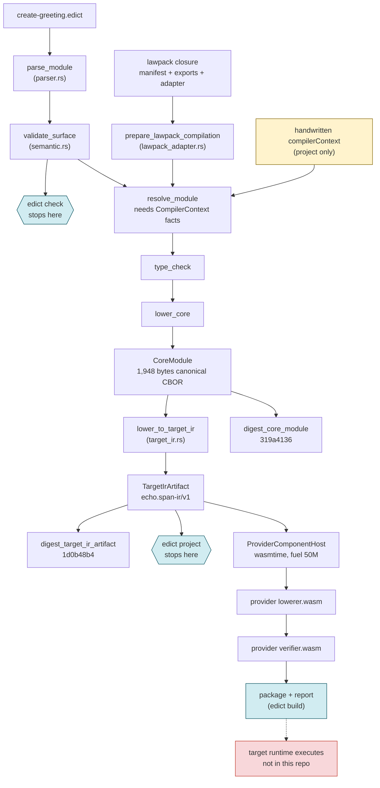
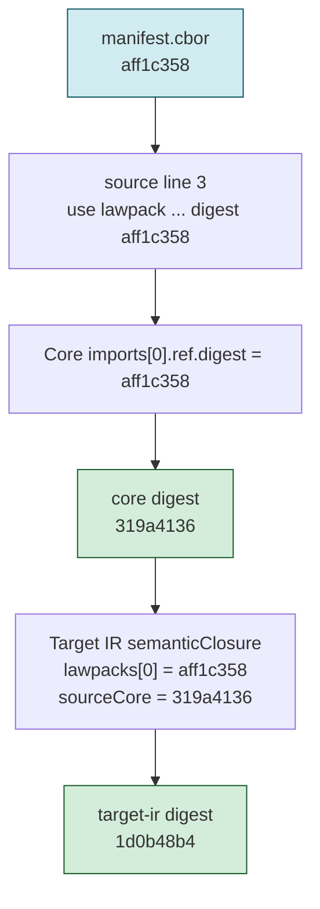
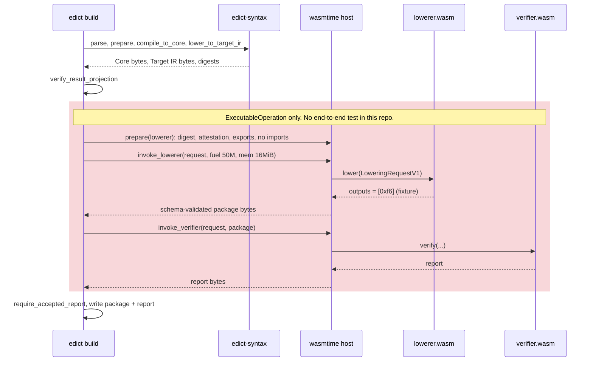
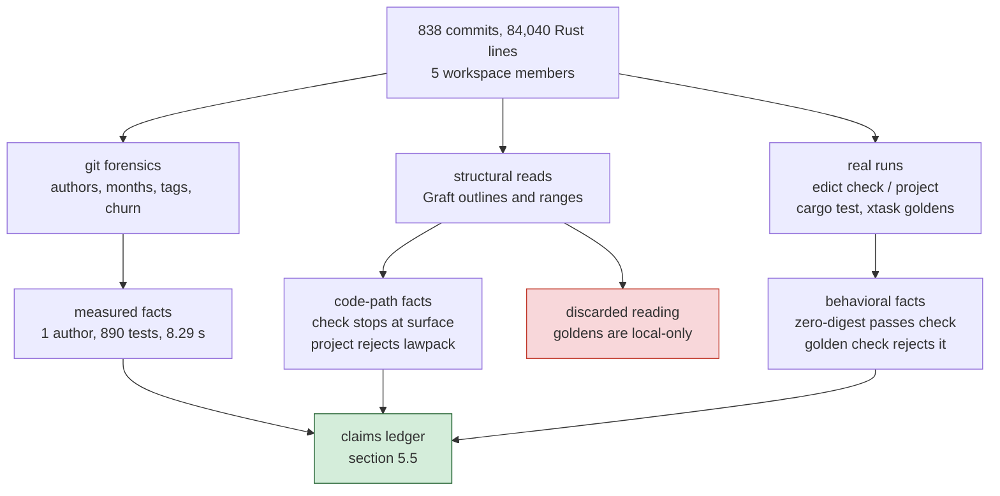
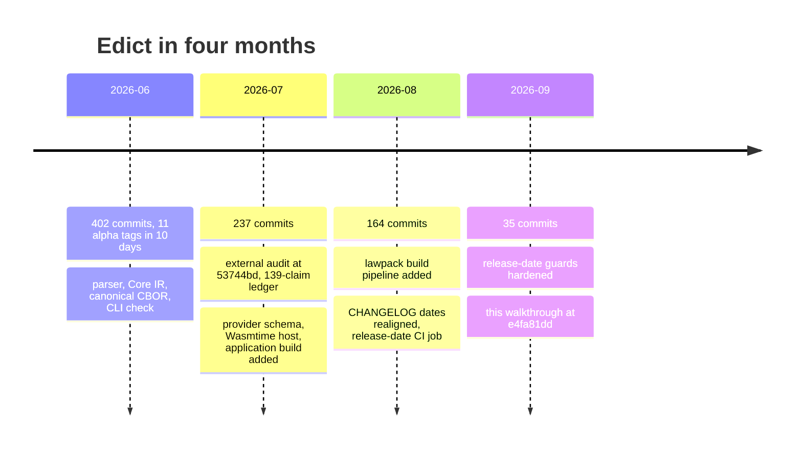

> **Ground rule for this document.** Every claim below about what Edict *does* comes
> from the Rust code in `crates/`, `xtask/`, and from running the built binary at commit
> `e4fa81dd` (2026-09-10). The prose docs and the README appear only on the *claims* side
> of the ledger in the "Where reality diverges" section. If a sentence here disagrees
> with a spec, trust the code path cited next to it. Between `e4fa81dd` and the `main`
> this document landed on (`3f81f759`), the only change under `crates/` is the new
> `crates/edict` facade package (a 53-line re-export library plus tests); no path
> described below moved.

## 1. Orient in sixty seconds

Edict is a small, restricted language for writing *operations* (things like "create a
greeting record") in a way that a compiler can prove bounded: every operation declares
what authority it needs, what budget it may spend, and which failure it maps to, and
the compiler refuses anything it cannot pin to an explicit, digest-locked fact. The
toolchain in this repo takes an `.edict` source file, turns it into a canonical binary
form called **Core IR**, lowers that into a target-specific **Target IR**, and computes
a SHA-256 identity for each layer so that every downstream consumer can verify it got
exactly the bytes the compiler produced. That is the whole arc: source → Core →
Target IR → digests, with a sandboxed hand-off to an external "provider" at the end.

Why it matters: the README's pitch is that a function's *declared* authority and its
*actual* authority should be the same thing, enforced by a compiler rather than by
code review. This document shows how far the code has actually taken that idea, by
following one real greeting through every stage, and then shows, with numbers, where
the README is ahead of the code.

## 2. The canonical example, in full

This section puts one real input and all of its outputs on the table before any
theory, because every later section refers back to it. The input is the `hello-echo`
fixture that ships in the repo, the smallest source that crosses every stage. I ran it
through the built binary, decoded its checked-in artifacts, and recomputed its
digests independently, so what follows is what the toolchain produces today, not what
a spec says it should produce.

### 2.1 The source

The file is `fixtures/lawpack/hello-echo/create-greeting.edict`, reproduced exactly:

```edict
package examples.hello_echo@1;

use lawpack hello.echo@1 digest "sha256:aff1c3580f4b817bf3db9af8e6ca8e15ef7d57dea578b71deaf3a249f863c5af" as hello;

type GreetingCreated = {
  key: String<max=64>,
  message: String<max=256>,
};

intent createGreeting(input: hello.CreateGreetingInput) returns GreetingCreated
  profile hello.createGreeting
  basis input.basis
  budget <= hello.smallCreateBudget
{
  let receipt: hello.GreetingReceipt = hello.createGreeting(input)
    else { alreadyExists(existing) => hello.AlreadyExists };
  return {
    key: receipt.key,
    message: input.message,
  };
}
```

Read it as a contract, not as a program. Four things are declared up front and none
of them can be omitted: the **lawpack** it imports (a signed bundle of types, effects,
and budgets, pinned by digest), the operation **profile** it runs under, the **basis**
(the fact the operation is conditioned on), and the **budget** ceiling. The body does
one effectful thing, `hello.createGreeting`, names the one failure it can absorb, and
returns a record whose two fields are bounded strings. Hold onto the digest on line 3;
it reappears in every artifact below.

### 2.2 Output one: the front-end check

The CLI reads JSON Lines on standard input and emits only JSON Lines. Sending the source
under a `check` settings record produces:

```json
{"command":"check","input":{"kind":"source","name":"create-greeting.edict"},"schema":"edict.cli.check-result/v1","status":"ok","type":"checkResult"}
{"checked":1,"command":"check","errors":0,"exitCode":0,"schema":"edict.cli.event/v1","status":"ok","type":"status"}
```

Two records, exit code 0. Note what this did *not* say: nothing about the lawpack, the
digest, the budget's value, or Core IR. Section 5 shows why that matters.

### 2.3 Output two: the Core module

The checked-in `create-greeting.core.cbor` is 1,948 bytes of canonical CBOR. Decoded
(with a twenty-line CBOR reader, no Edict code involved) and trimmed to the intent, it
reads:

```json
{
  "apiVersion": "edict.core/v1",
  "coordinate": "examples.hello_echo@1",
  "imports": [{"kind": "lawpack",
               "ref": {"id": "hello.echo@1",
                       "digest": ["sha256", "aff1c358…c5af"]}}],
  "intents": {"createGreeting": {
    "input":  "hello.echo@1.CreateGreetingInput",
    "output": "examples.hello_echo@1.GreetingCreated",
    "basis":  {"kind": "field", "field": "basis", "base": {"kind": "local", "ref": {"id": "arg.0"}}},
    "requiredOperationProfile": "continuum.profile.create/v1",
    "coreEvaluationBudget": {"maxSteps": 16, "maxOutputBytes": 512, "maxAllocatedBytes": 2048},
    "body": {"nodes": [{
      "kind": "effect",
      "effect": "hello.createGreeting",
      "input":   {"kind": "local", "ref": {"id": "arg.0"}},
      "binding": {"id": "local.0", "type": "hello.echo@1.GreetingReceipt"},
      "obstructionMap": {"alreadyExists": {
        "binder": {"id": "obstruction.0", "type": "hello.echo@1.ExistingGreeting"},
        "value":  {"kind": "call", "callee": "hello.AlreadyExists", "args": []}}}}],
      "result": {"kind": "record", "fields": {
        "key":     {"kind": "field", "field": "key",     "base": {"kind": "local", "ref": {"id": "local.0"}}},
        "message": {"kind": "field", "field": "message", "base": {"kind": "local", "ref": {"id": "arg.0"}}}}}}}}
}
```

Everything symbolic in the source has become explicit. `hello.smallCreateBudget` is
now three numbers. `profile hello.createGreeting` is now a Continuum profile
coordinate. `input.basis` is now a field access on a numbered local. The one
`else` arm is now an `obstructionMap` entry with its own typed binder. Nothing here
is a name that still needs looking up.

### 2.4 Output three: the Target IR

Lowering the Core module for the `echo.dpo@1` target produces `create-greeting.target-ir.cbor`
(1,475 bytes). The interesting part is the single step and the closure block:

```json
{
  "kind": "targetIrArtifact",
  "domain": "echo.span-ir/v1",
  "targetProfile": {"id": "echo.dpo@1", "digest": ["sha256", "2e249412…fb04"]},
  "semanticClosure": {
    "lawpacks":   [{"id": "hello.echo@1",         "digest": ["sha256", "aff1c358…c5af"]}],
    "sourceCore":  {"id": "examples.hello_echo@1", "digest": ["sha256", "319a4136…0dfa"]}
  },
  "intents": {"createGreeting": {
    "steps": [{
      "id": "createGreeting.step.0",
      "effect": "hello.createGreeting",
      "targetIntrinsic": "echo.dpo@1.anchored-node-attachment-create-if-absent",
      "obstructionFailures": ["echo.executable-operation/precondition-mismatch/v1"],
      "obstructionArms": {"echo.executable-operation/precondition-mismatch/v1": {
        "value": {"kind": "call", "callee": "hello.AlreadyExists"}}}}],
    "operationProfile": "continuum.profile.create/v1",
    "coreEvaluationBudget": {"maxSteps": 16, "maxOutputBytes": 512, "maxAllocatedBytes": 2048}}}
}
```

The abstract effect `hello.createGreeting` has been bound to one concrete Echo
intrinsic, and the source-level `alreadyExists` obstruction has been bound to one
concrete Echo failure coordinate. The `semanticClosure` block carries the digest of
the lawpack *and* the digest of the Core module it was lowered from.

### 2.5 The digests

Each artifact has a sibling `.sha256` file. Here are the ones this document uses:

| Artifact | Domain | Digest (prefix) |
|---|---|---|
| lawpack `manifest.cbor` | `edict.lawpack/v1` | `aff1c358…c5af` |
| `create-greeting.core.cbor` | `edict.core.module/v1` | `319a4136…0dfa` |
| `create-greeting.target-ir.cbor` | `edict.target-ir.artifact/v1` | `1d0b48b4…d518` |
| Echo target profile | (provider-owned) | `2e249412…fb04` |

The manifest digest is the one written in the source. The Core digest is the one the
Target IR embeds. Section 4 shows the exact preimage and reproduces two of these
outside Rust.

In summary, one twenty-line source becomes a fully resolved Core module, a
target-bound Target IR, and a chain of digests where each layer names the layer
below. Everything that follows explains how, and then where the story stops.

## 3. The cast and the mental model

Before looking at how the pipeline is built, the reader needs to know who the players
are and what shape the data takes between them. There are five Rust workspace members
and four artifact shapes, and the key mental model is that there is one compiler core
with three thin entry points in front of it and one sandboxed exit behind it.

### 3.1 The crates

| Crate | Lines (src) | Role, as implemented |
|---|---|---|
| `edict-syntax` | 30,288 | The compiler. Lexer, parser, surface validation, resolver, type checker, Core lowering, canonical CBOR, Target IR lowering, plus validators for lawpacks, bundles, admission records, and provider envelopes. |
| `edict-cli` | 12,780 | The `edict` binary. JSONL request parsing, the three operations, and the two build pipelines (`lawpack_build.rs`, `application_build.rs`). |
| `edict-provider-schema` | 2,815 | CDDL-based schema registry that validates the bytes a provider component sends back. |
| `edict-provider-host-wasmtime` | 1,558 | A deliberately narrow Wasmtime host that runs provider *components* (a lowerer and a verifier) with fuel and memory limits. |
| `xtask` | 9,491 | Golden-fixture regeneration and checking, release tooling, and the `verify` umbrella. |

Two vocabulary items the table needs. A **lawpack** is a digest-pinned bundle
(manifest, exports, target adapter) that defines the types, effects, profiles, and
budgets a source may use. A **provider** is an external package for one target
(here, Echo) that ships a target profile, artifact schemas, and two WASM components:
a lowerer that turns Target IR into an executable package and a verifier that checks it.

### 3.2 The pipeline

The following diagram shows the stages as they exist in code, with the three CLI
operations as entry points and the sandboxed provider hand-off at the end. Solid
edges are calls that exist; the dashed edge is the boundary Edict does not cross.



<details>
<summary>Figure 1 - The Edict pipeline as implemented</summary>

Figure 1 traces the canonical source through the stages that exist in `edict-syntax`
and `edict-cli`. Blue nodes mark where each CLI operation stops. The yellow node is
the alternative fact source that `project` uses instead of a lawpack. The red node is
execution of the produced package, which no crate in this repo performs.

</details>

| Stage | Function (file) | What it consumes | What it proves |
|---|---|---|---|
| Parse | `parse_module` (`parser.rs`) | source text | grammar |
| Surface validate | `validate_surface` (`semantic.rs`) | AST only | bounded scalars, required clauses, no shadowing |
| Prepare | `prepare_lawpack_compilation` (`lawpack_adapter.rs`) | AST + lawpack bundle + adapter | the import digest matches the manifest; derives the fact context |
| Resolve | `resolve_module` (`compiler.rs`) | AST + `CompilerContext` | every profile, budget, effect, and type names an explicit fact |
| Type check | `type_check` | resolved module | field, binder, and obstruction types agree |
| Lower | `lower_core` | typed module | in-memory `CoreModule` |
| Canonicalize | `encode_core_module`, `digest_core_module` (`canonical.rs`) | `CoreModule` | one byte string, one identity |
| Target lower | `lower_to_target_ir` (`target_ir.rs`) | Core + target facts | every effect has one intrinsic, every obstruction one failure coordinate |
| Provider crossing | `invoke_lowerer`, `invoke_verifier` (`application_build.rs`) | Target IR + provider package | the provider's outputs are schema-valid and size-bounded |

### 3.3 The identity chain

The second structural idea is that identities nest. The source names the lawpack
digest; the Core module carries it in `imports`; the Target IR carries both the
lawpack digest and the Core digest in `semanticClosure`; the Target IR's own digest
covers all of that. The diagram makes the containment explicit.



<details>
<summary>Figure 2 - The digest chain for the canonical example</summary>

Figure 2 shows how the manifest digest written in the source propagates into the Core
module, how the Core module's own digest is then embedded in the Target IR, and how the
Target IR digest therefore commits to the whole closure. Green nodes are digests
this document reproduces independently in section 4.

</details>

| Layer | Carries | Committed to by |
|---|---|---|
| Source | manifest digest (as text) | nothing yet; `check` does not verify it |
| Core module | manifest digest (as bytes) | Core digest `319a4136…` |
| Target IR | manifest digest + Core digest + target profile digest | Target IR digest `1d0b48b4…` |

> **Intuition to carry forward:** there is one compiler core, and `check`, `project`,
> and `build` are three doors into it that stop at different depths. A claim about
> "what the compiler rejects" is only as strong as the door you walked through.

In summary, the cast is five crates around one compiler, the data is a chain of four
artifact shapes, and identity is a digest that includes the digest below it. That
model is enough to read the design intent next.

## 4. The design as built

This section walks the code path that produced the section 2 artifacts, in order, so
that when section 5 shows where the story stops, the stopping points land on a map the
reader already has. Three pieces of code carry most of the weight: the four-stage
compiler spine, the digest framing, and the application build that crosses into the
provider sandbox.

### 4.1 The compiler spine

The one-call compiler entry point is a straight line, and it is worth seeing exactly
how straight. This is `compile_to_core` in `crates/edict-syntax/src/compiler.rs`,
verbatim minus error mapping:

```rust
pub fn compile_to_core(
    module: &Module,
    context: &CompilerContext,
) -> Result<CoreModule, Vec<CompilerError>> {
    validate_surface(module).map_err(/* stage: SurfaceValidation */)?;
    let resolved = resolve_module(module, context)?;
    let typed = type_check(&resolved)?;
    lower_core(&typed)
}
```

The load-bearing argument is `context`. A `CompilerContext` is a bag of explicit
facts: which source profile names map to which Continuum profile coordinates, which
effects belong to which write class, and what numbers each budget name stands for.
`resolve_module` looks every symbolic name up in that bag and fails with
`MissingContextFact` if it is absent. There is no default context, no environment
lookup, no registry. Section 5 demonstrates this by running the canonical source with
an empty context.

The context comes from one of two places. `edict build` derives it from the lawpack
closure through `prepare_lawpack_compilation`, whose first job is the digest check in
`matching_import_alias` (`lawpack_adapter.rs`):

```rust
if import.digest.as_deref() != Some(manifest_digest.as_str()) {
    return Err(one(failure(
        LawpackAdapterFailureKind::SourceImportMismatch,
        format!("module.imports.{}.digest", import.alias),
        manifest_digest,
    )));
}
```

The string on line 3 of the source must equal the review string of the digest the
loader computed over the manifest bytes it was actually handed. `edict project`
instead accepts a handwritten `compilerContext` object in the settings record and is
explicitly barred from taking a lawpack (`validate_operation_settings` in `main.rs`
rejects `lawpack` for anything but `build`).

### 4.2 The digest frame

Every identity in the repo is computed by one private function in `canonical.rs`:

```rust
let mut preimage = vec![0x83]; // canonical fixed-length array of three values
preimage.extend(encode_canonical_cbor(&text(CORE_DIGEST_FRAME))?); // "edict.digest/v1"
preimage.extend(encode_canonical_cbor(&text(domain))?);            // e.g. "edict.core.module/v1"
preimage.extend(encode_canonical_cbor(value)?);                    // the artifact itself
let hash = Sha256::digest(preimage);
```

So a digest is SHA-256 over the CBOR array `["edict.digest/v1", <domain>, <value>]`.
The frame and domain strings mean the same bytes get different identities as a Core
module and as a Target IR artifact, which prevents one artifact from impersonating
another. To confirm this is really what the goldens contain, I recomputed both
identities with a script that knows nothing about Edict:

```python
import hashlib
def txt(s):
    b = s.encode()
    return (bytes([0x60 + len(b)]) if len(b) < 24 else bytes([0x78, len(b)])) + b
core = open("fixtures/lawpack/hello-echo/create-greeting.core.cbor", "rb").read()
print(hashlib.sha256(b"\x83" + txt("edict.digest/v1") + txt("edict.core.module/v1") + core).hexdigest())
```

Output: `319a4136d0009095b516d9cbf1c6bd3b5105a43c290898a6ebc02d4713130dfa`, identical to
`create-greeting.core.sha256`. The same script with `edict.target-ir.artifact/v1` and
the Target IR bytes yields `1d0b48b4…d518`, identical to its sibling file. (The plain
`shasum -a 256` of the Core bytes is `bbf7e69a…`, which is why the frame matters.)

### 4.3 The application build

`edict build` with an `application` document is the one path that runs the whole of
Figure 1. `build_application` in `crates/edict-cli/src/application_build.rs` is 307
lines long, and its spine, in order, is:

```rust
let module = parse_module(source)?;                              // 1. parse
for lawpack in &config.lawpacks { loaded_lawpacks.push(load_lawpack(&root, lawpack)?); }
validate_application_lawpack_closure(&loaded_lawpacks)?;         // 2. lawpack closure
let provider_manifest = /* read + bind_target_provider_manifest */;
let adapter = decode_lawpack_adapter(&loaded.bundle, &config.target.profile, ...)?;
let preparation = prepare_lawpack_compilation(&module, &loaded.bundle, &adapter)?; // 3. digest check, facts
let core = compile_to_core(&module, preparation.compiler_context())?;               // 4. spine
let target_ir_report = lower_to_target_ir(&core, preparation.target_ir_facts());    // 5. target
let core_bytes = encode_core_module(&core)?;
let target_ir_bytes = encode_target_ir_artifact(&target_ir)?;                       // 6. canonical bytes
if config.build_kind == ApplicationBuildKind::ExternalAction {
    return write_external_action_outputs(&output_directory, &core_bytes, &target_ir_bytes); // early exit
}
verify_result_projection(&core, &target_ir, ...)?;                                  // 7. independent re-check
let host = ProviderComponentHost::new()?;                                           // 8. sandbox
let package_bytes = invoke_lowerer(&host, ..., &invocation)?;
let report_bytes  = invoke_verifier(&host, ..., &invocation, &package_bytes)?;
require_accepted_report(&report_bytes)?;
write_outputs(&output_directory, &package_bytes, &report_bytes)
```

Two things to notice. First, step 7 re-verifies the compiler's own result projection
from the artifacts rather than trusting the in-memory value; the build distrusts
itself. Second, the `ExternalAction` early exit at the middle of the function is the
*public* build path the README describes; everything after it, the provider crossing,
is the `ExecutableOperation` build kind. Section 5 returns to that line.

### 4.4 The sandbox

The host that runs the provider components is configured once, in
`ProviderComponentHost::new` (`edict-provider-host-wasmtime/src/lib.rs`):

```rust
config
    .wasm_component_model(true)
    .consume_fuel(true)
    .epoch_interruption(false)
    .wasm_simd(false)
    .wasm_relaxed_simd(false)
    .relaxed_simd_deterministic(true)
    .wasm_tail_call(false)
    .wasm_memory64(false)
    .wasm_multi_memory(false)
    .cranelift_nan_canonicalization(true)
    .memory_init_cow(false)
    .max_wasm_stack(MAX_WASM_STACK_BYTES);
```

Every line is a determinism or containment choice: fuel instead of wall-clock
interruption, NaN canonicalization so floating point cannot leak platform bits, and no
optional Wasm features. `prepare` then verifies the component's digest, checks a
contract attestation section, checks the export surface, and links with
`define_unknown_imports_as_traps`, so a component with any host import at all cannot
be instantiated. Per invocation, the CLI supplies these limits
(`host_limits()` in `application_build.rs`):

| Limit | Value |
|---|---|
| input bytes | 1 MiB |
| output bytes | 3 MiB |
| guest memory | 16 MiB |
| fuel | 50,000,000 |
| instances / memories / tables | 100 / 8 / 8 |
| host diagnostic bytes | 512 |

In summary, the design is a straight compiler spine fed only by explicit facts, one
digest frame shared by every artifact, and a build that re-checks its own output
before handing Target IR to a fuel-limited, import-free WASM component. The
intuition to violate next is the natural assumption that a green `check` means all of
this happened.

## 5. Where reality diverges from the claims

This section is the audit's core: a portfolio of places where the README, the CLI's
own surface, or the test suite claims more than the code delivers, each paired with
the code path or command that establishes what actually happens. None of these is a
crash. They are gaps between the promise and the mechanism, which is exactly the kind
of gap Edict exists to close in *other* people's code.

### 5.1 Foil one: `check` says ok to a broken lock

The false-positive foil. Replace the digest on line 3 of the canonical source with
sixty-four zeros and run `check`:

```json
{"command":"check","input":{"kind":"source","name":"create-greeting.edict"},"schema":"edict.cli.check-result/v1","status":"ok","type":"checkResult"}
{"checked":1,"command":"check","errors":0,"exitCode":0,"schema":"edict.cli.event/v1","status":"ok","type":"status"}
```

Exit 0, identical to the untampered run. This is by design, not by accident: `check`
in `lib.rs` is documented as "parse and surface-validate" and "does not resolve
imports". The digest is only compared in `prepare_lawpack_compilation`, which `build`
and the xtask golden check run. Doing the same tamper to the fixture and running
`cargo xtask lawpack-goldens --check` gives:

```text
xtask: fixtures/lawpack/hello-echo/create-greeting.edict: expected exactly one import pinned to sha256:aff1c3580f4b817bf3db9af8e6ca8e15ef7d57dea578b71deaf3a249f863c5af
```

So the lock holds, one door deeper. The gap is that the CLI's only source-level
operation whose name suggests "verify this" does not touch the lock.

### 5.2 Foil two: what the front end does reject

The negative foil, so the boundary is drawn from both sides. Two single-line edits to
the canonical source, each run through `check`:

| Edit | Diagnostic | Exit |
|---|---|---|
| `key: String<max=64>` becomes `key: String` | `{"kind":"UnboundedScalar","stage":"semantic","span":{"start":176,"end":187}}` | 1 |
| delete the `budget <= …` line | `{"kind":"MissingBudget","stage":"semantic","span":{"start":229,"end":558}}` | 1 |

Bounded strings and mandatory budgets are surface rules, so `check` enforces them with
byte-accurate spans. The front end is strict about *shape*; it is silent about
*facts*.

### 5.3 `project` needs facts it cannot get from a lawpack

Running the canonical source through `project` with `emit: ["core","targetIr","digests"]`
and no `compilerContext` yields, for both the Core and Target IR records:

```json
{"schema":"edict.projection.core/v1","type":"core","state":"blocked",
 "reason":[{"kind":"MissingContextFact","stage":"resolve","span":{"start":229,"end":593}}, …]}
{"checked":1,"command":"project","errors":2,"exitCode":0,"schema":"edict.cli.event/v1","status":"ok","type":"status"}
```

Two findings live in this output. The good one: span 229 to 593 is the whole intent,
and the compiler refuses to invent a profile or budget for it, which is the
no-ambient-authority rule working. The gap: the status record reports `errors: 2`
and `exitCode: 0`. `run_project_request` in `main.rs` returns `Ok(EXIT_OK)`
unconditionally. The July audit flagged this and it is unchanged. A second gap is
structural: `project` cannot be given the lawpack that would supply those facts, so
the canonical example cannot be projected to Core through the CLI at all; only
`build` and xtask can compile it.

### 5.4 The only lowerer in the repo returns `null`

The provider crossing in section 4.3 is real code with real limits, and the repo ships
`fixtures/providers/components/lowerer.component.wasm` to exercise it. Its source is a
fixture guest whose default branch is:

```rust
fn valid(request: LoweringRequestV1) -> LoweringResultV1 {
    Ok(LoweringSuccessV1 {
        outputs: request.requested_outputs.into_iter().map(|output| LoweringOutputArtifact {
            role: output.role, kind: output.kind,
            artifact: Artifact { domain: output.domain, bytes: vec![0xf6] },
            logical_path: None,
        }).collect(),
        diagnostics: Vec::new(),
    })
}
```

The artifact it emits is one byte, `0xf6`, which is CBOR `null`. The other branches
spin forever, trap, allocate 128 MiB, flood output, or return malformed envelopes,
which is exactly what a host test suite needs. But it means the sequence below is
proven end to end only against a stub, and the `ExecutableOperation` build kind that
drives it has no end-to-end test in `edict-cli` at all: every application build test
in `application_build.rs` and `lawpack_authoring_cli.rs` uses `buildKind:
"externalAction"`, which exits before the host is constructed.



<details>
<summary>Figure 3 - The provider crossing for one build</summary>

Figure 3 shows the order of calls in `build_application` after the compiler stages.
The shaded region is the part that only runs for the `ExecutableOperation` build kind
and that, in this repo, has only the fixture lowerer to talk to. The real Echo lowerer
lives in the Echo repository.

</details>

| Step | Where | Tested in this repo by |
|---|---|---|
| compile and lower | `edict-syntax` | 600 tests incl. hello-echo goldens |
| verify result projection | `application_build.rs` | unit tests in the same file |
| host prepare and invoke | `edict-provider-host-wasmtime` | 29 tests against fixture components |
| whole `ExecutableOperation` build | `build_application` after the early exit | nothing |

### 5.5 The claims ledger

The remaining gaps are best read as a table: the claim as written, and the executable
evidence. Line numbers refer to `README.md` at `e4fa81dd`; hit counts are
`grep -rni` over `crates/*/src`.

| Claim (README) | Line | Measured reality |
|---|---|---|
| "If an operation tries to access unauthorized state, mutate a forbidden table, or exceed its execution budget, it fails to compile." | 5 | True only against explicitly supplied facts. With none, the result is `blocked`, exit 0 (section 5.3). |
| "WASM Sandbox (Enforced limits & auto-rollback)" in the four-stage diagram, and the banner "the WASM sandbox are not implemented yet" | 13, 22 | Both wrong in different directions. A sandbox exists (section 4.4) but it runs the *provider's* lowerer and verifier, not Edict operations. "rollback" has 63 hits, all filesystem publication rollback in the build modules. |
| "Every contract bundle carries … a nutrition label … The compiler produced it" | 287 to 306 | `nutrition`: 0 hits. |
| "HOLMES takes the complete, SHA-locked bundle and evaluates every invariant" | 314 to 318 | 3 hits: an `AssuranceRole::Holmes` enum variant and its string. `certificate`: 0 hits. The `edict-syntax` crate doc says it "does not execute those tools". |
| `reveal entry;` shown as source syntax | 432 | 0 hits. The parser's keyword set has no `reveal`. |
| "Compiler CLI workflows beyond JSONL `check`" listed under what does not exist | Current Status | The CLI has three operations: `check`, `project`, `build` (`main.rs` constants). The status text is stale in the code's favor. |
| "Public request-only application builds … without provider-component invocation" | Current Status | Accurate, and the only build kind with end-to-end coverage (section 5.4). |

Two entries deserve a sentence. The banner at line 22 undersells the code, which is
the rare direction for this README, and the nutrition-label and HOLMES paragraphs
are written in the present tense about machinery that has no implementation beyond an
enum. The July audit flagged all of these; at `e4fa81dd`, only the CHANGELOG dates
have been corrected.

In summary, the lock is real one door deeper than `check`, the sandbox is real but has
only a stub to run, `project` cannot reach the canonical example and returns success on
failure, and the README's narrative sections describe a system about two layers ahead
of the one that compiles. The next section shows how those statements were established
and which of my own first readings were wrong.

## 6. How it was measured

The gaps above are only as trustworthy as the method that found them, so this section
lays out the evidence sources, the counts, and the dead ends, including two places
where an earlier reading (mine, and the July audit's) turned out to be wrong. The
method combined three kinds of evidence: running the built binary on the canonical
example, reading the code structurally with Graft's outline and range tools, and git
and test forensics over the repository.

### 6.1 Evidence funnel

The three streams start from the same raw material and answer different questions,
and the diagram below shows which stream produced which kind of fact, including the
one reading that did not survive.



<details>
<summary>Figure 4 - From repository to ledger</summary>

Figure 4 shows the three evidence streams and where they converge. The red node is a
claim inherited from the July audit that this pass overturned in part; section 6.4
explains it.

</details>

| Stream | Commands | What it can and cannot establish |
|---|---|---|
| git forensics | `git rev-list --count`, `git shortlog -sn`, `git for-each-ref refs/tags`, `git log --name-only` | who, when, how often; nothing about behavior |
| structural reads | Graft `file_outline`, `read_range`, `code_show` | what a path *can* do; not what it does on a given input |
| real runs | `./target/debug/edict < request.jsonl`, `cargo test --workspace --offline`, `cargo xtask lawpack-goldens --check` | what happens on the canonical input; only for the inputs tried |

### 6.2 Repository forensics

| Measure | Value |
|---|---|
| Commits on the `HEAD` lineage | 838 (727 non-merge) |
| Authors | 1 (100% of commits) |
| First and last commit | 2026-06-17 to 2026-09-07 |
| Commits per month | June 402, July 237, August 164, September 35 |
| Release tags | 11, all `-alpha.1`, all cut between 2026-06-21 and 2026-06-30 UTC |
| Rust lines | 56,932 source, 27,108 tests |
| Lockfile packages | 169 distinct (32 Wasm or Cranelift related) |
| Direct deps of `edict-syntax` | `serde`, `serde_json`, `sha2` |
| Longest function | `parser.rs::let_rhs`, 493 lines |
| Most-touched source file | `xtask/src/main.rs`, 99 commits; `compiler.rs` second at 66 |

Two of those numbers shape the rest. The single author is the audit's only critical
finding and it has not moved. The lockfile grew from 29 packages in July to 169 now,
almost entirely from adding Wasmtime; the compiler crate itself still has three
dependencies.

### 6.3 Test and CI evidence

`cargo test --workspace --offline` on a warm build: 890 passed, 0 failed, 1 ignored,
across 47 binaries, in 8.29 seconds of wall time. Per crate: `edict-syntax` 600,
`edict-cli` 136, `edict-provider-schema` 32, host 29 plus the one ignored replay
child, `xtask` 88. Five doctests, all in `edict-syntax`.

CI (`.github/workflows/ci.yml`) runs `cargo fmt --check`, `cargo clippy` with warnings
denied, `cargo test --workspace --all-features` on Rust 1.94.0 and stable, one Windows
containment test, `cargo deny`, and two xtask checks: `provider-component-fixtures
--check` and `release-dates --check`. It does not run `cargo xtask verify`,
`contract-check`, any of the seven `*-goldens --check` commands, `cargo doc`, or any
fuzzer. There is no `fuzz/` directory and no `proptest`, `quickcheck`, or `arbitrary`
dependency anywhere in the workspace; the three grep hits for "arbitrary" are English
words in doc comments.

### 6.4 Dead ends and corrections

These are kept because each one changed a sentence in section 5.

- **"Goldens are local-only" is half wrong.** The July audit reported that golden
  checks live only in xtask. Re-checking, `crates/edict-syntax/tests/lawpack.rs`
  embeds the hello-echo source, Core bytes, Target IR bytes, and both `.sha256` files
  with `include_bytes!` and asserts the compiler reproduces them, and `golden_cli.rs`
  replays every `fixtures/cli/` case. Both run under `cargo test`, which CI runs. What
  CI still lacks is the xtask *regenerate-and-diff* loop and `contract-check`. The
  ledger entry was narrowed accordingly.
- **The canonical example cannot go through `project`.** My first plan was to show
  `project` emitting Core and digests for `create-greeting.edict`. It cannot: the
  lawpack setting is build-only, and the projection context has no slot for lawpack
  types. That failure became section 5.3 instead of a footnote.
- **Grepping for command names found nothing.** The CLI's operations are `const`
  strings, not literal `"edict.…"` schema names, so the first search for the command
  surface returned empty. Reading `main.rs` structurally through its outline found the
  three constants in the first 40 lines.
- **The README banner is stale in the code's favor.** I began treating "WASM sandbox
  not implemented" as a plain overclaim and had to reverse it: the sandbox exists, but
  for provider components, so the honest entry is "wrong in both directions".

> **Intuition to carry forward:** a claims audit of a compiler should be run against
> one real input at every door, because the doors stop at different depths and a
> grep cannot tell you which one a sentence was written about.

In summary, three evidence streams converge on the ledger, the numbers are the ones
the commands print, and two inherited readings were corrected rather than smoothed
over.

## 7. What mature looks like

The audit is not a bug report with a fix; it is a distance measurement. This closing
section states where the repo is on the July report card, which of its ten headline
findings have moved, and what acceptance criteria would make each section 5 gap
disappear, so that "mature" is a checklist rather than a mood. The chronology first,
because the shape of the effort explains the shape of the gaps.



<details>
<summary>Figure 5 - Chronology of the repository</summary>

Figure 5 places the July audit and this document on the commit timeline. The June
burst produced the compiler; the later months produced the provider crossing and the
release hygiene, which is why the front half is the best-tested half.

</details>

### 7.1 Report card and movement since July

The July audit graded ten vectors. Where this pass has evidence, the movement is noted.

| Vector | July grade | Movement at `e4fa81dd` |
|---|---|---|
| Architecture and code quality | A− | Two crates and the provider crossing added; five functions over 150 lines now |
| Test quality | A− | 367 to 890 tests, still 0 failures; still no fuzzing |
| Documentation | B+ | CHANGELOG dates fixed; README narrative sections unchanged |
| Ecosystem and hygiene | B+ | `cargo deny` and release-date checks in CI; goldens loop still local |
| Security and supply chain | A− | Wasmtime pinned at 46.0.3 after two advisories; lockfile 29 to 169 |
| Bus factor | D | 838 of 838 commits by one author |
| Recommendation, use | Not yet | Unchanged: nothing executes an operation |

### 7.2 Acceptance criteria

Each item closes one gap named in section 5 or 6. The list is ordered by how much of
the README it would make true.

- [ ] **A non-stub lowerer completes an `ExecutableOperation` build in CI.** The
      real Echo provider lowers the hello-echo Target IR, the verifier accepts it, and a
      test asserts the package bytes are not `0xf6`. This turns Figure 3's shaded region
      from proven-against-a-stub into proven.
- [ ] **`project` exits non-zero when `errors` is non-zero**, and either accepts a
      lawpack or documents that it is a review surface, not a gate.
- [ ] **`cargo xtask verify` runs in CI**, so the golden regenerate-and-diff loop and
      `contract-check` cannot drift from what `cargo test` embeds.
- [ ] **A fuzz target exists for `parse_module`**, given `let_rhs` at 493 lines and a
      threat model that stakes itself on not panicking on malformed input.
- [ ] **The README's narrative sections match the ledger**: the banner names the
      provider-component sandbox, the nutrition-label and HOLMES paragraphs move to future
      tense or to the roadmap, `reveal` is removed, and Current Status lists three CLI
      operations.
- [ ] **A second committer lands a non-trivial change**, moving the one grade the
      code cannot fix by itself.

Done, for this document's purposes, is the first three boxes: at that point the
canonical greeting would go from source to an accepted provider package with every
step tested where it runs, and `check`, `project`, and `build` would each be honest
about how deep they went.

In summary, the compiler half of Edict is built, tested, and reproducible down to the
byte, as section 2 showed; the hand-off half is built and sandboxed but only ever
proven against a fixture that returns `null`; and the README describes the system that
will exist when the first checkbox above is ticked.

---

### Appendix: reproducing this document's runs

All commands run from the repo root at `e4fa81dd` after `cargo build -p edict-cli`.

```sh
# section 2.2 and 5.1: check the canonical source (swap the digest for zeros for the foil)
S=$(jq -Rs . < fixtures/lawpack/hello-echo/create-greeting.edict)
printf '%s\n%s\n' \
  '{"schema":"edict.compiler.settings/v1","type":"compilerSettings","operation":"check"}' \
  "{\"schema\":\"edict.compiler.input/v1\",\"type\":\"compilerInput\",\"kind\":\"source\",\"name\":\"create-greeting.edict\",\"source\":$S}" \
  | ./target/debug/edict

# section 2.5 and 4.2: reproduce the goldens with the real toolchain
cargo xtask lawpack-goldens --check

# section 5.3: project without facts
# same input record, settings: {"operation":"project","emit":["core","targetIr","digests"],
#   "target":{"coordinate":"echo.dpo@1","profileDigest":"sha256:<64 hex>","irDomain":"echo.span-ir/v1"}}

# section 6.3
cargo test --workspace --offline
```
