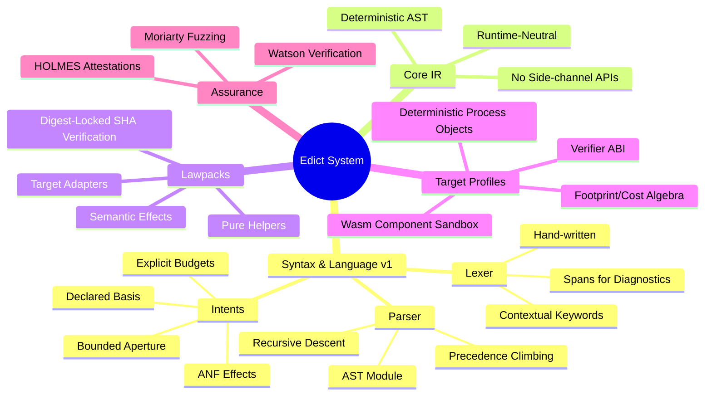
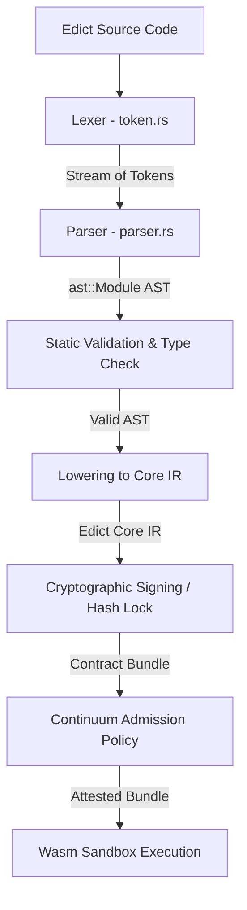
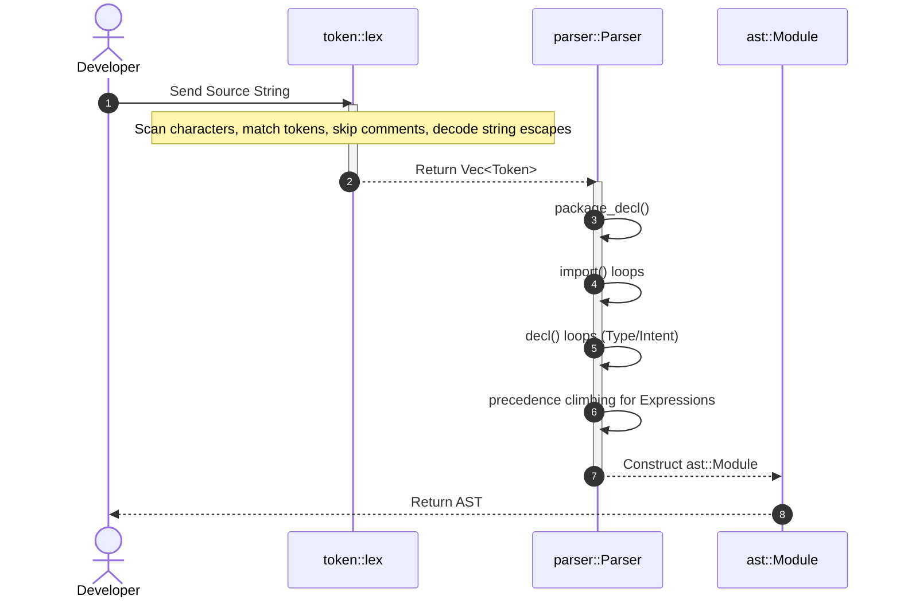
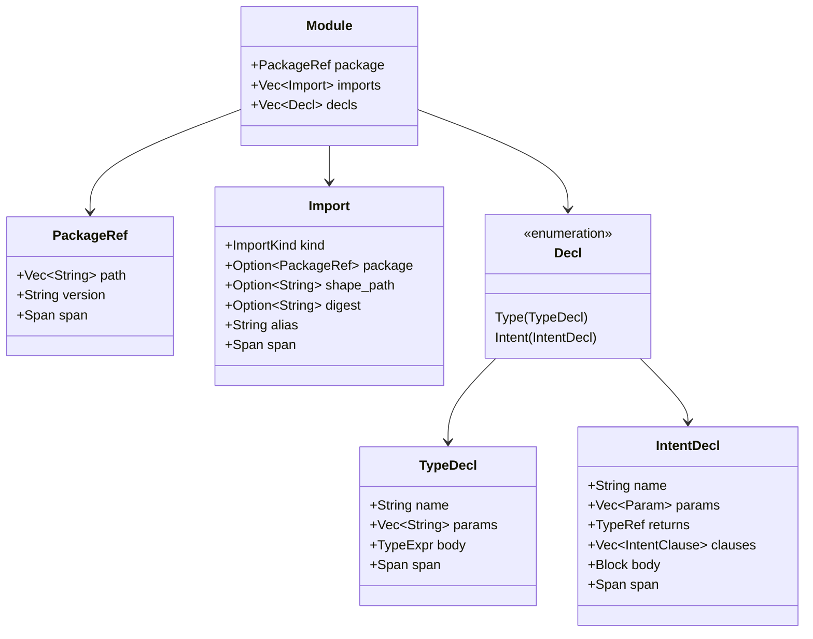

# Table of Contents

- [1. Domain Dictionary (Glossary)](#1-domain-dictionary-glossary) — Line 53
- [2. High-Level Architecture Overview](#2-high-level-architecture-overview) — Line 73
- [3. Bootstrapping vs. Runtime Execution](#3-bootstrapping-vs-runtime-execution) — Line 83
- [4. The Entry Point: Compilation Lifecycle](#4-the-entry-point-compilation-lifecycle) — Line 101
- [5. Lexical Analysis (token.rs)](#5-lexical-analysis-tokenrs) — Line 145
- [6. Syntactic Analysis & Precedence Climbing (parser.rs)](#6-syntactic-analysis--precedence-climbing-parserrs) — Line 212
- [7. Anatomy of a Payload: AST Transformations](#7-anatomy-of-a-payload-ast-transformations) — Line 306
- [8. Unhappy Paths & Error Handling](#8-unhappy-paths--error-handling) — Line 473
- [9. Security Boundaries: SHA-Locks & Sandbox Isolation](#9-security-boundaries-sha-locks--sandbox-isolation) — Line 501
- [10. Concurrency, Parallelism, and Determinism](#10-concurrency-parallelism-and-determinism) — Line 511
- [11. External Dependencies & Boundaries](#11-external-dependencies--boundaries) — Line 521
- [12. Design Rationale & Trade-offs](#12-design-rationale--trade-offs) — Line 531



## 1. Domain Dictionary (Glossary)

The Edict ecosystem employs specialized terminology derived from capabilities-based security, observer geometry, and formal verification. The following table defines these core concepts:

| Term | Definition |
| :--- | :--- |
| **FIDLAR** | *Footprints Ignored; Developer Lies About Risk*. The security gap between a function's declared purpose (e.g., its name or signature) and its actual authority (whatever the host process can access). Edict eliminates FIDLAR by statically verifying and cryptographically sealing code authority. |
| **Intent** | The primary unit of execution in Edict. Unlike a traditional function, an intent is an optic-shaped operation specification that declares its bounded input, output, basis, budget, footprint bounds, and governing law. |
| **Aperture** | The bounded set of state and capabilities that an intent is permitted to read or write. Accessing anything outside the declared aperture triggers a compile-time rejection. |
| **Basis** | The causal history reference point or timeline anchor used to resolve projections. It represents the point of state from which the execution begins. |
| **Lawpack** | A cryptographically locked, authority-free package of pure helper functions, typed constants, semantic effect signatures, and target adapters. Lawpacks represent domain rules and are pinned by SHA-256 hashes. |
| **Target Profile / DPO** | A Deterministic Process Object specification defining the execution environment's runtime intrinsics, verifier rules, footprint/cost algebras, and target-lowering properties (e.g., `echo.dpo`). |
| **Core IR** | A runtime-neutral, canonical representation of compiled Edict intents. It has no side-channel APIs, no file system, and no networking, and is completely deterministic. |
| **Contract Bundle** | A participant-neutral, CBOR-encoded package of compiled Core IR, target lowerings, proof evidence, and cryptographic signatures. |
| **HOLMES / Watson / Moriarty** | The Wesley platform's assurance machinery. **HOLMES** manages evidence and attestations; **Watson** verifies bundle compliance; **Moriarty** runs fuzzing and relapse tests to discover gaps. |
| **A-Normal Form (ANF)** | A restricted syntactic structure where every intermediate effectful computation must be bound to a distinct variable. This makes the sequencing of side effects explicit and verifiable. |
| **SHA-Lock / Digest-Lock** | Pinned references to external dependencies (lawpacks, targets) using their SHA-256 digests. This guarantees that dependencies cannot change silently without modifying the intent's identity. |

---

## 2. High-Level Architecture Overview

Edict's architecture separates language syntax, target runtime specifics, and contract admission rules to enforce static capability checks.

Edict compiles source modules containing raw intent declarations to a canonical, runtime-neutral intermediate representation (Core IR). This Core IR represents pure calculations and explicit target adapters, stripping away all ambient authority. The static verification uses hash-locked schemas (GraphQL shapes), lawpacks (rule definitions), and target profiles to form a cryptographic contract bundle.

This bundle is sent to the Continuum platform for admission check. When the platform policy is satisfied, it issues admission receipts, making the intent available for deterministic execution inside sandboxed target runtimes.

---

## 3. Bootstrapping vs. Runtime Execution

A core architectural separation in Edict is the division between compile-time configuration/bootstrap and runtime evaluation.

### The Bootstrap Phase (Static Assembly)
During bootstrapping, the Edict compiler (`wesley` or the compiler engine) loads the Edict source module, resolves the imported GraphQL schemas, and validates the SHA-256 digest locks on lawpacks and target profiles.
1. **Schema Imports**: Maps GraphQL type definitions into concrete constraints.
2. **Digest Validation**: Verifies that the local or cached lawpacks/target profiles match their declared `digest "sha256:..."` strings exactly.
3. **Capability Mapping**: Configures the compiler environment with allowed targets (e.g., Wasm WIT bindings) and bounds.

### The Runtime Phase (Sandboxed Evaluation)
Once compiled and admitted as a **Contract Bundle**, the runtime executes the intent within a Deterministic Process Object (DPO) container:
1. **Budget Enforcement**: Evaluates cost dynamically. The verifier checks operations against a strict fuel limit (`budget <= law.tinyBudget`).
2. **Footprint Bounds**: Dynamic read/write effects are checked against the verified aperture.
3. **Deterministic State Changes**: All database/KV writes are staged atomically (`precommit-atomic`). If an obstruction (error) occurs, the rollback is complete with zero visible side effects.

---

## 4. The Entry Point: Compilation Lifecycle

The parsing of Edict source code begins with the `parse_module` function defined in [lib.rs](file:///Users/james/git/edict/crates/edict-syntax/src/lib.rs#L18-L20) (specifically exposed from the `parser` module).



### Tracing the Golden Path
The execution flow from raw text to the parsed Abstract Syntax Tree (AST) behaves as follows:



---

## 5. Lexical Analysis (`token.rs`)

The lexical analysis phase scans character sequences to emit a `Vec<Token>` stream.

### The Source of Truth (Lexer State)
During lexing, the state lives entirely in memory within the `Lexer<'a>` struct defined in [token.rs](file:///Users/james/git/edict/crates/edict-syntax/src/token.rs#L143-L146):
```rust
struct Lexer<'a> {
    src: &'a [u8],
    pos: usize,
}
```
As it traverses the byte array, it keeps track of `pos` (character index) and extracts slices of `src` to construct tokens. Spans are recorded as half-open intervals `[start, end)` (e.g., `Span::new(start, self.pos)`).

### Highlight: Under-the-Hood String Escape Decoding
A novel design choice in Edict's hand-written lexer is string literal escape parsing. Rather than deferring escape decoding to later compiler phases, string literals are decoded directly into memory during tokenization. Let's look at `token.rs`'s internal string processing function:

```rust
fn string(&mut self) -> Result<TokenKind, LexError> {
    let start = self.pos - 1; // skip leading double-quote
    let mut s = String::new();
    while self.pos < self.src.len() {
        match self.src[self.pos] {
            b'"' => {
                self.pos += 1;
                return Ok(TokenKind::Str(s));
            }
            b'\' => {
                if self.pos + 1 >= self.src.len() {
                    return Err(LexError {
                        message: "unterminated escape sequence".into(),
                        span: Span::new(start, self.src.len()),
                    });
                }
                match self.src[self.pos + 1] {
                    b'n' => s.push('\n'),
                    b'r' => s.push('\r'),
                    b't' => s.push('\t'),
                    b'\\' => s.push('\\'),
                    b'"' => s.push('"'),
                    b'u' => {
                        // Unicode escapes: \u{XXXX}
                        // Explicit parsing occurs here...
                    }
                    other => return Err(LexError {
                        message: format!("invalid escape char `\\{}`", other as char),
                        span: Span::new(self.pos, self.pos + 2),
                    }),
                }
                self.pos += 2;
            }
            other => {
                // Decode UTF-8 code point
                // Push to s and advance self.pos
            }
        }
    }
    Err(LexError {
        message: "unterminated string literal".into(),
        span: Span::new(start, self.pos),
    })
}
```
*Design Trade-off:* By decoding escape sequences directly at the lexical level, downstream AST nodes and compiler optimization passes can work directly on canonical UTF-8 strings without maintaining parser-specific escapes.

---

## 6. Syntactic Analysis & Precedence Climbing (`parser.rs`)

The parser is implemented as a recursive-descent parser. Top-level files declare a package, list imports, and describe type declarations and intents.

### Module AST Structure


### Highlight: Precedence Climbing
Expressions in Edict are parsed using **precedence climbing**, which allows efficient parsing of infix operations without deep call stacks. The parser defines standard levels of precedence (relational, additive, multiplicative, etc.) using the helper `binop_left` defined in [parser.rs](file:///Users/james/git/edict/crates/edict-syntax/src/parser.rs#L595-L618):

```rust
fn binop_left(
    &mut self,
    next: fn(&mut Self) -> Result<Expr, ParseError>,
    ops: &[(TokenKind, BinOp)],
) -> Result<Expr, ParseError> {
    let start = self.peek_span().start;
    let mut lhs = next(self)?;
    'outer: loop {
        for (tok, op) in ops {
            if self.peek() == tok {
                self.idx += 1;
                let rhs = next(self)?;
                lhs = Expr::Binary {
                    op: *op,
                    lhs: Box::new(lhs),
                    rhs: Box::new(rhs),
                    span: Span::new(start, self.prev_end()),
                };
                continue 'outer;
            }
        }
        return Ok(lhs);
    }
}
```

Precedence is resolved in the following structural order:
1. `logic_or` (e.g., `||`) binds tightest at the top of the expression hierarchy.
2. `logic_and` (e.g., `&&`)
3. `equality` (e.g., `==`, `!=`)
4. `relational` (e.g., `<`, `<=`, `>`, `>=`)
5. `additive` (e.g., `+`, `-`)
6. `multiplicative` (e.g., `*`, `/`, `%`)
7. `unary` (e.g., `!`, `-`)
8. `postfix` (e.g., `.field` member access)
9. `primary` (integers, strings, identifiers, parentheses, record literals)

---

## 7. Anatomy of a Payload: AST Transformations

To understand how data flows through the compiler, we examine the AST representations.

### The Source Payload (`bounded-hello.edict`)
```graphql
package examples.hello@1;

use lawpack hello.optics@1 digest "sha256:0000000000000000000000000000000000000000000000000000000000000000" as hello;

type HelloInput = {
  name: String<max=256>,
};

type HelloReading = {
  message: String<max=512>,
};

intent sayHello(input: HelloInput)
  returns HelloReading
  profile hello.readOnly
  basis none
  budget <= hello.tinyBudget
  where input.name != ""
{
  let message = "hello, " + input.name;
  return { message };
}
```

### The AST Representation (Simplified Rust Struct In-Memory)
During syntactic analysis, the above code is materialized into the following memory payload (an instance of `ast::Module`):

```json
{
  "package": {
    "path": ["examples", "hello"],
    "version": "1"
  },
  "imports": [
    {
      "kind": "Lawpack",
      "package": {
        "path": ["hello", "optics"],
        "version": "1"
      },
      "digest": "sha256:0000000000000000000000000000000000000000000000000000000000000000",
      "alias": "hello"
    }
  ],
  "decls": [
    {
      "Type": {
        "name": "HelloInput",
        "params": [],
        "body": {
          "Record": [
            {
              "name": "name",
              "ty": {
                "StringTy": {
                  "max": { "Int": 256 },
                  "canonical": null
                }
              },
              "constraints": []
            }
          ]
        }
      }
    },
    {
      "Type": {
        "name": "HelloReading",
        "params": [],
        "body": {
          "Record": [
            {
              "name": "message",
              "ty": {
                "StringTy": {
                  "max": { "Int": 512 },
                  "canonical": null
                }
              },
              "constraints": []
            }
          ]
        }
      }
    },
    {
      "Intent": {
        "name": "sayHello",
        "params": [
          {
            "name": "input",
            "ty": {
              "Named": {
                "path": ["HelloInput"],
                "args": []
              }
            }
          }
        ],
        "returns": {
          "Named": {
            "path": ["HelloReading"],
            "args": []
          }
        },
        "clauses": [
          { "Profile": ["hello", "readOnly"] },
          { "Basis": null },
          { "Budget": ["hello", "tinyBudget"] },
          { "Where": [
              {
                "Binary": {
                  "op": "Ne",
                  "lhs": {
                    "Field": {
                      "base": { "Ident": "input" },
                      "field": "name"
                    }
                  },
                  "rhs": { "Str": "" }
                }
              }
            ]
          }
        ],
        "body": {
          "stmts": [
            {
              "Let": {
                "name": "message",
                "ty": null,
                "value": {
                  "Binary": {
                    "op": "Add",
                    "lhs": { "Str": "hello, " },
                    "rhs": { "Ident": "input" }
                  }
                }
              }
            },
            {
              "Return": {
                "value": {
                  "Record": [
                    {
                      "Shorthand": { "name": "message" }
                    }
                  ]
                }
              }
            }
          ]
        }
      }
    }
  ]
}
```

---

## 8. Unhappy Paths & Error Handling

Edict enforces a zero-panic grammar parsing policy. Errors encountered during Lexing or Parsing are transformed into structured failure payloads.

### Lexer Failures
If the lexer encounters invalid Unicode sequences, unclosed string literals, or unrecognized operators, it returns a `LexError`:
```rust
pub struct LexError {
    pub message: String,
    pub span: Span,
}
```
*Example: Unterminated String*
Source: `let greeting = "hello;`
Result: `lex error at 15..22: unterminated string literal`

### Parser Failures
During parsing, recursive descent paths can fail when token sequences violate the language spec rules (e.g., missing semicolons, improper type arguments). The parser returns `ParseError`:
```rust
pub struct ParseError {
    pub message: String,
    pub span: Span,
}
```
Because the parser uses explicit recursive matching, it bails out immediately at the first point of syntactic violation rather than attempting heuristics that could lead to cascading phantom errors.

---

## 9. Security Boundaries: SHA-Locks & Sandbox Isolation

Edict is built from the ground up to prevent the ambient authority problem (FIDLAR). It establishes three crisp boundaries:

1. **Aperture Limits**: Compiled intents cannot issue direct syscalls. Filesystem, networking, and environment configurations are excluded from the grammar. Any dynamic read/write is mapped to target-profile adapters that are explicitly defined and sandboxed.
2. **Cryptographic SHA-Locks**: The dependency structure is frozen. If a developer attempts to update a lawpack to change behavior without updating the digest lock `digest "sha256:..."` in the import header, compilation fails. Silent code changes are impossible.
3. **Sandbox Borders**: The compiled bundle executes inside a WASM component sandbox. Interaction with external state is mediated through a WebAssembly Interface Type (WIT) interface, ensuring complete control over runtime actions.

---

## 10. Concurrency, Parallelism, and Determinism

Traditional programming languages embrace concurrency (multithreading, async queues, lock coordination) to maximize processing throughput. Edict rejects ambient runtime concurrency within intents to preserve **strict determinism**:

* **No Threads**: There are no thread-spawning primitives, promises, or background tasks within Edict code.
* **Purely Sequential Processing**: In Edict, the compilation path enforces A-normal form (ANF) for effectful statements. An effect must be evaluated, resolved, and bound before the next instruction executes. This guarantees that all effects have a single, verifiable, reproducible path of causation.
* **Parallel Verification**: While the execution of an intent is single-threaded, the *verification* of contract bundles and signatures by `wesley`'s assurance platform can be run across thousands of parallel threads safely since individual intents are side-effect-free during the check phase.

---

## 11. External Dependencies & Boundaries

Edict maintains a strict code boundary. The syntax crate `edict-syntax` prohibits any dependencies beyond the Rust standard library:

* **Zero-Dependency Core**: The `Cargo.toml` specifies only workspace lint settings. There are no external parsing libraries (e.g., syn, nom, pest, combine).
* **Forbid Unsafe**: The crate defines `unsafe_code = "forbid"`. This prevents raw-pointer manipulations, memory safety violations, or compiler-bypass techniques.
* **GraphQL Border**: The type layout mappings are kept abstract. The parser handles GraphQL schemas as typed definitions in `use shape "path.graphql"` configurations. The actual resolution of schema fields is handled at the lowering phase, insulating the syntax front-end from schema-validator version changes.

---

## 12. Design Rationale & Trade-offs

During the creation of Edict minimal-v1, the architecture made explicit design compromises:

### Contextual Keywords vs. Reserved Keywords
* **Trade-off**: The parser matches keywords (`max`, `min`, `canonical`, `type`, `intent`) contextually using identifier string comparison instead of reserving them globally.
* **Benefit**: Developers can name fields or parameters `max` or `type` (e.g., `input.type`) without compiling errors.
* **Cost**: The parsing code is slightly more complex, requiring defensive identifier peeking to determine whether a keyword represents a declaration keyword or a variable name.

### Rigid A-Normal Form (ANF) vs. General Expression Nesting
* **Trade-off**: Forcing all effectful outcomes to bind to variables (`let result = effect() else fallback`).
* **Benefit**: Solves the execution ordering ambiguity. Evaluators can precisely compute costs and trace footprints because execution flows sequentially from statement to statement.
* **Cost**: Writing Edict programs requires more boilerplate variable assignments than languages that allow nested function calls (e.g., `process(fetch())`).

### Hand-Written Lexer/Parser vs. Parser Generators
* **Trade-off**: Recursive-descent implementation vs. using `LALR` toolchains (e.g., LALRPOP or peg).
* **Benefit**: Better compile times, zero dependency footprint, highly detailed custom parse error Spans, and easy contextual keyword peeking.
* **Cost**: Maintenance requires manually adjusting parsing functions when grammar specifications change.
