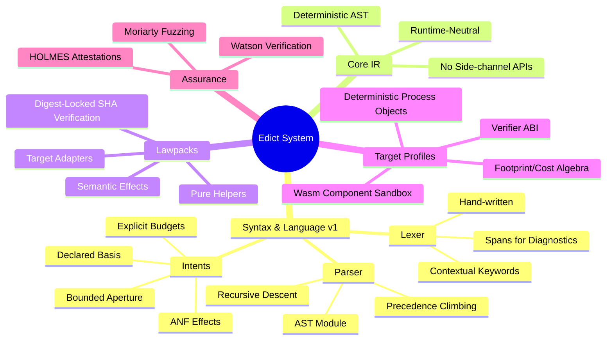
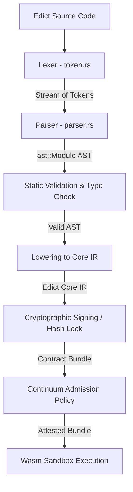
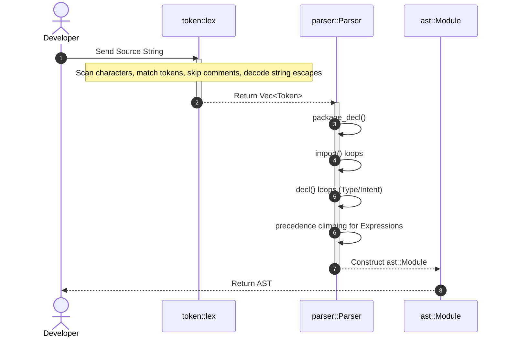
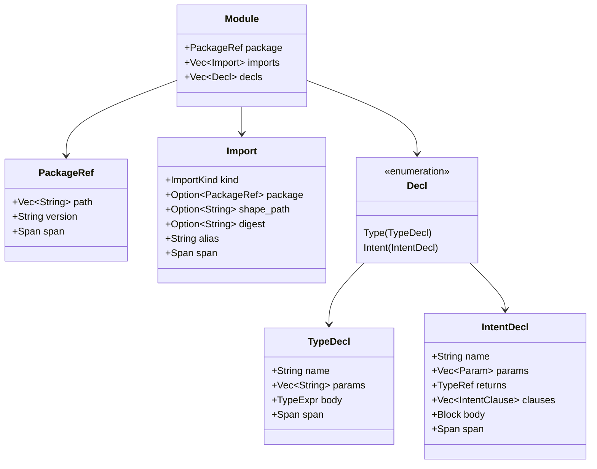

# Table of Contents

- [1. Domain Dictionary (Glossary)](#1-domain-dictionary-glossary) — Line 57
- [2. High-Level Architecture Overview](#2-high-level-architecture-overview) — Line 77
- [3. Bootstrapping vs. Runtime Execution](#3-bootstrapping-vs-runtime-execution) — Line 87
- [4. The Entry Point: Compilation Lifecycle](#4-the-entry-point-compilation-lifecycle) — Line 105
- [5. Lexical Analysis (token.rs)](#5-lexical-analysis-tokenrs) — Line 149
- [6. Syntactic Analysis & Precedence Climbing (parser.rs)](#6-syntactic-analysis--precedence-climbing-parserrs) — Line 216
- [7. Anatomy of a Payload: AST Transformations](#7-anatomy-of-a-payload-ast-transformations) — Line 310
- [8. Unhappy Paths & Error Handling](#8-unhappy-paths--error-handling) — Line 477
- [9. Security Boundaries: SHA-Locks & Sandbox Isolation](#9-security-boundaries-sha-locks--sandbox-isolation) — Line 505
- [10. Concurrency, Parallelism, and Determinism](#10-concurrency-parallelism-and-determinism) — Line 515
- [11. External Dependencies & Boundaries](#11-external-dependencies--boundaries) — Line 525
- [12. Design Rationale & Trade-offs](#12-design-rationale--trade-offs) — Line 535
- [13. Computer Languages: A Comparative Taxonomic Overview](#13-computer-languages-a-comparative-taxonomic-overview) — Line 556
- [14. Novel Language Quirks, Features, and Design Rationales](#14-novel-language-quirks-features-and-design-rationales) — Line 580
- [15. High-Assurance Platform Mechanics: HOLMES, Moriarty, and the Two-Lowerer Trial](#15-high-assurance-platform-mechanics-holmes-moriarty-and-the-two-lowerer-trial) — Line 602
- [16. Cryptographic State Separation: Why Core IR Excludes Source Spans](#16-cryptographic-state-separation-why-core-ir-excludes-source-spans) — Line 617



## 1. Domain Dictionary (Glossary)

The Edict ecosystem employs specialized terminology derived from capabilities-based security, observer geometry, and formal verification. The following table defines these core concepts:

| Term | Definition |
| :--- | :--- |
| **FIDLAR** | *Footprints Ignored; Developer Lies About Risk*. The security gap between a function's declared purpose (e.g., its name or signature) and its actual authority (whatever the host process can access). Edict eliminates FIDLAR by statically verifying and cryptographically sealing code authority. |
| **Intent** | The primary unit of execution in Edict. Unlike a traditional function, an intent is an optic-shaped operation specification that declares its bounded input, output, basis, budget, footprint bounds, and governing law. |
| **Aperture** | The bounded set of state and capabilities that an intent is permitted to read or write. Accessing anything outside the declared aperture triggers a compile-time rejection. |
| **Basis** | The causal history reference point or timeline anchor used to resolve projections. It represents the point of state from which the execution begins. |
| **Lawpack** | A cryptographically locked, authority-free package of pure helper functions, typed constants, semantic effect signatures, and target adapters. Lawpacks represent domain rules and are pinned by SHA-256 hashes. |
| **Target Profile / DPO** | A Deterministic Process Object specification defining the execution environment's runtime intrinsics, verifier rules, footprint/cost algebras, and target-lowering properties (e.g., `echo.dpo`). |
| **Core IR** | A runtime-neutral, canonical representation of compiled Edict intents. It has no side-channel APIs, no file system, and no networking, and is completely deterministic. |
| **Contract Bundle** | A participant-neutral, CBOR-encoded package of compiled Core IR, target lowerings, proof evidence, and cryptographic signatures. |
| **HOLMES / Watson / Moriarty** | The Wesley platform's assurance machinery. **HOLMES** manages evidence and attestations; **Watson** verifies bundle compliance; **Moriarty** runs fuzzing and relapse tests to discover gaps. |
| **A-Normal Form (ANF)** | A restricted syntactic structure where every intermediate effectful computation must be bound to a distinct variable. This makes the sequencing of side effects explicit and verifiable. |
| **SHA-Lock / Digest-Lock** | Pinned references to external dependencies (lawpacks, targets) using their SHA-256 digests. This guarantees that dependencies cannot change silently without modifying the intent's identity. |

---

## 2. High-Level Architecture Overview

Edict's architecture separates language syntax, target runtime specifics, and contract admission rules to enforce static capability checks.

Edict compiles source modules containing raw intent declarations to a canonical, runtime-neutral intermediate representation (Core IR). This Core IR represents pure calculations and explicit target adapters, stripping away all ambient authority. The static verification uses hash-locked schemas (GraphQL shapes), lawpacks (rule definitions), and target profiles to form a cryptographic contract bundle.

This bundle is sent to the Continuum platform for admission check. When the platform policy is satisfied, it issues admission receipts, making the intent available for deterministic execution inside sandboxed target runtimes.

---

## 3. Bootstrapping vs. Runtime Execution

A core architectural separation in Edict is the division between compile-time configuration/bootstrap and runtime evaluation.

### The Bootstrap Phase (Static Assembly)

During bootstrapping, the Edict compiler (`wesley` or the compiler engine) loads the Edict source module, resolves the imported GraphQL schemas, and validates the SHA-256 digest locks on lawpacks and target profiles.

1. **Schema Imports**: Maps GraphQL type definitions into concrete constraints.
2. **Digest Validation**: Verifies that the local or cached lawpacks/target profiles match their declared `digest "sha256:..."` strings exactly.
3. **Capability Mapping**: Configures the compiler environment with allowed targets (e.g., Wasm WIT bindings) and bounds.

### The Runtime Phase (Sandboxed Evaluation)

Once compiled and admitted as a **Contract Bundle**, the runtime executes the intent within a Deterministic Process Object (DPO) container:

1. **Budget Enforcement**: Evaluates cost dynamically. The verifier checks operations against a strict fuel limit (`budget <= law.tinyBudget`).
2. **Footprint Bounds**: Dynamic read/write effects are checked against the verified aperture.
3. **Deterministic State Changes**: All database/KV writes are staged atomically (`precommit-atomic`). If an obstruction (error) occurs, the rollback is complete with zero visible side effects.

---

## 4. The Entry Point: Compilation Lifecycle

The parsing of Edict source code begins with the `parse_module` function defined
in [lib.rs](../crates/edict-syntax/src/lib.rs#L18-L21) (specifically exposed
from the `parser` module).



### Tracing the Golden Path

The execution flow from raw text to the parsed Abstract Syntax Tree (AST) behaves as follows:



---

## 5. Lexical Analysis (`token.rs`)

The lexical analysis phase scans character sequences to emit a `Vec<Token>` stream.

### The Source of Truth (Lexer State)

During lexing, the state lives entirely in memory within the `Lexer<'a>` struct
defined in [token.rs](../crates/edict-syntax/src/token.rs#L143-L146):

```rust
struct Lexer<'a> {
    src: &'a [u8],
    pos: usize,
}
```

As it traverses the byte array, it keeps track of `pos` (character index) and extracts slices of `src` to construct tokens. Spans are recorded as half-open intervals `[start, end)` (e.g., `Span::new(start, self.pos)`).

### Highlight: Under-the-Hood String Escape Decoding

A novel design choice in Edict's hand-written lexer is string literal escape parsing. Rather than deferring escape decoding to later compiler phases, string literals are decoded directly into memory during tokenization. Let's look at `token.rs`'s internal string processing function:

```rust
fn string(&mut self) -> Result<TokenKind, LexError> {
    let start = self.pos - 1; // skip leading double-quote
    let mut s = String::new();
    while self.pos < self.src.len() {
        match self.src[self.pos] {
            b'"' => {
                self.pos += 1;
                return Ok(TokenKind::Str(s));
            }
            b'\' => {
                if self.pos + 1 >= self.src.len() {
                    return Err(LexError {
                        message: "unterminated escape sequence".into(),
                        span: Span::new(start, self.src.len()),
                    });
                }
                match self.src[self.pos + 1] {
                    b'n' => s.push('\n'),
                    b'r' => s.push('\r'),
                    b't' => s.push('\t'),
                    b'\\' => s.push('\\'),
                    b'"' => s.push('"'),
                    b'u' => {
                        // Unicode escapes: \u{XXXX}
                        // Explicit parsing occurs here...
                    }
                    other => return Err(LexError {
                        message: format!("invalid escape char `\\{}`", other as char),
                        span: Span::new(self.pos, self.pos + 2),
                    }),
                }
                self.pos += 2;
            }
            other => {
                // Decode UTF-8 code point
                // Push to s and advance self.pos
            }
        }
    }
    Err(LexError {
        message: "unterminated string literal".into(),
        span: Span::new(start, self.pos),
    })
}
```

*Design Trade-off:* By decoding escape sequences directly at the lexical level, downstream AST nodes and compiler optimization passes can work directly on canonical UTF-8 strings without maintaining parser-specific escapes.

---

## 6. Syntactic Analysis & Precedence Climbing (`parser.rs`)

The parser is implemented as a recursive-descent parser. Top-level files declare a package, list imports, and describe type declarations and intents.

### Module AST Structure



### Highlight: Precedence Climbing

Expressions in Edict are parsed using **precedence climbing**, which allows
efficient parsing of infix operations without deep call stacks. The parser
defines standard levels of precedence (relational, additive, multiplicative,
etc.) using the helper `binop_left` defined in
[parser.rs](../crates/edict-syntax/src/parser.rs#L1109-L1132):

```rust
fn binop_left(
    &mut self,
    next: fn(&mut Self) -> Result<Expr, ParseError>,
    ops: &[(TokenKind, BinOp)],
) -> Result<Expr, ParseError> {
    let start = self.peek_span().start;
    let mut lhs = next(self)?;
    'outer: loop {
        for (tok, op) in ops {
            if self.peek() == tok {
                self.idx += 1;
                let rhs = next(self)?;
                lhs = Expr::Binary {
                    op: *op,
                    lhs: Box::new(lhs),
                    rhs: Box::new(rhs),
                    span: Span::new(start, self.prev_end()),
                };
                continue 'outer;
            }
        }
        return Ok(lhs);
    }
}
```

Precedence is resolved from the loosest binding level to the tightest:

1. `logic_or` (e.g., `||`) is the loosest infix level.
2. `logic_and` (e.g., `&&`)
3. `equality` (e.g., `==`, `!=`)
4. `relational` (e.g., `<`, `<=`, `>`, `>=`)
5. `additive` (e.g., `+`, `-`)
6. `multiplicative` (e.g., `*`, `/`, `%`)
7. `unary` (e.g., `!`, `-`)
8. `postfix` (e.g., `.field` member access, calls, type-calls)
9. `primary` (integers, strings, booleans, digest literals, identifiers,
   parentheses, record literals) binds tightest.

---

## 7. Anatomy of a Payload: AST Transformations

To understand how data flows through the compiler, we examine the AST representations.

### The Source Payload (`bounded-hello.edict`)

```graphql
package examples.hello@1;

use lawpack hello.optics@1 digest "sha256:0000000000000000000000000000000000000000000000000000000000000000" as hello;

type HelloInput = {
  name: String<max=256>,
};

type HelloReading = {
  message: String<max=512>,
};

intent sayHello(input: HelloInput)
  returns HelloReading
  profile hello.readOnly
  basis none
  budget <= hello.tinyBudget
  where input.name != ""
{
  let message = "hello, " + input.name;
  return { message };
}
```

### The AST Representation (Simplified Rust Struct In-Memory)

During syntactic analysis, the above code is materialized into the following memory payload (an instance of `ast::Module`):

```json
{
  "package": {
    "path": ["examples", "hello"],
    "version": "1"
  },
  "imports": [
    {
      "kind": "Lawpack",
      "package": {
        "path": ["hello", "optics"],
        "version": "1"
      },
      "digest": "sha256:0000000000000000000000000000000000000000000000000000000000000000",
      "alias": "hello"
    }
  ],
  "decls": [
    {
      "Type": {
        "name": "HelloInput",
        "params": [],
        "body": {
          "Record": [
            {
              "name": "name",
              "ty": {
                "StringTy": {
                  "max": { "Int": 256 },
                  "canonical": null
                }
              },
              "constraints": []
            }
          ]
        }
      }
    },
    {
      "Type": {
        "name": "HelloReading",
        "params": [],
        "body": {
          "Record": [
            {
              "name": "message",
              "ty": {
                "StringTy": {
                  "max": { "Int": 512 },
                  "canonical": null
                }
              },
              "constraints": []
            }
          ]
        }
      }
    },
    {
      "Intent": {
        "name": "sayHello",
        "params": [
          {
            "name": "input",
            "ty": {
              "Named": {
                "path": ["HelloInput"],
                "args": []
              }
            }
          }
        ],
        "returns": {
          "Named": {
            "path": ["HelloReading"],
            "args": []
          }
        },
        "clauses": [
          { "Profile": ["hello", "readOnly"] },
          { "Basis": null },
          { "Budget": ["hello", "tinyBudget"] },
          { "Where": [
              {
                "Binary": {
                  "op": "Ne",
                  "lhs": {
                    "Field": {
                      "base": { "Ident": "input" },
                      "field": "name"
                    }
                  },
                  "rhs": { "Str": "" }
                }
              }
            ]
          }
        ],
        "body": {
          "stmts": [
            {
              "Let": {
                "name": "message",
                "ty": null,
                "value": {
                  "Binary": {
                    "op": "Add",
                    "lhs": { "Str": "hello, " },
                    "rhs": { "Ident": "input" }
                  }
                }
              }
            },
            {
              "Return": {
                "value": {
                  "Record": [
                    {
                      "Shorthand": { "name": "message" }
                    }
                  ]
                }
              }
            }
          ]
        }
      }
    }
  ]
}
```

---

## 8. Unhappy Paths & Error Handling

Edict enforces a zero-panic grammar parsing policy. Errors encountered during Lexing or Parsing are transformed into structured failure payloads.

### Lexer Failures

If the lexer encounters invalid Unicode sequences, unclosed string literals, or unrecognized operators, it returns a `LexError`:

```rust
pub struct LexError {
    pub message: String,
    pub span: Span,
}
```

*Example: Unterminated String*
Source: `let greeting = "hello;`
Result: `lex error at 15..22: unterminated string literal`

### Parser Failures

During parsing, recursive descent paths can fail when token sequences violate the language spec rules (e.g., missing semicolons, improper type arguments). The parser returns `ParseError`:

```rust
pub struct ParseError {
    pub kind: ParseErrorKind,
    pub message: String,
    pub span: Span,
}
```

Because the parser uses explicit recursive matching, it bails out immediately at the first point of syntactic violation rather than attempting heuristics that could lead to cascading phantom errors.

---

## 9. Security Boundaries: SHA-Locks & Sandbox Isolation

Edict is built from the ground up to prevent the ambient authority problem (FIDLAR). It establishes three crisp boundaries:

1. **Aperture Limits**: Compiled intents cannot issue direct syscalls. Filesystem, networking, and environment configurations are excluded from the grammar. Any dynamic read/write is mapped to target-profile adapters that are explicitly defined and sandboxed.
2. **Cryptographic SHA-Locks**: The dependency structure is frozen. If a developer attempts to update a lawpack to change behavior without updating the digest lock `digest "sha256:..."` in the import header, compilation fails. Silent code changes are impossible.
3. **Sandbox Borders**: The compiled bundle executes inside a WASM component sandbox. Interaction with external state is mediated through a WebAssembly Interface Type (WIT) interface, ensuring complete control over runtime actions.

---

## 10. Concurrency, Parallelism, and Determinism

Traditional programming languages embrace concurrency (multithreading, async queues, lock coordination) to maximize processing throughput. Edict rejects ambient runtime concurrency within intents to preserve **strict determinism**:

- **No Threads**: There are no thread-spawning primitives, promises, or background tasks within Edict code.
- **Purely Sequential Processing**: In Edict, the compilation path enforces A-normal form (ANF) for effectful statements. An effect must be evaluated, resolved, and bound before the next instruction executes. This guarantees that all effects have a single, verifiable, reproducible path of causation.
- **Parallel Verification**: While the execution of an intent is single-threaded, the *verification* of contract bundles and signatures by `wesley`'s assurance platform can be run across thousands of parallel threads safely since individual intents are side-effect-free during the check phase.

---

## 11. External Dependencies & Boundaries

Edict maintains a strict code boundary. The syntax crate `edict-syntax` keeps
its dependency surface explicit and narrow:

- **No Parser Framework Dependency**: Parsing remains hand-written and
  deterministic. There are no external parsing libraries (e.g., syn, nom, pest,
  combine).
- **Explicit Cryptographic Dependency**: Core module digest computation uses the
  reviewed `sha2` crate for SHA-256 rather than a local hash implementation.
- **Forbid Unsafe**: The crate defines `unsafe_code = "forbid"`. This prevents raw-pointer manipulations, memory safety violations, or compiler-bypass techniques.
- **GraphQL Border**: The type layout mappings are kept abstract. The parser handles GraphQL schemas as typed definitions in `use shape "path.graphql"` configurations. The actual resolution of schema fields is handled at the lowering phase, insulating the syntax front-end from schema-validator version changes.

---

## 12. Design Rationale & Trade-offs

During the creation of Edict minimal-v1, the architecture made explicit design compromises:

### Contextual Keywords vs. Reserved Keywords

- **Trade-off**: The parser matches keywords (`max`, `min`, `canonical`, `type`, `intent`) contextually using identifier string comparison instead of reserving them globally.
- **Benefit**: Developers can name fields or parameters `max` or `type` (e.g., `input.type`) without compiling errors.
- **Cost**: The parsing code is slightly more complex, requiring defensive identifier peeking to determine whether a keyword represents a declaration keyword or a variable name.

### Rigid A-Normal Form (ANF) vs. General Expression Nesting

- **Trade-off**: Forcing all effectful outcomes to bind to variables (`let result = effect() else fallback`).
- **Benefit**: Solves the execution ordering ambiguity. Evaluators can precisely compute costs and trace footprints because execution flows sequentially from statement to statement.
- **Cost**: Writing Edict programs requires more boilerplate variable assignments than languages that allow nested function calls (e.g., `process(fetch())`).

### Hand-Written Lexer/Parser vs. Parser Generators

- **Trade-off**: Recursive-descent implementation vs. using `LALR` toolchains (e.g., LALRPOP or peg).
- **Benefit**: Better compile times, zero dependency footprint, highly detailed custom parse error Spans, and easy contextual keyword peeking.
- **Cost**: Maintenance requires manually adjusting parsing functions when grammar specifications change.

---

## 13. Computer Languages: A Comparative Taxonomic Overview

When analyzing computer languages in general, systems engineers evaluate them across three taxonomic axes: Generality, State Paradigm, and Authority Model. Under this framework, Edict represents a distinct design point:

### Domain-Specific vs. General Purpose Languages (DSLs vs. GPLs)

Traditional General-Purpose Languages (GPLs) like Rust, Go, or Python are **Turing-complete** by design. They support arbitrary computation, unbounded loops, dynamic memory allocation, and indirect system calls. In contrast, Domain-Specific Languages (DSLs) restrict execution semantics to solve specific systemic problems efficiently.

Edict is a highly specialized DSL. By design, Edict lacks Turing completeness in its source language: it prohibits arbitrary iterative loops and unbounded recursion. This is not a limitation but a deliberate security feature. It ensures that the Execution Halting Problem is mitigated statically. Every Edict intent can have its cost calculated and capped before execution starts.

### State Paradigm & Execution Determinism

Modern computer languages manage execution state through different paradigms:

1. **Imperative/OOP**: Memory is a stateful graph modified via reference-sharing and locks. This introduces concurrency races and makes execution history highly variable.
2. **Purely Functional**: State is immutable; new states are returned as values. Execution is deterministic but often relies on complex, nested garbage collectors.
3. **Capabilities-Based**: State access is protected by cryptographic tokens or capability descriptors rather than raw pointer access.

Edict occupies a hybrid space. Expressions are functional, pure, and deterministic. Side effects are sequentialized via A-normal form (ANF) statements. This structures the execution history into a transparent, verifiable timeline of state changes, making audits reproducible.

### Ambient Authority vs. Sandbox Isolation

In a standard computer language runtime, a process executes with "Ambient Authority" — the process inherits the permissions of the user running it. A library imported from a package repository can silently invoke socket connections, spawn files, or leak environment variables (FIDLAR).

Edict abandons Ambient Authority entirely. Runtimes must verify and sign incoming **Contract Bundles** before they are admitted. Any effectful operation must target an adapter defined within a SHA-256 digest-locked lawpack or target profile, executing in a strictly sandboxed WASM component.

---

## 14. Novel Language Quirks, Features, and Design Rationales

Edict incorporates several specific syntactic and behavioral designs that differ from mainstream computer languages. This section details these quirks and explains the engineering rationale behind them.

### Quirk A: Adjacency-Locked Package Versions

- **Quirk**: The lexer and parser require that the package version specifiers (e.g., `examples.hello@1.2.3-beta`) contain zero whitespace characters. Standard punctuation (dots, hyphens, and alphanumeric segments) must be tightly adjacent.
- **Why We Did It This Way**: In traditional languages, package declarations are parsed using complex grammatical rules, or they are delegated to external configuration files (e.g., `Cargo.toml`, `package.json`). Edict places imports directly inside the code file, requiring strict cryptographic pinning. To prevent version numbers from being parsed as member accesses or mathematical expressions (`major.minor - beta`), the lexer binds the version as a single atomic token. Terminating version parsing immediately upon encountering whitespace eliminates parsing ambiguities.

### Quirk B: Contextual Keyword Resolution

- **Quirk**: Keywords like `max`, `min`, `canonical`, `type`, and `intent` are not reserved tokens in Edict. The lexer produces a generic `Ident(String)` token for all keywords. The [parser](../crates/edict-syntax/src/parser.rs#L44-L92) determines contextually whether an identifier represents a declaration keyword or a variable name.
- **Why We Did It This Way**: In languages with reserved keyword sets, developers cannot use common words like `type` or `max` as field names (e.g., `payload.type` or `object.max` are syntax errors in Rust and Java unless escaped). By matching keywords contextually, Edict allows developers to write natural, standard API interfaces while keeping the underlying compiler lexer simple and zero-dependency.

### Quirk C: Obstruction-Driven Control Flow (No Exceptions)

- **Quirk**: Edict has no `try/catch` mechanism, no `throw` statement, and no `null` pointers. If an effectful call fails, it must be bound inline to an alternative outcome payload: `let node = ref.read() else law.MissingNode;`.
- **Why We Did It This Way**: In traditional runtimes, exception unwinding allocates memory for stack traces and jumps instructions dynamically. This runtime overhead is highly non-deterministic and architecture-dependent, preventing static cost estimation. By forcing explicit inline outcomes at the syntax boundary, the compiler can track all execution branches and statically verify cost bounds (`budget <= law.tinyBudget`).

### Quirk D: Constrained Scalar Types (`String<max=256>`)

- **Quirk**: Basic types are parameterized directly in type signatures with bounds (e.g., `String<max=256>` or `Bytes<max=1024>`).
- **Why We Did It This Way**: GPLs allow dynamically sized strings, allocating memory from a heap as needed. In high-assurance sandboxes, dynamic heap allocation can lead to denial-of-service memory exhaustion attacks. Integrating length bounds directly into the type definition allows the Edict compiler to compute the maximum memory footprint of an intent before admission.

---

## 15. High-Assurance Platform Mechanics: HOLMES, Moriarty, and the Two-Lowerer Trial

Edict is designed not just as a syntax parser, but as the compiler front-end of a global cryptographic platform. The downstream validation pipelines rely on unique security mechanisms:

### HOLMES (Evidence Attestation Logs)

During compiled artifact check, the platform's **HOLMES** engine collects attestation evidence. Instead of verifying raw Rust code or running complex verification trees at admission time, HOLMES digests the compile-time outputs and creates a structured evidence record. This record acts as a "nutrition label" detailing exactly what security permissions (footprints) the contract claims and what mathematical proofs support those claims. The signature of HOLMES seals the contract bundle, making it immutable.

### Moriarty (Relapse Fuzzing)

Codebases are prone to "relapses" — where subsequent changes or optimizer enhancements accidentally introduce non-deterministic features (e.g., exposing a host clock, file path leak, or dynamic memory leaks). The **Moriarty** agent runs automated fuzzing across admitted target profiles and lawpacks. It attempts to breach the WASM sandbox or find cost calculation mismatches. Any discrepancy found immediately suspends the target profile version from Continuum admission ledger.

### The Two-Lowerer Trial

A critical vector in compiler security is **Lowerer Exploitation**. If a single compiler backend converts Core IR to Wasm bytecode, a bug or malicious insert in that compiler backend could produce unsafe bytecode while the verifier reports success. Edict mitigates this by mandating the **Two-Lowerer Trial**. Core IR is compiled through two independently written, separate lowerer pipelines. The system generates bytecode hashes for both compilation targets and compares them. If the resulting structures diverge by a single byte, admission is rejected, neutralizing compiler-vector exploits.

---

## 16. Cryptographic State Separation: Why Core IR Excludes Source Spans

In traditional language compilers, debug configurations preserve source locations (`Span` coordinates referencing filename, line number, and column numbers) to populate stack traces. Edict explicitly strips source spans during the lowering phase to Core IR.

### The Formatting Identity Hazard

Edict contract bundles are identified by the cryptographic hash of their compiled Core IR. If source coordinates were preserved inside the Core IR:

1. Adding a single comment, space, or running a code reformatter (like `rustfmt`) would shift source spans.
2. Shifting source spans would change the compiled Core IR byte representation.
3. The cryptographic hash of the intent would mutate, changing its identity.

As a result, a developer who merely cleaned up whitespace or comments would create a "new" contract in the eyes of the Continuum admission engine. This would invalidate prior HOLMES attestations and audit approvals.

### The Solution: Lexical Spans as Transient Metadata

Edict separates developer diagnostics from execution semantics. The `Span` struct is a compiler-frontend concept: it is captured in the tokenization and recursive-descent parsing phases to render beautiful, clickable error messages to the developer. However, during the lowering phase to Core IR, all span data is stripped. The resulting Core IR is a purely semantic tree, guaranteeing that formatting changes have zero impact on the contract's cryptographic hash identity.
